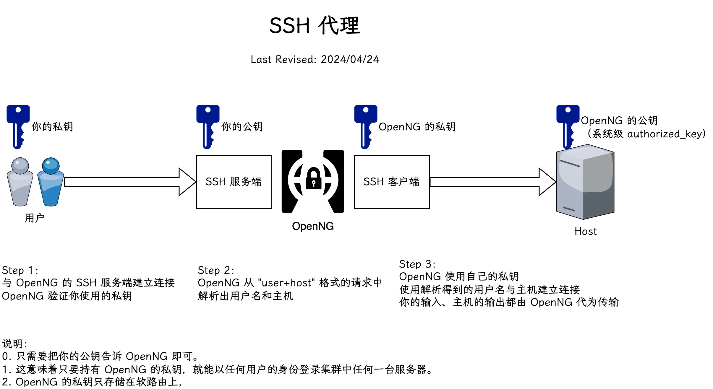
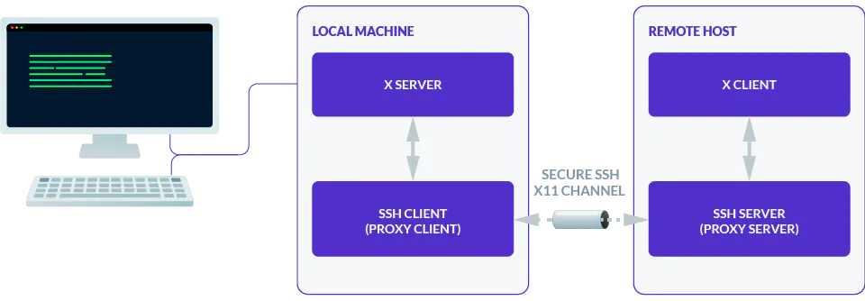
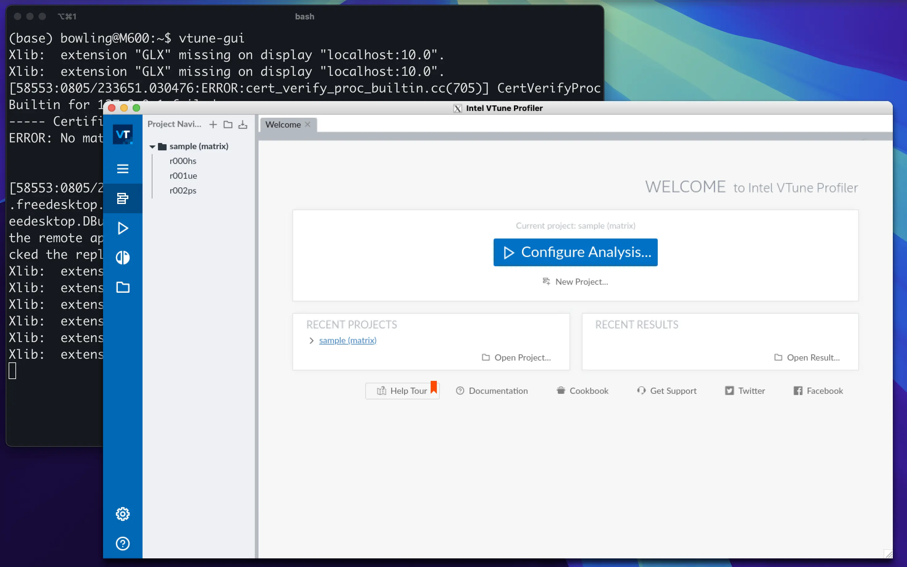

# 登录集群

!!! warning "别急"
    集群会在短学期正式开始后开放使用。

## 配置 SSH 密钥登录

!!! warning "警告"
    不要使用密码登录集群，密码登陆是蜜罐，输入的密码会被明文记录在日志中。

集群仅会支持 SSH 密钥登录。请按照以下步骤配置 SSH 密钥登录：

1. 在 [ZJU Git](https://git.zju.edu.cn/) 中添加你的 SSH 公钥。集群 SSH 验证将从这里动态获取你的公钥。你可以通过 `https://git.zju.edu.cn/学号.keys` 查看你添加的公钥。
1. 登录集群时，使用 `ssh 账户名+节点名@clusters.zju.edu.cn` 登录。如果你的 SSH 密钥配置正确，你将登录到集群登录节点。

    !!! example

        用户 `student` 登录到 `hpc101` 节点，应当执行的命令为：

        ```shell
        ssh student+hpc101@clusters.zju.edu.cn
        ```

1. `clusters.zju.edu.cn` 支持 SSH 的端口有：22、80、443。如果默认端口（22）无法连接，请尝试使用另外两个端口：

    ```shell
    ssh username+nodename@clusters.zju.edu.cn -p 443
    ```

    受限于学校网络安全策略，目前已知下列情况下 22 端口无法使用：

    - 校外访问
    - RVPN（zju-connect）访问

1. 在集群内，要通过 SSH 连接到其他节点，不需要输入用户名，直接使用 `ssh nodename` 即可。

    !!! example

        在集群内的 `hpc101` 节点上 SSH 到 `hpc102` 节点：

        ```shell
        ssh hpc102
        ```

!!! warning

    注意部分 ssh 实现，如 `mobaxterm`、`xshell` 部分版本默认会在建立连接时检测服务器 ssh 版本，会造成 3s 的等待时间。

    你可以在这些软件的选项里找到关于协商 ssh 版本的选项，并指定为 SSHv2，以消除等待时间。

!!! tip

    可以通过配置 `ssh config` 来获得更加优雅的登陆方式。例如：

    ```text title="~/.ssh/config"
    Host hpc101
        User student+hpc101
        HostName clusters.zju.edu.cn
        Port 443
    ```

    此后可以使用

    ```shell
    ssh hpc101
    ```

    连接到集群

### 常见问题

请根据你的情况检查以下问题：

!!! question "是否能看到如下的 SSH Banner？"

    ```shell
    $ ssh username+nodename@clusters.zju.edu.cn
    * * * * * * * * * * * * * * * * * * * * * * * * * * *
    * ███████╗     ██╗██╗   ██╗███████╗ ██████╗████████╗*
    * ╚══███╔╝     ██║██║   ██║██╔════╝██╔════╝╚══██╔══╝*
    *   ███╔╝      ██║██║   ██║███████╗██║        ██║   *
    *  ███╔╝  ██   ██║██║   ██║╚════██║██║        ██║   *
    * ███████╗╚█████╔╝╚██████╔╝███████║╚██████╗   ██║   *
    * ╚══════╝ ╚════╝  ╚═════╝ ╚══════╝ ╚═════╝   ╚═╝   *
    * * * * * * * * * * * * * * * * * * * * * * * * * * *
    Mon, 01 Jul 2024 12:47:19 +0000
    Your IP: ***.***.***.***
    User: username
    %%% 我靠，桌子上怎么有水啊，显卡沾水了😱😱😱
    ```

    ??? note "不能看见 SSH Banner"

        未能连接到 `clusters.zju.edu.cn`。

        - 校网环境：检查 `clusters.zju.edu.cn` 是否解析到 `10.78.18.247`，检查 DNS 设置是否正确。
        - 校外环境：尝试 80 或 443 端口，检查防火墙设置。

    ??? note "能看见 SSH Banner"

        根据 SSH Banner 后的错误信息检查：

        | 错误信息 | 原因 |
        | --- | --- |
        | `username@clusters.zju.edu.cn: Permission denied (publickey).` | 用户名或 SSH 密钥未配置正确 |
        | `Connection closed by ***.***.***.*** port ***` | 内部错误，请联系管理员 |
        | `* Unknown host "nodename"` | 目标节点不存在，请检查节点名称<br />若未添加节点名称，则默认节点不在线，请联系管理员 |
        | `Failed to connect to remote host`<br>`no route to host`<br>`i/o timeout` | 目标节点不在线，请联系管理员 |

### 集群 SSH 代理原理

集群目前使用 [OpenNG](https://github.com/mrhaoxx/OpenNG) 提供的 SSH 代理功能，原理如下图所示：

<figure markdown="span">
{ align=center }
<figcaption>集群 SSH 代理登录原理</figcaption>
</figure>

OpenNG 通过 TCP 头识别 SSH 连接，进行接管，详见 [:simple-github: 源码](https://github.com/mrhaoxx/OpenNG/blob/f59461d12c48a9410967c7f4dd5a5ae1df251eef/tcp/detect.go#L116)。

## 使用 X11 Forwarding

!!! quote

    - [What You Need to Know About X11 Forwarding - Teleport](https://goteleport.com/blog/x11-forwarding/)

!!! warning

    Termius 目前暂不支持 X11 Forwarding。

??? info "X11 Forwarding 原理"

    !!! info inline ""

        <figure markdown="span">
        <center>
        
        </center><figcaption>
        X 视窗系统架构
        <br /><small>
        [MakeTechEasier](https://www.maketecheasier.com/the-x-window-system/)
        </small> </figcaption>
        </figure>

    X 视窗系统（X Window System）是一种在 UNIX 和类 UNIX 操作系统上运行的图形用户界面系统。为了使多个程序共享一套硬件（如显示器、键盘和鼠标），它设计为服务器/客户端架构，如上图所示：

    - X Server：控制硬件，向客户端提供访问硬件的服务。
    - X Client：每当你启动一个图形界面（Graphical User Interface, GUI）应用程序时，它会有一个 X Client，负责与 X Server 交互，使画面显示在屏幕上。

    X 视窗系统的服务器/客户端通信协议可以通过网络传输，这就是 X11 Forwarding 的原理。

    <figure markdown="span">
    <center>
    { width=80% align=center }
    </center><figcaption>
    X11 Forwarding 原理
    <br /><small>
    [Teleport](https://goteleport.com/blog/x11-forwarding/)
    </small> </figcaption>
    </figure>

### 在系统上安装 X Server

我们可以使用 SSH 的 X11 Forwarding 功能，将远程服务器的图形界面显示到本地。当然，这需要本地有 X Server。Linux 用户无需额外配置。

!!! note ""

    === "macOS"

        推荐使用 [xQuartz](https://www.xquartz.org/)。

        ```bash
        brew install xquartz
        ```

    === "Windows"

        推荐使用以下工具：

        - [Xming](http://www.straightrunning.com/XmingNotes/)
        - [vcxsrv](https://sourceforge.net/projects/vcxsrv/)

安装完成后，可能需要配置环境变量，如 `echo "export DISPLAY=:0" >> ~/.zprofile`，具体请根据产生的错误信息进行调整。

### 使用 SSH X11 Forwarding

当你直接使用 SSH 连接到服务器并启动图形界面应用程序时，大概会出现如下错误：

```bash
user@local:~$ ssh user@machine
user@machine:~$ vtune-gui
[49258:0805/223217.963666:ERROR:ozone_platform_x11.cc(240)] Missing X server or $DISPLAY
[49258:0805/223217.963716:ERROR:env.cc(257)] The platform failed to initialize.  Exiting.
```

这是因为默认情况下，SSH 不会转发 X11 会话。本地和远程服务器上都应当启用 X11 转发。服务端已经配置好了，你只需要在连接到集群时使用的 SSH 命令上添加 `-X` 或 `-Y` 以启用 X11 转发即可。

```bash
user@local:~$ ssh -X user@machine
user@machine:~$ vtune-gui
```

<figure markdown="span">
  { width=80% align=center }
  <figcaption>
    X11 Forwarding 成功
  </figcaption>
</figure>
