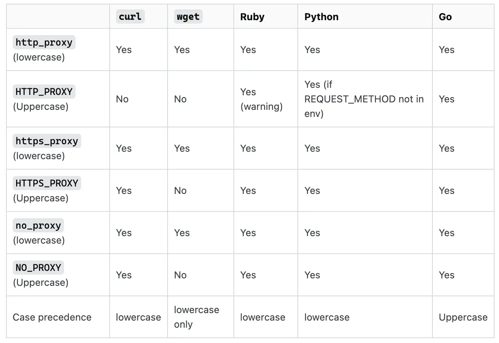

# 集群概况

目前集群硬件资源如下：

- M6 集群：
    - CPU：Silver 4314 16Core @ 2.4GHz 或 Gold 5320 26Core @ 2.2GHz
    - 内存：DDR4 256 GB 以上
    - Ethernet：10Gbps
    - Infiniband：HDR 200Gbps
- M7 集群
    - CPU：Gold 5418Y 24Core @ 2.0GHz
    - 内存 DDR5-4800
    - Ethernet：1Gbps
    - Infiniband：HDR 200Gbps
- 管理节点：`root`
    - CPU：Platinum 8358 CPU 32Core @ 2.60GHz
    - 内存：DDR4 512 GB
    - Ethernet：1Gbps
    - Infiniband：HDR 200Gbps + QDR 40Gbps
    - 存储池：
        - `/pxe`：3.2TB NVMe SSD ZFS
        - `/river`：7.68TB=4x3.48TB NVMe SSD RAIDZ10
        - `/lake`：18TB=12x2TB SATA HDD RAIDZ3
- 存储节点：`storage`
    - CPU：E5-2670 v3 12Core @ 2.3GHz
    - 内存：DDR4 256 GB
    - Ethernet：1Gbps
    - Infiniband：QDR 40Gbps
    - 存储池：
        - `/ocean`：22TB=4x4TB SATA HDD RAIDZ2 + 4x8TB SATA HDD RAIDZ2

## 存储

集群中有四个位置用于存储文件：

- `~`：6.4T SSD 阵列，你的家目录，权限仅个人
- `/river`：和家目录同一个阵列，用于共享文件
- `/lake`：12T HDD 阵列，用于备份
- `/ocean`：22T HDD 阵列，用于归档

这四个位置均跨节点挂载，你可以在任意节点访问这些存储池。

```text
/river      按项目划分文件夹。文件夹权限使用 ACL 控制，仅项目组内成员可读写。
├── temp        临时共享目录，每周清理
├── script      一些常用的共享脚本
├── hpc101      HPC 课程项目
│   └── 2024        2024 学年
│       ├── share       通用共享（供同学们有需要使用）
│       ├── day4        第 4 次课程资料
│       ├── lab5        实验 5 文件
│       └── ...
├── projects    各个项目
│   ├── project1    项目 1
│   │   ├── data        数据
│   │   ├── code        代码
│   │   └── ...
│   └── ...
└── ...
/lake
└── ...         暂未整理
/ocean
└── mirror
    ├── debian-cd       Debian 镜像（同步自 tuna）
    ├── ubuntu-releases Ubuntu 镜像（同步自 tuna）
    ├── windows         Windows 镜像（手动下载）
    └── windows-server  Windows Server 镜像（手动下载）
```

## 网络

集群路由负责校园网 L2TP 拨号，在集群内网可以直接访问校外网络。集群内网还配置了访问国外网络的 Clash 代理服务：

- `172.25.2.253:7890`：HTTP 代理
- `172.25.2.253:7891`：SOCKS5 代理

集群节点上配置好了 proxychains4，你可以通过 `proxychains` 命令使用代理服务。例如，使用 `wget` 下载文件：

```shell
$ proxychains curl http://google.com
[proxychains] config file found: /etc/proxychains4.conf
[proxychains] preloading /usr/lib/x86_64-linux-gnu/libproxychains.so.4
[proxychains] DLL init: proxychains-ng 4.16
[proxychains] Dynamic chain  ...  172.25.2.253:7891  ...  google.com:80  ...  OK
<HTML><HEAD><meta http-equiv="content-type" content="text/html;charset=utf-8">
<TITLE>301 Moved</TITLE></HEAD><BODY>
<H1>301 Moved</H1>
The document has moved
<A HREF="http://www.google.com/">here</A>.
</BODY></HTML>
```

有些程序使用 `proxychains` 会出现问题，可以尝试设置 Linux 环境变量，有些程序能够通过这种方式识别代理：

```shell
$ export http_proxy=http://172.25.2.253:7890
$ curl http://google.com
<HTML><HEAD><meta http-equiv="content-type" content="text/html;charset=utf-8">
<TITLE>301 Moved</TITLE></HEAD><BODY>
<H1>301 Moved</H1>
The document has moved
<A HREF="http://www.google.com/">here</A>.
</BODY></HTML>
```

<figure markdown="span">
  { width=80% align=center }
  <figcaption>常见应用对环境变量代理的支持</figcaption>
</figure>
