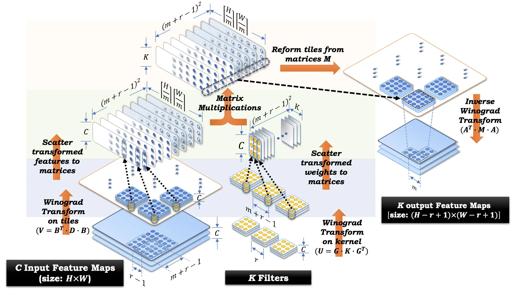

# Final Project 大作业

!!! tip 重要通知
    大作业截止日期为 **2025 年 8 月 31 日晚 23:59**，请务必在截止日期前提交。您将被要求在截止日期后进行线上答辩，具体时间另行通知。

    负责助教：杨星宇、蒋翼泽、李厚融

## 导言
在本课程的大作业中，您将会运用在课程实验中学习到的优化方法，对两个实际工程中的应用进行优化。本次大作业共包含两个应用场景，分别为：

- (1) Winograd 卷积优化；
- (2) HPCG 基准测试优化。

请注意大作业的题目与 PAC 的赛题是**不同**的，具体内容请以**本文档**为准。上述两个应用场景都需要完成，各占大作业总分的 50%。大作业需要 **4 人一组**组队完成，截止日期为 **2025 年 8 月 31 日晚 23:59**，在此之后不再接受任何补交，请务必在截止日期前提交。

本次大作业需要就优化内容进行**答辩**。答辩安排在截止日期后，形式暂定为线上讲解，包括 7 分钟 PPT 展示、3 分钟提问，具体时间待定，请关注后续通知。

往年 HPC101 课程的大作业为参加 PAC 竞赛，但今年 PAC 竞赛的赛题与课程实验有重复之处，截止日期较早，且赛方提供的集群易用性很差，考虑到同学们实际的上课体验，我们更改了大作业的题目，本次大作业**只需要在学在浙大提交**，**不需要提交到 PAC 竞赛平台**。您可以选择使用赛方提供的平台继续完成 PAC 竞赛的两道赛题（DGEMM 和 HPCG），这部分内容可以作为 Bonus 单独提交到学在浙大（至少包括代码和简单实验报告）。再次强调 PAC 竞赛的赛题与本课程大作业的题目是不同的。

## 实验要求

### 实验平台
大作业在本课程提供的集群上进行，您可以任选在 CPU 或 GPU 平台上进行优化，对应集群的鲲鹏 920 队列和 V100 队列（**任选其一即可**，有兴趣可以都尝试优化作为加分项）。选择不同的优化平台不会对最终得分产生影响，大作业将根据优化方法、实验报告和答辩表现进行综合评分。两个平台上的优化加速比是重要的评分依据，但并不是硬性指标；我们会分别考虑不同平台上的加速比，不会简单直接比较。

鲲鹏 920 平台使用千兆以太网互联，多机互联性能较差，如果您选择了鲲鹏 920 平台，最多使用 1 个节点进行优化。请注意赛方提供的集群与我们提供的鲲鹏 920 集群支持的指令集是不同的，我们提供的集群仅支持 Neon (asimd) 指令集扩展，不支持 SVE 和 SME 指令集扩展，建议使用 Neon 指令集进行优化。

V100 平台使用 NVLink 互联，如果您选择了 V100 平台，最多使用 1 个节点（即双卡 V100）进行优化。

### 提交要求
请在截止日期前将大作业的所有提交内容压缩为 zip 格式，提交到学在浙大上，每个小组仅需组长提交一份，提交时请确保压缩包内包含以下内容：

- Winograd 文件夹下：
    - 一份 `README.md` 文件，说明如何编译和运行代码；
    - Winograd 卷积代码和运行脚本；
    - 最终运行结果截图或命令行输出。
- HPCG 文件夹下：
    - 一份 `README.md` 文件，说明如何编译和运行代码；
    - HPCG 基准测试代码和运行脚本；
    - 性能最佳的 HPCG 输出结果文件。
- 一份答辩 PPT；
- 一份 20 页以内的实验报告 PDF（请不要复制粘贴具体代码，可以结合伪代码说明），应至少包含以下内容：
    - 成员姓名和学号；
    - 选择的实验平台；
    - 优化方法和思路；
    - 最终运行结果截图；
    - 每一步优化的加速效果和分析。

提交的目录结构应如下所示：

```
project
├── Winograd
│   ├── README.md
│   ├── your_code
│   ├── some_scripts
|   └── ...
├── HPCG
│   ├── README.md
│   ├── your_code
│   ├── some_scripts
│   └── ...
├── report.pdf
└── presentation.pptx
```

## 题目一：Winograd 卷积优化

### 题目介绍
卷积计算在深度学习中广泛应用，现行的深度学习框架在卷积层中通常采用 Winograd 算法进行卷积计算，而不是直接使用卷积核滑动的方法进行计算。这两种方法在数学上是等价的，但 Winograd 卷积算法在计算量上更小，能显著提高卷积计算的速度。

Winograd 卷积算法的核心思想是通过 Winograd’s 最小滤波算法将卷积运算转换为等价但计算量更小的操作，然后使用矩阵乘法来实现卷积计算。矩阵乘法有许多高性能的实现，从而使得 Winograd 卷积算法在实际应用中具有更高的性能。

关于 Winograd 算法是如何降低计算量的，我们可以类比复数乘法 $(a+bi) \times (c+di) = (ac-bd) + (ad+bc)i$，标准的复数乘法需要 4 次乘法和 2 次加法。但我们可以通过一些数学上的等价方法，先算出某些中间结果，通过增加加法次数，来降低乘法次数（乘法运算相对加法运算慢得多）：

1. 计算 $p = a \times c$,
2. 计算 $q = b \times d$,
3. 计算 $r = (a+b) \times (c+d)$,
4. 最后的结果 $(a+bi) \times (c+di) = p - q + (r - p - q)i$.

这样，我们只需要进行 3 次乘法来计算两个复数的乘积，代价是总共需要 5 次加法运算。Winograd 卷积算法的核心思想就是通过类似的方式，将卷积运算转换为更少的乘法运算，算法流程如下：

1. 对 $k$ 个具有 $c$ 个通道的卷积核进行变换（变换矩阵是预先确定的），将结果重排列到 $U$ 矩阵中；
2. 对分辨率为 $h \times w$，具有 $c$ 个通道的输入图像进行变换，将结果重排列到 $V$ 矩阵中；
3. 对 $U$ 矩阵和 $V$ 矩阵进行矩阵乘法，reduce 通道维度，得到 $M$ 矩阵；
4. 将 $M$ 矩阵重排列，结果进行逆变换，得到输出结果。

算法流程可视化如下图所示：


具体细节请参考原始论文 [Fast Algorithms for Convolutional Neural Networks](https://arxiv.org/pdf/1509.09308)。

### 实验任务
在本实验中，正确但未经优化的 Winograd 卷积基准代码已经提供，您将被要求对其进行优化以提高性能。作为参考的基准代码可以在 HPC101 课程的 [GitHub 仓库](https://github.com/ZJUSCT/HPC101/tree/main/src/project/winograd) 的 `src/project/winograd` 下找到，运行方式请参考仓库中的 `README.md`。本实验只需要考虑大小为 $3 \times 3$，具有多个通道的卷积核，参考代码使用了 Winograd $F(2 \times 2, 3 \times 3)$ （定义请参考论文）的实现，您也可以尝试使用不同的 $F(m \times m, 3 \times 3)$ 比较性能。本实验只需要修改 `winograd_conv.c` 或 `winograd_conv.cu`，其余代码不可修改（多卡并行例外）。卷积算法不可直接调用现成的实现，矩阵运算可以调用数学库。

### 参考资料
1. Winograd 卷积算法的原始论文 [Fast Algorithms for Convolutional Neural Networks](https://arxiv.org/pdf/1509.09308)
2. 高洋对 Winograd 卷积的实现方法介绍 [知乎 - “远超”理论浮点峰值](https://zhuanlan.zhihu.com/p/465739282)
3. 一篇介绍 Winograd 算法的博客 [卷积神经网络中的Winograd快速卷积算法](https://www.cnblogs.com/shine-lee/p/10906535.html)
4. 李宏毅机器学习对卷积算法的介绍视频 [B站搬运版](https://www.bilibili.com/video/BV1Wv411h7kN?vd_source=a47b0d0055eac7a2775a8964f0f54948&p=31&spm_id_from=333.788.videopod.episodes), [Youtube](https://www.youtube.com/watch?v=OP5HcXJg2Aw&list=PLJV_el3uVTsMhtt7_Y6sgTHGHp1Vb2P2J&index=9)
5. 李飞飞 CS231N 卷积介绍视频 [B站搬运版](https://www.bilibili.com/video/BV1RcApeHE71?vd_source=a47b0d0055eac7a2775a8964f0f54948&p=5&spm_id_from=333.788.videopod.episodes), [Youtube](https://www.youtube.com/watch?v=bNb2fEVKeEo&list=PL3FW7Lu3i5JvHM8ljYj-zLfQRF3EO8sYv&index=5)
6. 一篇卷积算法介绍文章 [知乎 - CNN卷积核与通道讲解](https://zhuanlan.zhihu.com/p/251068800?spm=a2c6h.13046898.publish-article.19.38926ffaMNqpPb)
7. 多通道卷积的介绍 [多输入多输出通道](https://zh.d2l.ai/chapter_convolutional-neural-networks/channels.html)


## 题目二：HPCG 基准测试优化

### 题目介绍

HPCG (High Performance Conjugate Gradient) 基准测试是一个旨在衡量高性能计算平台在处理实际应用中的性能的基准测试。它通过生成数学上与实际应用相似的稀疏线性系统，使用预条件共轭梯度法 (Preconditioned Conjugate Gradient) 求解该线性系统，模拟实际应用中的数据访问模式，从而达到测试内存子系统和超级计算机内部互联的目的。HPCG 是 I/O 密集的，因此通常只能达到测试平台浮点峰值性能的一小部分。

预条件共轭梯度求解器的算法流程如下图所示。直接理解算法和伪代码可能有些困难，我们在参考资料中为您提供了共轭梯度法教程，作为一个较好的上手点；您可以先阅读该资料以了解算法的基本思路和实现细节。
<div align = center><image src = "image/cg_algorithm.png" width = 50%></div>


### 实验任务
在本实验中，您将被要求优化 HPCG 基准测试的性能，并报告最终的性能结果。您可以直接使用各个厂商提供的 HPCG 实现，例如 [HPCG_for_Arm](https://github.com/ARM-software/HPCG_for_Arm) 或 [nvidia-hpcg](https://github.com/NVIDIA/nvidia-hpcg)。您的优化方向可以集中在对各个配置的调整，而无需修改源代码。运行 HPCG 可能没有命令行输出；如果运行成功，您可以在当前目录下找到 `HPCG-` 开头的 `txt` 文件，里面包含了运行结果。

您使用的 HPCG 实现通常会提供一个输入配置文件，名为 `hpcg.dat`，您可以通过修改该文件来调整 HPCG 的运行参数。HPCG 基准测试的输入配置文件通常包含以下内容：

```
HPCG benchmark input file
Sandia National Laboratories; University of Tennessee, Knoxville
104 104 104
60
```

其中，前两行是注释行，第三行表示三维网格的大小，最后一行指定了 HPCG 至少需要运行 60 秒。您可以根据需要调整网格大小和运行时间。更多信息请查看 HPCG 官方文档或各个实现的 README 文件。

!!! note 可供参考的优化方向
    - 使用不同的 HPCG 实现
    - 调整 HPCG 的输入配置文件
    - 尝试不同的编译器实现与版本
    - 尝试不同的编译选项
    - 尝试不同的数学库
    - 尝试不同的 MPI 实现
    - 尝试不同的 MPI 运行参数（例如进程数和核心数）
    - 对源代码进行优化（较为困难）

### 参考资料

1. [HPCG官方网站](https://www.hpcg-benchmark.org/)
2. HPCG 技术报告 [HPCG Technical Specification](https://www.osti.gov/servlets/purl/1113870)
3. 共轭梯度法的教程 [An Introduction to the Conjugate Gradient Method Without the Agonizing Pain](https://www.cs.cmu.edu/~quake-papers/painless-conjugate-gradient.pdf)
4. 英伟达 HPCG 文档 [NVIDIA hpc-benchmarks](https://docs.nvidia.com/nvidia-hpc-benchmarks/HPCG_benchmark.html)
