# Lab 0: Linux Crash Course

!!! tip "QC PASS"

    This lab workflow has passed the quality check. Feel free to proceed.

    Responsible TA: **Xingxing Hao @mrhaoxx**

!!! tip "To help students get accustomed to reading English documentation, this lab will be conducted entirely in English."

    In the fields of **Linux** and **HPC**, a significant amount of software and hardware infrastructure is collaboratively developed by people from around the world. **English serves as a crucial medium for communication.** In the future, you will encounter well-known software projects such as **NumPy**, **PyTorch**, **OpenMP**, and **MPI**. While using these tools, you will inevitably need to read their documentation to solve problems, and these documents are often written in English. **To help students get accustomed to reading English documentation, this lab will be conducted entirely in English.**

    Of course, we understand that reading lengthy English documents can be challenging. Therefore, we **recommend students download and configure the [Immersive Translate](https://immersivetranslate.com/) browser extension** to assist with reading.

    Similarly, when installing the system later in this lab, we also require selecting the **English language pack**.

    Don't worry, the rest of course labs will still provide documentation in **Chinese**.

    If you encounter any issues while completing the lab or notice that some instructions in the lab documentation are outdated and need updating, feel free to raise them in the group or consult the **TA**.

!!! tip "About This Lab"

    Most students may have only heard of **Linux** but have never used it. To reduce the difficulties caused by unfamiliarity with the **Linux environment** when completing **Lab 1**, we have added this lab.

    Through this lab, we aim to provide students with a **consistent basic understanding of Linux and set up a uniform environment**, laying the groundwork for subsequent labs.

    This lab is **not included in the evaluation** of the **HPC 101 short-term course**, and no lab report is required. **Answers are directly provided after the questions.**

    If you complete this lab, you only need to provide a few screenshots:

    - **Task 1.1**: Hash result
    - **Task 2.1**: `nano` screenshot
    - **Task 3.2**: SSH connection screenshot
    - **Task 5.2**: SSH connection screenshot

    If you already have a **deep understanding of Linux** or are currently using a **Linux system** and are familiar with the content of this lab, you can skip reading the content and directly complete the tasks.

<!-- !!! tip "如何阅读错误信息并处理错误"

    命令行与图形界面的一大不同就是，在命令的运行过程中会给出很多记录（Log）和错误信息（Error Message）。新手可能都有畏难心理，觉得这些信息很难看懂/看了也没有什么用，但很多时候解决方法已经在错误信息中了。举个例子，下面是运行 `make` 时产生的一些信息，你能指出错误是什么吗？

    ```text linenums="1"
    make[1]: Leaving directory '/home/test/hpl/hpl-2.3'
    make -f Make.top build_src arch=Linux_PII_CBLAS
    make[1]: Entering directory '/home/test/hpl/hpl-2.3'
    ( cd src/auxil/Linux_PII_CBLAS; make )
    make[2]: Entering directory '/home/test/hpl/hpl-2.3/src/auxil/Linux_PII_CBLAS'
    Makefile:47: Make.inc: No such file or directory
    make[2]: *** No rule to make target 'Make.inc'.  Stop.
    make[2]: Leaving directory '/home/test/hpl/hpl-2.3/src/auxil/Linux_PII_CBLAS'
    make[1]: *** [Make.top:54: build_src] Error 2
    make[1]: Leaving directory '/home/test/hpl/hpl-2.3'
    make: *** [Make.top:54: build] Error 2
    ```

    ??? success "Check your answer"

        错误是第 6 行的 `Makefile:47: Make.inc: No such file or directory`。这个错误信息的开头是 `Makefile:47`，表示错误发生在 Makefile 的第 47 行。错误原因是 `Make.inc` 文件不存在。

        那么如何解决这个问题呢？**当然是去发生错误的地方看看**。跳转到 `/home/test/hpl/hpl-2.3/src/auxil/Linux_PII_CBLAS` 这个文件夹，使用 `ls -lah` 命令查看文件夹中的文件，我们得到如下结果：

        ```text
        total 5.5K
        drwxr-xr-x 2 test test  4.0K May  6  2024 .
        drwxr-xr-x 3 test test 11.0K May  6  2024 ..
        lrwxrwxrwx 1 test test    36 May  6  2024 Make.inc -> /home/test/hpl/hpl/Make.Linux_PII_CBLAS
        -rw-r--r-- 1 test test  5.0K May  6  2024 Makefile
        ```

        对比一下现在的位置：`/home/test/hpl/hpl-2.3/`，显然上面路径中是把 `hpl-2.3` 写成了 `hpl`。修改顶层 Makefile 中的路径即可解决问题。

    总结步骤如下：

    1. 阅读提示信息，定位错误位置和原因（如果读不懂，去 Google 或扔给 ChatGPT）。
    2. 去错误现场，看看发生了什么。
    3. 根据提示和查阅得到的资料修复错误。 -->

## Tasks

- Obtain a Linux Virtual Machine
    - Install a hypervisor on your computer
    - Create a new virtual machine in the hypervisor
    - Install a Linux distribution in the virtual machine
- Linux Basics
    - Command Line Interface (CLI)
    - Linux File System
    - Package Management
- Remote Access
    - Network Basics
    - SSH
- More on Linux
    - Users and Permissions
    - Environment Variables
- Git
    - Register a ZJU Git account
    - Configure Public Key
    - Clone a Repository

## Before You Start

- Read this [presentation](https://slides.tonycrane.cc/PracticalSkillsTutorial/2023-fall-ckc/lec1/) or watch this [:simple-bilibili: video](https://www.bilibili.com/video/BV1ry4y1A7qo/).
- Make sure you can access GitHub, Google and Stack Overflow.

## Obtain a Linux Virtual Machine

### OS and Kernel

<figure markdown="span">

<figcaption>Computer Architecture</figcaption>
</figure>

An operating system (OS) is system software that manages computer hardware, software resources, and provides common services for computer programs. The operating system is a vital component of the system software in a computer system.

A kernel is a computer program that is the **core of a computer's operating system**, with complete control over everything in the system. It is the "lowest" level of the OS.

### Linux

Linux is a family of open-source Unix-like operating systems based on the Linux kernel, an operating system kernel first released on September 17, 1991, by Linus Torvalds. Linux is typically packaged in a Linux distribution.

Linux is a popular choice for developers and system administrators due to its flexibility and open-source nature. Linux is also widely used in the HPC field due to its high performance and scalability.

???+ success "🎉 Good Luck! You are a Linux User now!"
    <!-- A minimal structure for the ScreenAdapter defined in browser/screen.js -->
    <div id="screen_container" style="display: flex;">
        <div style="white-space: pre; font: 14px monospace; line-height: 14px; margin: auto;"></div>
        <canvas style="display: none"></canvas>
    </div>

    We want to show you that learning Linux is not hard and getting Linux is very easy. **Linux runs everywhere, even in your browser.**

    Don't be afraid, the black screen above is an emulator using [Web Assembly](https://webassembly.org/) technology. It runs [Linux](https://en.wikipedia.org/wiki/Linux) kernel 6.8.12 (Try typing `uname -a` to check it out!) with [Buildroot](https://buildroot.org/) environment (which contains a collection of basic Linux command line tools).

    You can try common Linux commands here, like `ls`, `cd`, `cat`, `echo`, `pwd`, `uname`, `date`, `top`, `ps`, `clear`, and `exit`.

    Good job! Now you're a true Linux user. You can go on and finish this lab.

<script src="/javascripts/v86/libv86.js"></script>
<script>
"use strict";

// Save references to the original event handler methods
const originalAddEventListener = window.addEventListener;
const originalRemoveEventListener = window.removeEventListener;

// Array to store keydown listeners
const keydownListeners = [];

// Override addEventListener to track keydown listeners
window.addEventListener = function(type, listener, options) {
originalAddEventListener.call(window, type, listener, options);
if (type === 'keydown') {
    keydownListeners.push({ listener, options });
}
};

// Override removeEventListener to update the keydown listeners list
window.removeEventListener = function(type, listener, options) {
originalRemoveEventListener.call(window, type, listener, options);
if (type === 'keydown') {
    const index = keydownListeners.findIndex(entry =>
    entry.listener === listener &&
    (entry.options === options ||
    (typeof entry.options === 'object' && typeof options === 'object' &&
        JSON.stringify(entry.options) === JSON.stringify(options))));
    if (index !== -1) {
    keydownListeners.splice(index, 1);
    }
}
};

window.onload = function()
{
    // Remove key listener from material mkdocs
    if (keydownListeners.length > 0) {
        const firstListener = keydownListeners.shift();
        window.removeEventListener('keydown', firstListener.listener, firstListener.options);
    }

    var emulator = new V86({
        wasm_path: "/javascripts/v86/v86.wasm",
        memory_size: 512 * 1024 * 1024,
        vga_memory_size: 8 * 1024 * 1024,
        screen_container: document.getElementById("screen_container"),
        bios: {
            url: "/javascripts/v86/seabios.bin",
        },
        vga_bios: {
            url: "/javascripts/v86/vgabios.bin",
        },
        bzimage: {
            url: "/javascripts/v86/buildroot-bzimage68.bin",
        },
        autostart: true,
    });
};
</script>

### Linux distributions

What is Linux distribution? A Linux distribution (or Linux distro) is essentially a collection of software packages and configurations that are used to create a complete Linux operating system. They both use the Linux kernel, but might have different out-of-the-box configurations and user applications.

There are many Linux distributions available, each with its own strengths and weaknesses. Here are some popular choices:

- **Ubuntu**: A popular choice for beginners due to its ease of use, large community support, and compatibility with many hardware devices.
- **Debian**: Known for its stability and security.
- **Fedora**: A community-driven Linux distribution sponsored by Red Hat.
- **Arch Linux**: A lightweight and flexible Linux distribution that follows the "rolling release" model.

In HPC and cloud computing, Debian is a popular choice due to its stability and security.

**We recommend using Debian for this course.**

!!! question "Task 1.1: Download and verify the latest **textonly** version of Debian ISO image from [ZJU Mirrors](https://mirrors.zju.edu.cn/debian-cd/)"

    === "Step 1"

        Follow the link to the Debian CD image download page: [ZJU Mirrors](https://mirrors.zju.edu.cn/debian-cd/).

        ```text
        Index of /debian-cd/
        ../
        12.11.0/                                           17-May-2025 17:55                   -
        12.11.0-live/                                      17-May-2025 17:55                   -
        current/                                           17-May-2025 17:55                   -
        current-live/                                      17-May-2025 17:55                   -
        project/                                           23-May-2005 16:50                   -
        ls-lR.gz                                           17-May-2025 20:12               13882
        ```

        We need you to download the **textonly** version.

        Don't know how to find correct download link from the above webpage? Read this guide: [:simple-github: Your guide to Debian iso downloads](https://github.com/slowpeek/debian-iso-guide).

    === "Step 2"


        !!! warning "For MacBook users with M series processors"

            You need to download the `arm64` version of Debian, but **not** the `debian-mac-` version under `amd64` directory.

        The download link should look like this: [https://mirrors.zju.edu.cn/debian-cd/current/amd64/iso-cd/debian-12.11.0-amd64-netinst.iso](https://mirrors.zju.edu.cn/debian-cd/current/amd64/iso-cd/debian-12.11.0-amd64-netinst.iso).

        **Quick questions:**

        - What is the difference between `debian-12.11.0-amd64-netinst.iso` and the `debian-12.11.0-amd64-DVD-1.iso`?
        - What is the difference between the `amd64` and `arm64` versions?

        ??? success "Check your answer"

            - The `netinst` version is a small ISO image that contains only the necessary files to start the installation. The `DVD-1` version is a large ISO image that contains desktop environments, applications, and other software.
            - `amd64` is the 64-bit version for x86-64 processors, while `arm64` is the 64-bit version for ARM processors. For example, Windows laptops usually use x86-64 processors, while latest MacBooks use ARM processors.

    === "Step 3"

        Verify the integrity of the downloaded ISO image. This is to ensure the ISO image is not corrupted or modified during the download process.

        You can use:

        - `sha256sum` on Linux: `sha256sum debian-12.10.0-amd64-netinst.iso`
        - `certutil` on Windows: `certutil -hashfile debian-12.10.0-amd64-netinst.iso SHA256`
        - `shasum` on macOS: `shasum -a 256 debian-12.10.0-amd64-netinst.iso`

        Show the result of your verification, and compare it with the result in `SHA256SUMS` file under the same directory as the ISO image.

        If they are the same, then you are good to go.

### Virtual Machine

!!! info "More on Virtualization"

    If you are interested in virtualization and cloud computing, you can watch the [Cloud·Explained video series](https://www.bilibili.com/video/BV1b64y1a7wL/) to learn the related concepts as an introduction.

A virtual machine (VM) is a software-based emulation of a computer. By running a VM on your computer, you can run multiple operating systems on the same hardware. This is useful for testing software, running legacy applications, and learning new operating systems.

<figure markdown="span">
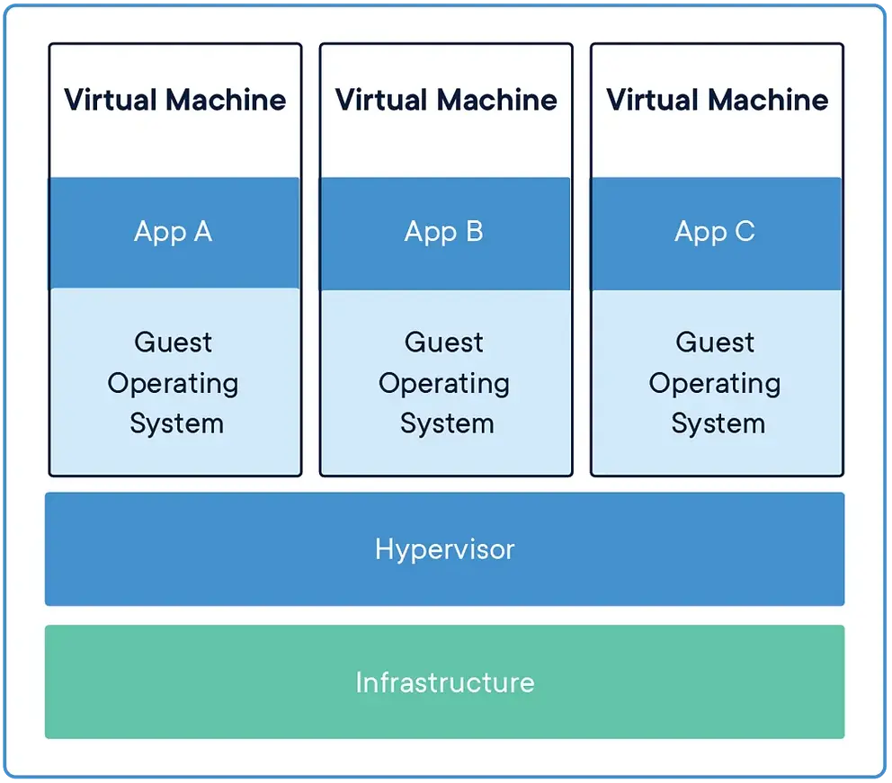
<figcaption>Virtual Machines</figcaption>
</figure>

Hypervisors are software that creates and runs virtual machines.

??? info "Two types of hypervisors"

    - **Type 1 hypervisor**: Runs directly on the host's hardware to control the hardware and to manage guest operating systems. Examples include VMware ESXi, Microsoft Hyper-V, and Xen.
    - **Type 2 hypervisor**: Runs on a conventional operating system just like other computer programs. Examples include VMware Workstation, Oracle VirtualBox, and Parallels Desktop.

    Usually, we use Type 2 hypervisors for personal use. There are many Type 2 hypervisors available, such as VMware Workstation, Oracle VirtualBox, and Parallels Desktop.

You can choose whatever hypervisor you like. In this course, we recommend using [VMware Workstation Pro](https://www.vmware.com/products/desktop-hypervisor.html) on Windows and Linux, or [VMware Fusion](https://www.vmware.com/products/fusion.html) on macOS. They are free for personal use since [May 13, 2024](https://blogs.vmware.com/workstation/2024/05/vmware-workstation-pro-now-available-free-for-personal-use.html).

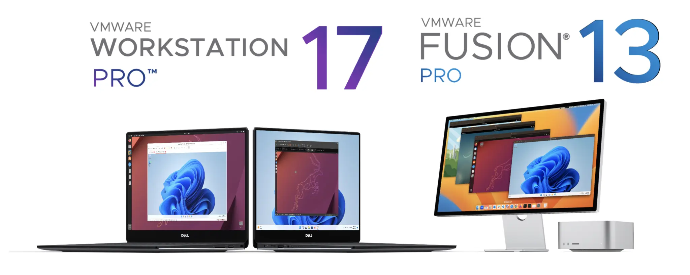

!!! question "Task 1.2: Download and install VMware Hypervisor"

    Watch this video to learn how to download and install VMware Workstation: [:simple-youtube: VMware Workstation Pro is Now FREE (How to get it)](https://www.youtube.com/watch?v=66qMLGCGP5s)

    - [VMware Workstation Pro](https://support.broadcom.com/group/ecx/productdownloads?subfamily=VMware%20Workstation%20Pro)
    - [VMware Fusion](https://support.broadcom.com/group/ecx/productdownloads?subfamily=VMware%20Fusion)

    (When filling out the download form, you can use any information like address, etc. It's common for large companies to have such tedious download processes 😵.)

!!! question "Task 1.3: Create a new virtual machine and install Debian"

    !!! warning "Please read the installation instructions carefully."

        If the following instructions don't mention a specific step, leave it as default.

    === "Step 1 (Windows)"

        Select the downloaded Debian ISO image as the installation media. Create a new virtual machine.

        <center>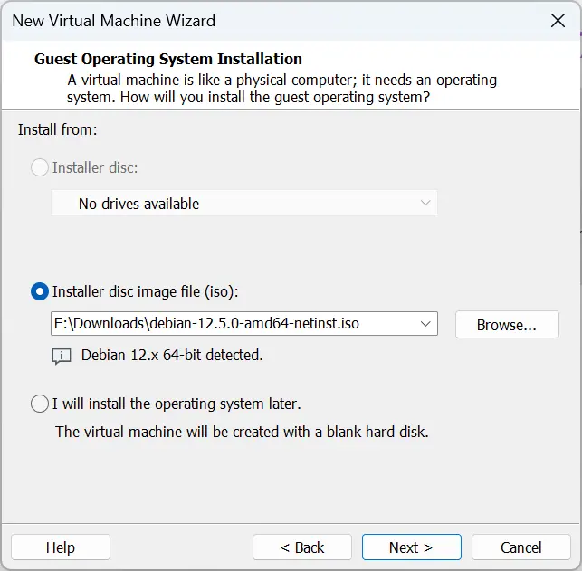{ width=80% }</center>

        Here is my configuration:

        <center>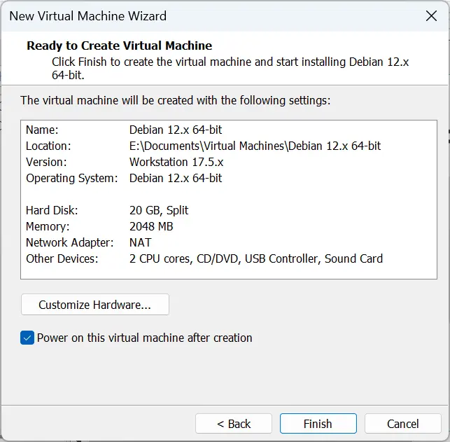{ width=80% }</center>

    === "Step 1 (macOS)"

        Select the downloaded Debian ISO image as the installation media. Create a new virtual machine.

        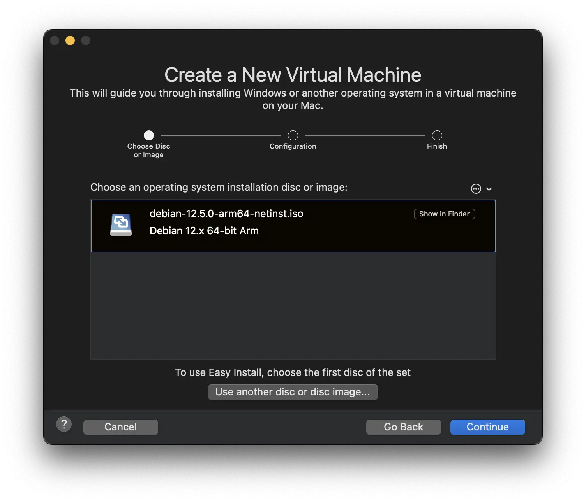

        Here is my configuration:

        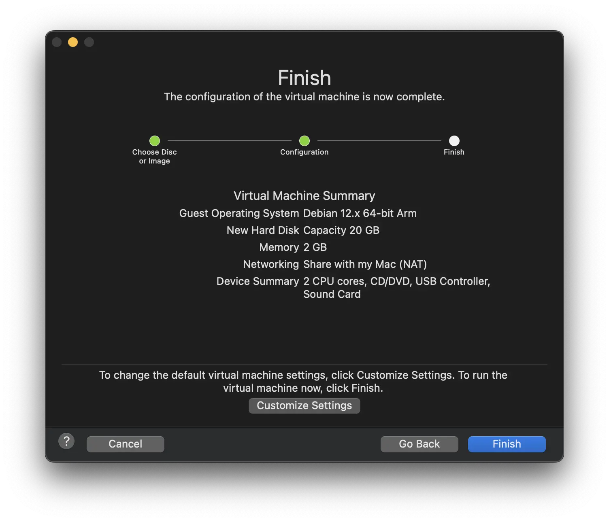

    === "Step 2"

        Run the virtual machine and install Debian. (We recommend to choose `Install` but not `Graphical install`.)

        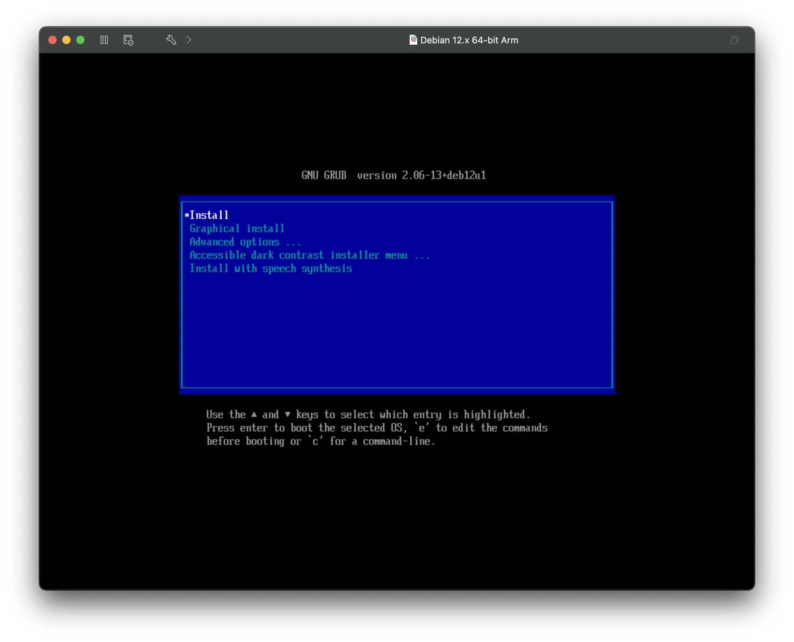

        Please **choose English as the language**.

        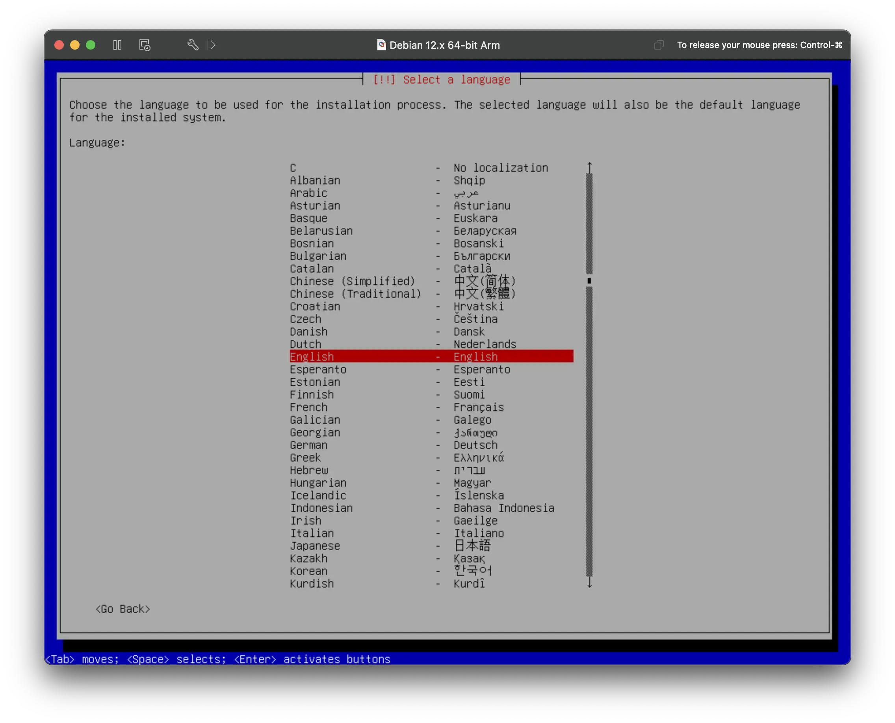

    === "Step 3"

        You can change hostname, domain name, etc. as you like.

        Don't set a root password. Read the text on the screen carefully.

        > If you leave this empty, the root account will be disabled and the system's initial user will be given the power to become root using the `sudo` command.

        So, if you set a root password, you will need to add yourself to the `sudo` group later manually.

        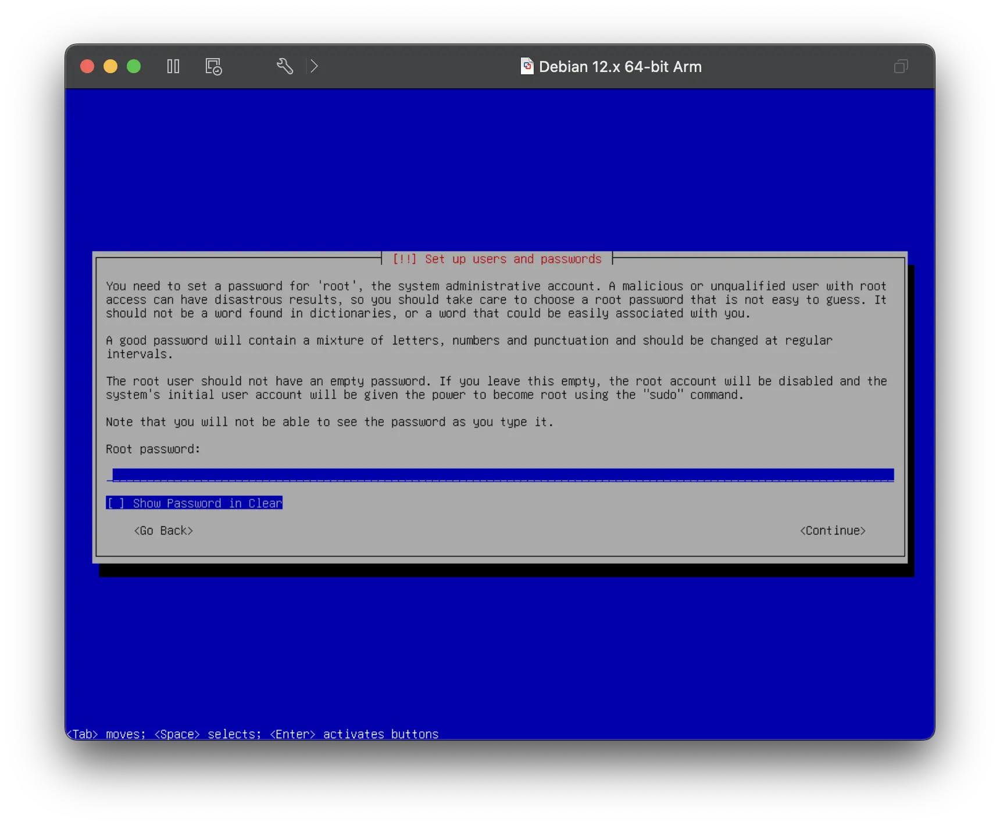

        Then set up your user account. Use the entire disk for the installation.

        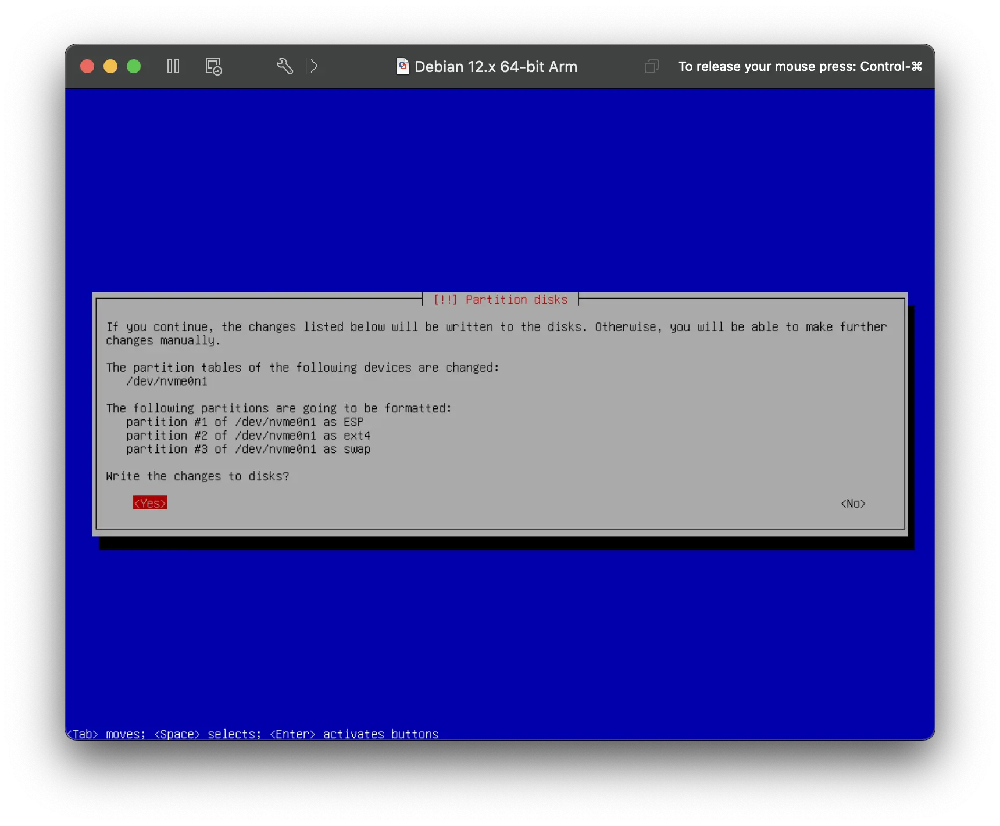

    === "Step 4"

        Configure the package manager. Choose `enter information manually` and set the mirror to `mirrors.zju.edu.cn`.

        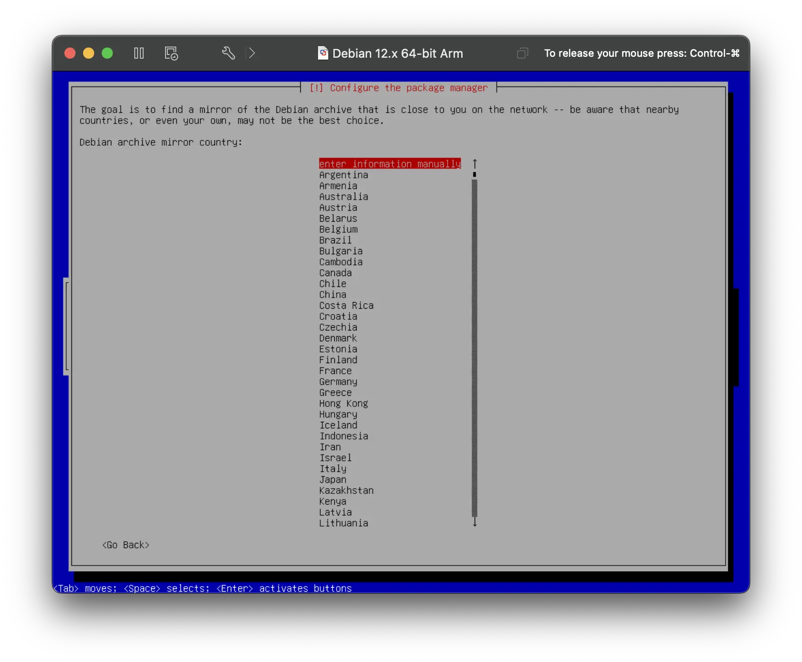

        

        Notice in the `Software selection` step, you need to select `SSH server` and `standard system utilities`, and cancel the selection of any other options. The text at the bottom of the screen will tell you how to navigate the menu.

        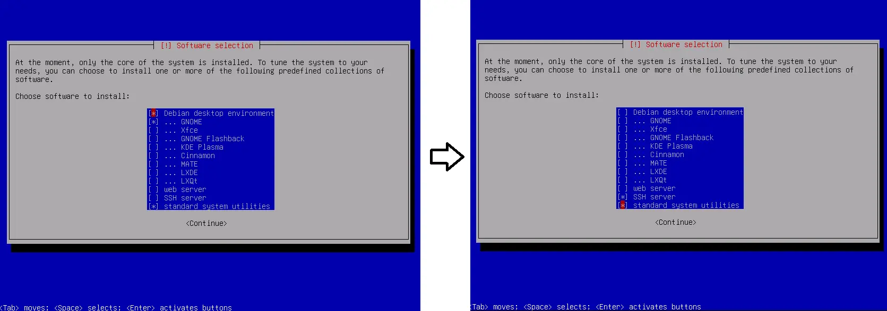

    === "Step 5"

        In the `Configuring grub-pc` step, should choose `/dev/sda` as the device for boot loader installation. Otherwise, you may not be able to boot into the system.

        <center>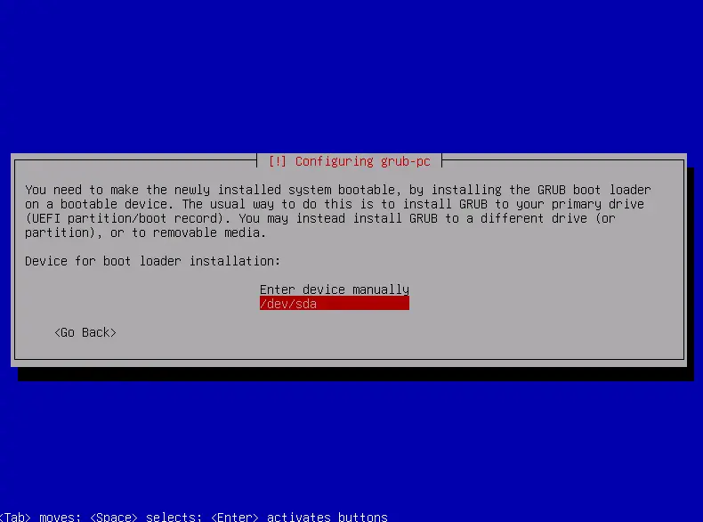{ width=80% }</center>

        Installation finished. Usually you don't need to remove the installation media manually because the virtual machine will try to boot from the disk first.

        

        After rebooting, you can log in with the user account you created.

        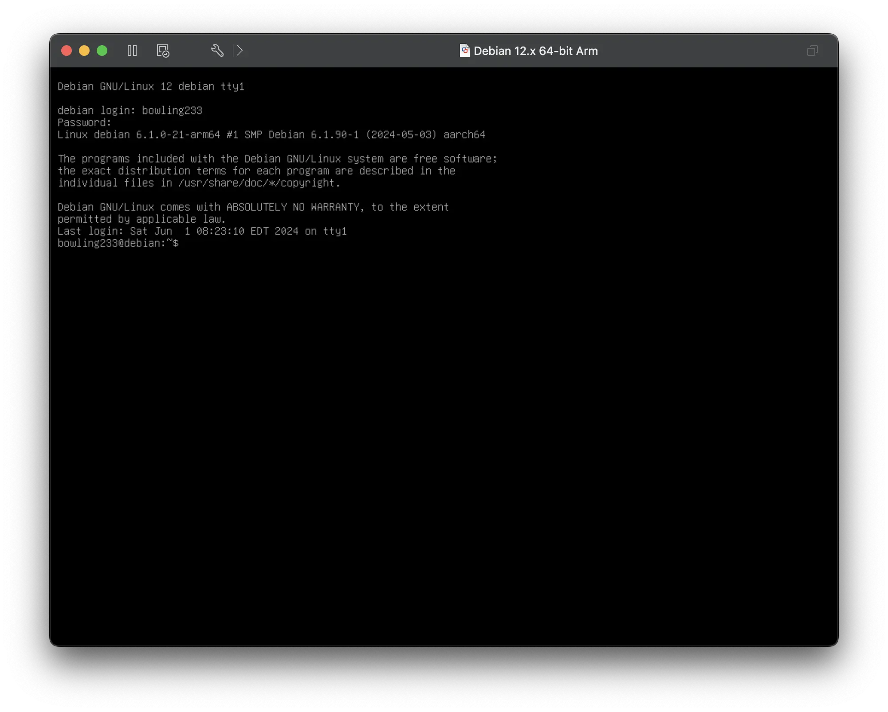

## Linux Basics

### Command Line Interface (CLI)

Read [The Linux command line for beginners - Ubuntu](https://ubuntu.com/tutorials/command-line-for-beginners#1-overview). Begin with section 1 and stop at section 5.

!!! question "Task 2.1: Answer the following questions"

    1. What is terminal, shell and prompt? Find definitions from the article.
    2. What commands did you learn from the article?
    3. Try to learn `nano`. Use it to create a file and write some text.

??? success "Check your answer"

    1. Answers:
        - Terminal: They would just send keystrokes to the server and display any data they received on the screen.
        - Shell: By wrapping the user’s commands this “shell” program, as it was known, could provide common capabilities to any of them, such as the ability to pass data from one command straight into another, or to use special wildcard characters to work with lots of similarly named files at once.
        - Prompt: That text is there to tell you the computer is ready to accept a command, it’s the computer’s way of prompting you.
    2. Examples:

        ```text
        cd pwd mkdir ls cat echo less mv rm rmdir
        ```
    3. Show your screenshot of using `nano`.

### Linux File System

Watch [:simple-youtube: Linux File System Explained!](https://www.youtube.com/watch?v=bbmWOjuFmgA)

!!! question "Task 2.2: Answer the following questions"

    1. Where is your location when you first log in?
    2. Where are the homes for executable binaries?
    3. What is `/usr` stands for?
    4. What's in `/usr/local/bin`?
    5. Where are the configuration files stored?

??? success "Check your answer"

    1. `/home/username`
    2. `/bin`, `/sbin`, `/usr/bin`, `/usr/local/bin`.
    3. `/usr` stands for "Unix System Resources".
    4. `/usr/local/bin` holds executables installed by the admin, usually after building them from source.
    5. `/etc`

### The Advanced Packaging Tool (APT)

Unlike Windows, where you need to download software from the internet and install it manually (this can be dangerous), Linux distributions have package managers that allow you to install software from a central repository.

For Debian-based distributions, the package manager is called `apt`. You can use `apt` to install, update, and remove software packages. For example, to install the `htop` package, you can run:

```bash
sudo apt update
sudo apt install htop
```

The first command updates the local package list from the repository, and the second command installs the `htop` package.

You can edit the `/etc/apt/sources.list` file to change the repository mirror. Read [SourceList - Debian Wiki](https://wiki.debian.org/SourcesList) to learn more about the `sources.list` file.

If you are finding a package, you can use [pkgs.org](https://pkgs.org/) to search for the package and find the repository.

??? note "[Why you need repository mirrors?](https://askubuntu.com/questions/913180/what-are-mirrors)"

    On the Internet, distance matters. In fact, it matters a lot. A long connection can cause high latency, slower connection speeds, and pretty much all the other classic issues that data has when it needs to travel across an ocean and half a continent. Therefore, we have these distributed mirrors. People connect to their physically nearest one (as it's usually the fastest -- there are some exceptions) for the lowest latency and highest download speed.

!!! question "Task 2.3: Answer the following questions"

    === "Question 1"

        One student encountered an error when running `sudo apt update`. The error message is:

        ```text
        Ign:1 cdrom://[Debian GNU/Linux 11.0.0 _Bullseye_ - Official amd64 DVD Binary-1 20210814-10:04] bullseye InRelease
        Err:2 cdrom://[Debian GNU/Linux 11.0.0 _Bullseye_ - Official amd64 DVD Binary-1 20210814-10:04] bullseye Release
        Please use apt-cdrom to make this CD-ROM recognized by APT. apt-get update cannot be used to add new CD-ROMs
        Hit:3 <http://security.debian.org/debian-security> bullseye-security InRelease
        Hit:4 <http://deb.debian.org/debian> bullseye InRelease
        Hit:5 <http://deb.debian.org/debian> bullseye-updates InRelease
        Reading package lists... Done
        E: The repository 'cdrom://[Debian GNU/Linux 11.0.0 _Bullseye_ - Official amd64 DVD Binary-1 20210814-10:04] bullseye Release' does not have a Release file.
        N: Updating from such a repository can't be done securely, and is therefore disabled by default.
        N: See apt-secure(8) manpage for repository creation and user configuration details.
        ```

        And here is the content of the `/etc/apt/sources.list` file:

        ```text title="/etc/apt/sources.list"
        deb cdrom:[Debian GNU/Linux 11.0.0 _Bullseye_ - Official amd64 DVD Binary-1 20210814-10:04] bullseye main
        ```

        What is the problem? How to solve it?

        ??? success "Check your answer"

            The problem is that the `cdrom` repository is not available. You can remove the `cdrom` repository from the `/etc/apt/sources.list` file and add the correct repository. Then run `sudo apt update` again.

    === "Question 2"

        One student can't install the `nvtop` package. The error message is:

        ```text
        Reading package lists... Done
        Building dependency tree... Done
        Reading state information... Done
        E: Unable to locate package nvtop
        ```

        And here is the content of the `/etc/apt/sources.list` file:

        ```text title="/etc/apt/sources.list"
        deb http://deb.debian.org/debian bullseye main
        deb http://deb.debian.org/debian bullseye-updates main
        deb http://security.debian.org/debian-security bullseye-security main
        ```

        What is the problem? How to solve it?

        !!! tip "Hint: use [pkgs.org](https://pkgs.org/) to search for the package's component."

        ??? success "Check your answer"

            The problem is that the `nvtop` package is not available in the `main` component of the repository. You can add the correct repository to the `/etc/apt/sources.list` file and run `sudo apt update` again.

    === "Question 3"

        One student can't install the `htop` package. The error message is:

        ```text
        Reading package lists... Done
        Building dependency tree... Done
        Reading state information... Done
        E: Unable to locate package htop
        ```

        And here is the content of the `/etc/apt/sources.list` file:

        ```text title="/etc/apt/sources.list"
        Types: deb
        URIs: <https://mirrors.zju.edu.cn/debian/>
        Suites: trixie trixie-updates trixie-backports
        Components: main contrib non-free non-free-firmware

        Types: deb
        URIs: <https://mirrors.zju.edu.cn/debian-security/>
        Suites: trixie-security
        Components: main contrib non-free non-free-firmware
        Signed-By: /usr/share/keyrings/debian-archive-keyring.gpg
        ```

        What is the problem? How to solve it?

        ??? success "Check your answer"

            For Deb822-style Format sources, each file needs to have the `.sources` extension. So you need to rename the file to `/etc/apt/sources.list.d/trixie.sources` and run `sudo apt update` again.

## Access the Virtual Machine using SSH

### Network Basics

Do you know the following concepts?

- IP address
- MAC address
- Subnet mask
- Gateway
- Port
- Port forwarding

If you are not familiar with these concepts, watch the following video to learn more about network:

- [:simple-bilibili: IP、MAC、DHCP 与 ARP](https://www.bilibili.com/video/BV1CQ4y1d728)
- [:simple-bilibili: IP 与 NAT](https://www.bilibili.com/video/BV1DD4y127r4)

### Network in Virtual Machines

Watch this video to understand network in the virtual machines: [:simple-bilibili: 虚拟机网络模式](https://www.bilibili.com/video/BV11M4y1J7zP).

!!! question "Task 3.1: Ping the virtual machine"

    === "Step 1"

        Check if the network mode of the virtual machine is set to `NAT`.

        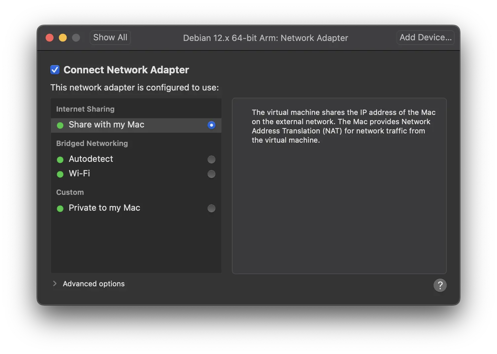

    === "Step 2"

        Start the virtual machine and log in. Use the `ip addr` command to find the IP address of the virtual machine.

        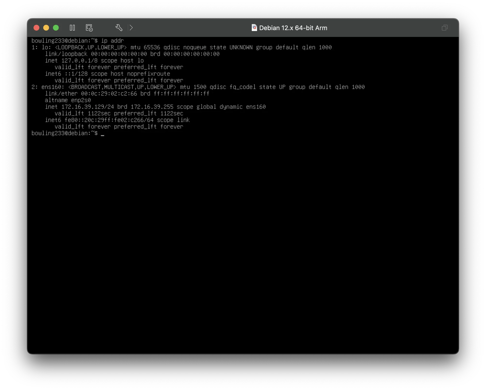

        From the screenshot, the virtual machine has two network interfaces: `ens160` and `lo`. The latter is the loopback interface, and the former is the network interface used to connect to the network. We can see that the IP address of the virtual machine is `172.16.39.129`.

    === "Step 3"

        Open a terminal on your host machine and ping the virtual machine.

        ```bash
        ping IP_ADDRESS
        ```

        Replace `IP_ADDRESS` with the IP address of the virtual machine.

        The correct output should look like this:

        ```text
        PING 172.16.39.129 (172.16.39.129): 56 data bytes
        64 bytes from 172.16.39.129: icmp_seq=0 ttl=64 time=5.485 ms
        64 bytes from 172.16.39.129: icmp_seq=1 ttl=64 time=0.695 m
        ```

### SSH

Secure Shell (SSH) is a cryptographic network protocol for operating network services securely over an unsecured network. The best-known example application is for remote login to computer systems by users.

??? info "Asymmetric Encryption"

    SSH uses asymmetric encryption to secure the connection between the client and the server. In asymmetric encryption, two keys are used: a public key and a private key. The public key is used to encrypt the data, and the private key is used to decrypt the data.

    When you connect to an SSH server, the server sends its public key to the client. The client uses this public key to encrypt a random session key and sends it back to the server. The server uses its private key to decrypt the session key and establish a secure connection.

    The public key is shared with others, while the private key is kept secret.

    For more information, watch this video: [:simple-youtube: Asymmetric Encryption - Simply explained](https://www.youtube.com/watch?v=AQDCe585Lnc)

<figure markdown="span">
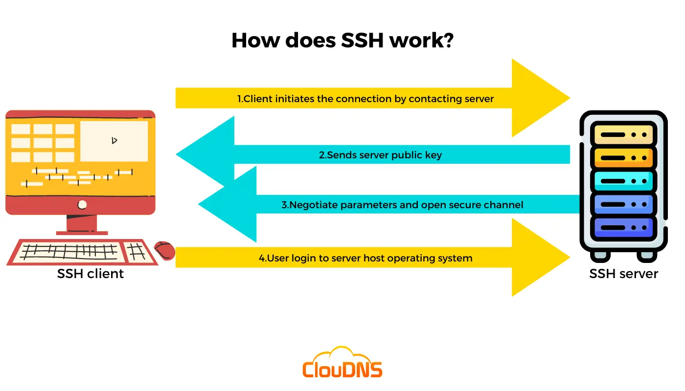
<figcaption>SSH</figcaption>
</figure>

!!! question "Task 3.2: Connect to the virtual machine using SSH"

    === "Step 1"

        To use SSH, you need to install an SSH client on your computer. On Linux and macOS, the SSH client is usually pre-installed. On Windows, you can follow the instructions [Get started with OpenSSH for Windows - Microsoft](https://learn.microsoft.com/en-us/windows-server/administration/openssh/openssh_install_firstuse?tabs=gui#install-openssh-for-windows) to install the OpenSSH client.

    === "Step 2"

        You also need to install an SSH server on the virtual machine. On Debian-based distributions, you can install the `openssh-server` package:

        ```bash
        sudo apt update
        sudo apt install openssh-server
        ```

    === "Step 3"

        After installing the SSH server, you can use the `ssh` command to connect to the virtual machine:

        ```bash
        ssh username@IP_ADDRESS
        ```

        Replace `username` with your username on the virtual machine and `IP_ADDRESS` with the IP address of the virtual machine.

        It will ask you to enter the password of the user account. After entering the password, you will be logged in to the virtual machine.

        

        Show the screenshot of your successful connection.

Now you can copy and paste commands to this terminal. You can also use the `scp` command to copy files between your computer and the virtual machine. You can also connect your VSCode to the virtual machine using the Remote-SSH extension, but don't rely on it too much.

## More on Linux

### Users and Permissions

Watch this video to learn about:

- Users and Groups: [:simple-youtube: Linux Crash Course - Managing Users](https://www.youtube.com/watch?v=19WOD84JFxA)
- Permissions: [:simple-youtube: Linux File Permissions in 5 Minutes | MUST Know!](https://www.youtube.com/watch?v=LnKoncbQBsM)

### Environment Variables

Read this article to learn about environment variables: [How to Set and List Environment Variables in Linux](https://linuxize.com/post/how-to-set-and-list-environment-variables-in-linux/).

!!! question "Task 4.1: Answer the following questions"

    1. What is the `$HOME` environment variable used for? What is the value of `$HOME` for you and the root user?
    2. What is the difference between the `chmod` and `chown` commands?
    3. What is the difference between the `rwx` permissions for a file and a directory?

??? success "Check your answer"

    1. Answers:
        - The `$HOME` environment variable is used to store the path to the current user's home directory.
        - The value of `$HOME` for you is `/home/username`, and the value of `$HOME` for the root user is `/root`.
    2. `chmod` is used to change the permissions of a file or directory, while `chown` is used to change the owner of a file or directory.
    3. For a file, `rwx` permissions mean read, write, and execute permissions. For a directory, the execute permission is used to list the contents of the directory.

## Git

Git is a distributed version control system that is widely used in software development. It allows multiple developers to work on the same project simultaneously and track changes to the codebase over time.

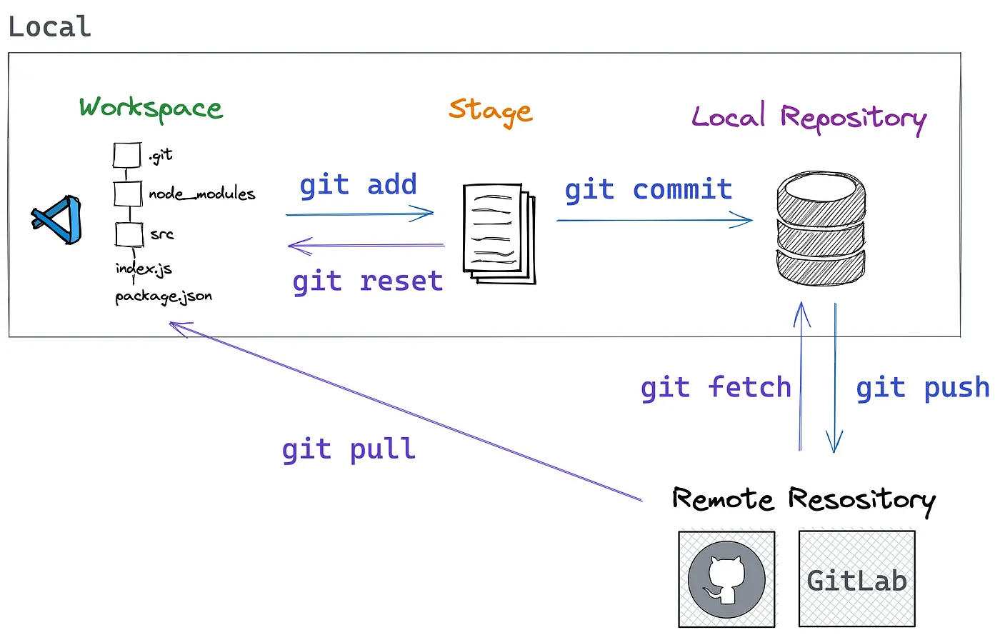

!!! warning "Do the following tasks on your **host machine**."

### Register a ZJU Git account

!!! question "Task 5.1: Go to [ZJU Git](https://git.zju.edu.cn) and register an account."

### Configure Public Key

!!! question "Task 5.2: Generate an SSH key and add it to your ZJU Git account."

    === "Step 1"

        Follow this guide to generate an SSH key: [:simple-github: Generating a new SSH key and adding it to the ssh-agent](https://docs.github.com/en/github/authenticating-to-github/generating-a-new-ssh-key-and-adding-it-to-the-ssh-agent).

        Please take care of your **private** key, don't share it with anyone. And for the **public** key, you can share it with anyone who needs it.

        We strongly suggest you to use `ed25519` algorithm instead of `rsa` for better security with shorter key length, unless you want to end up being like this when sharing your SSH **public** key:

        <figure markdown="span" style="width: 30%;">
        
        </figure>


    === "Step 2"

        Add the public key to your ZJU Git account:

        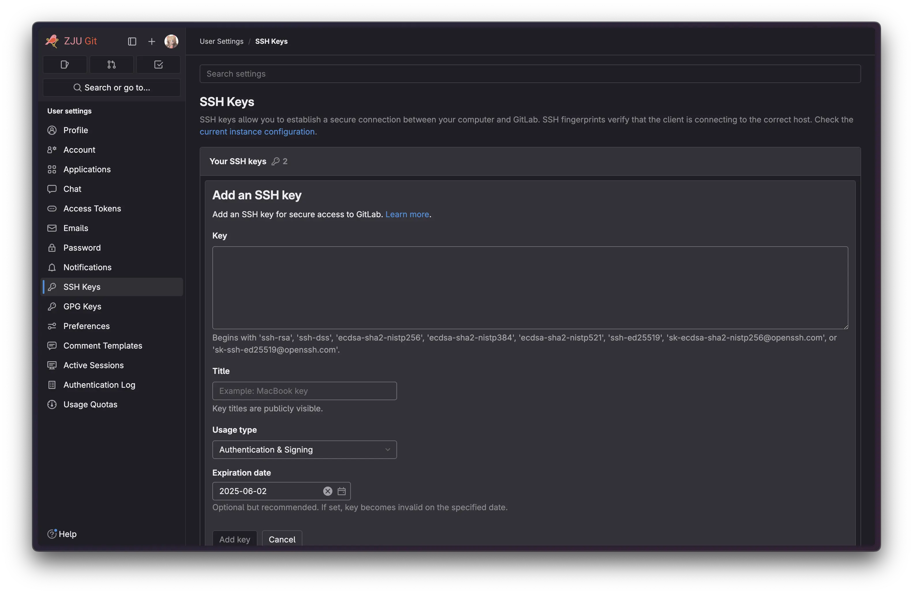

    === "Step 3"

        Test the SSH connection, it should look like this:

        ```bash
        $ ssh -T git@git.zju.edu.cn
        ssh -T git@git.zju.edu.cn
        Welcome to GitLab, @324010****!
        ```

        Show the screenshot of your successful connection.

!!! warning "This public key will be **used to access the clusters** in the future."

## References

- [How do you explain an OS Kernel to a 5 year old?](https://medium.com/@anandthanu/how-do-you-explain-an-os-kernel-to-a-5-year-old-92a08755e014)
- [Virtual machines in Azure](https://medium.com/@syed.sohaib/virtual-machines-in-azure-7efdee4df802)
