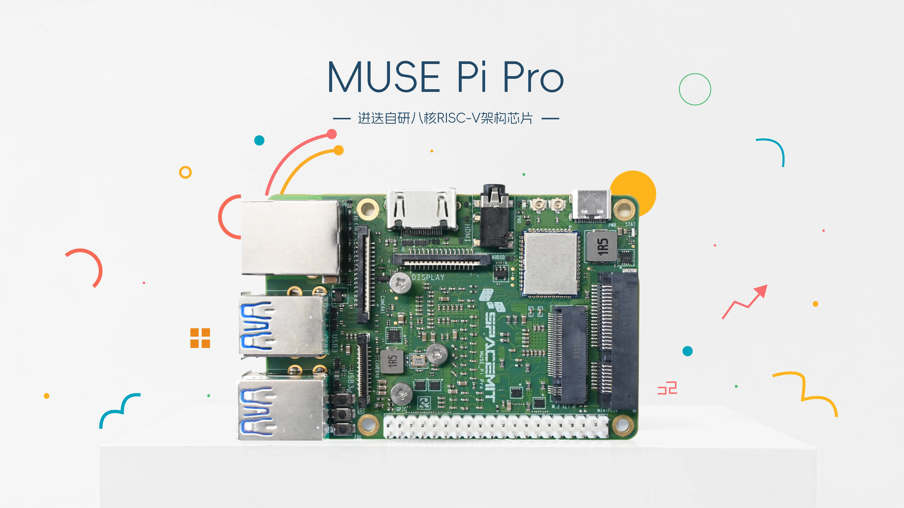
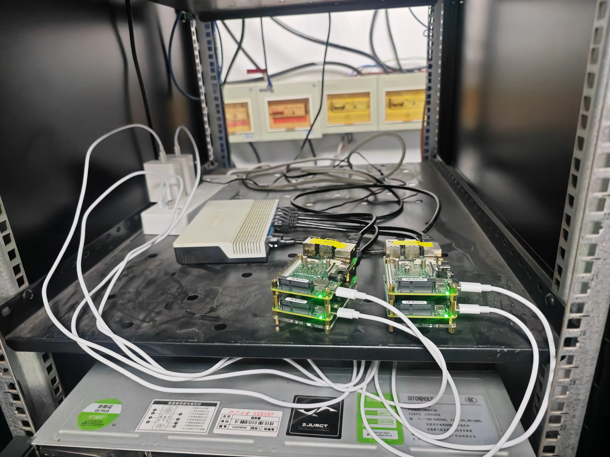
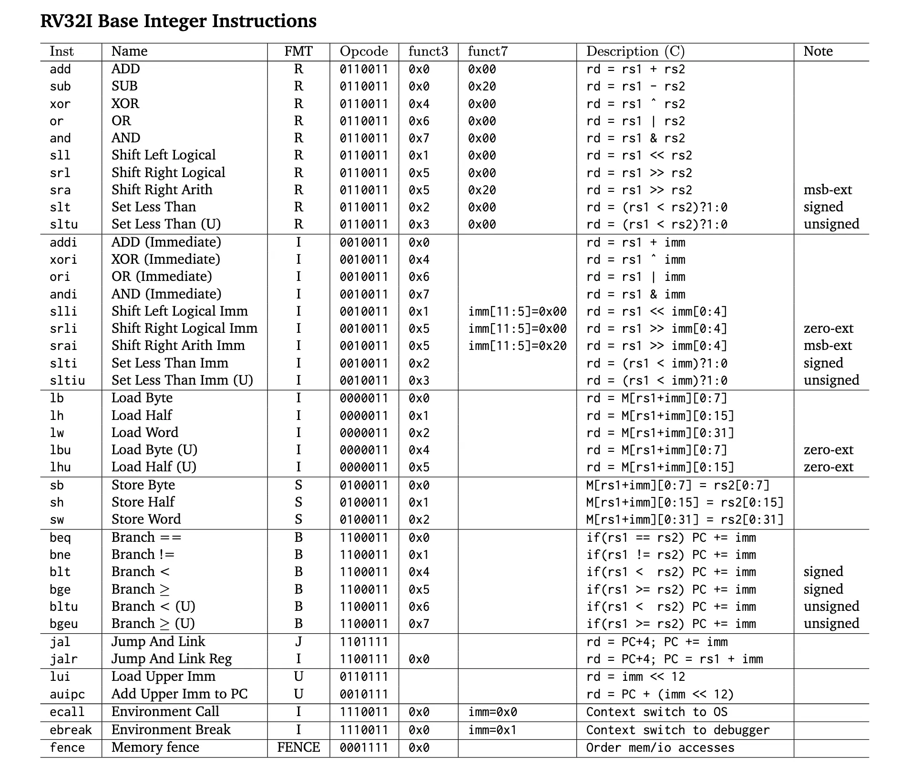
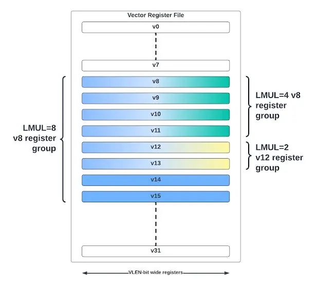
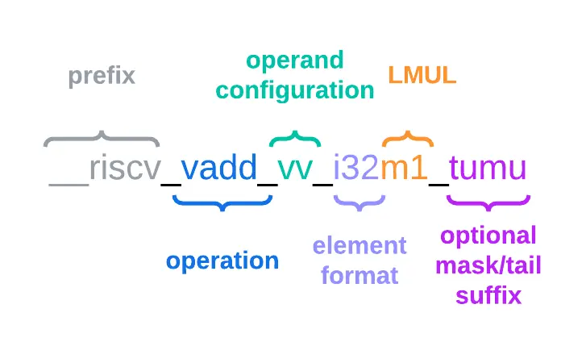
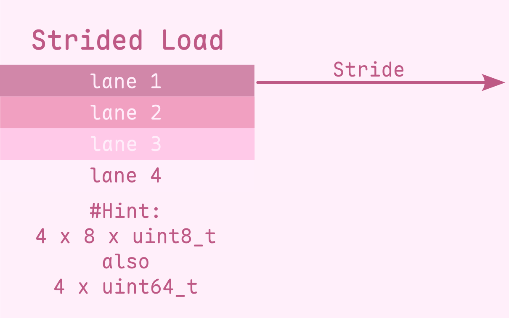
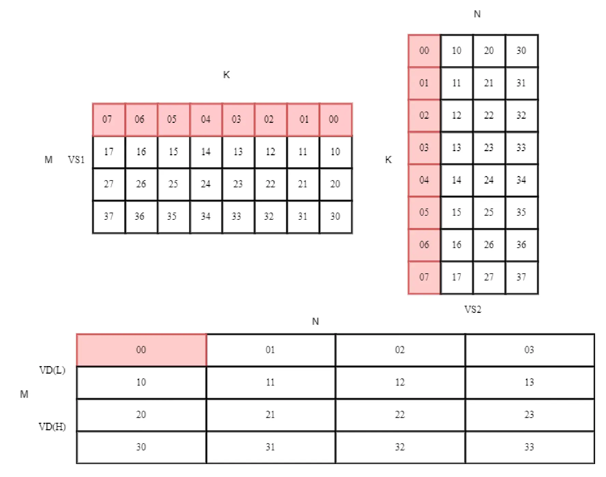
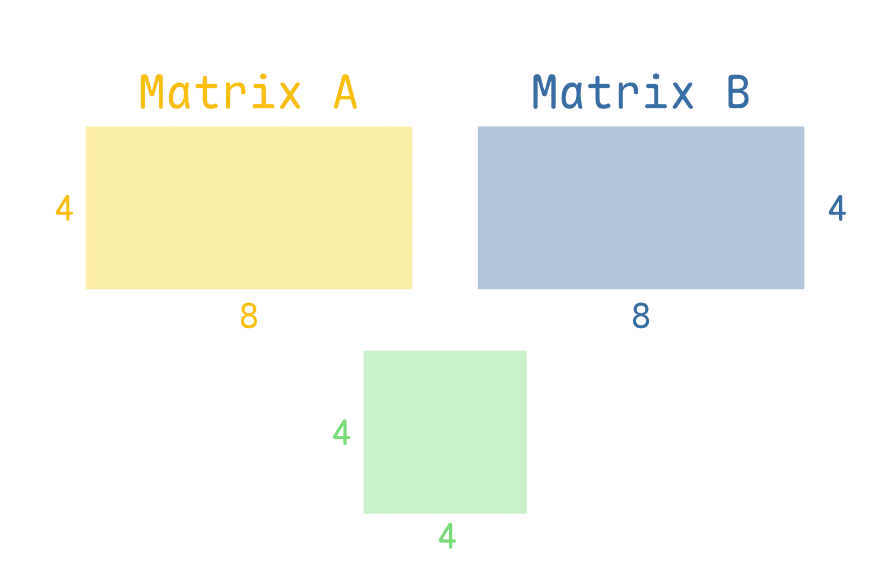
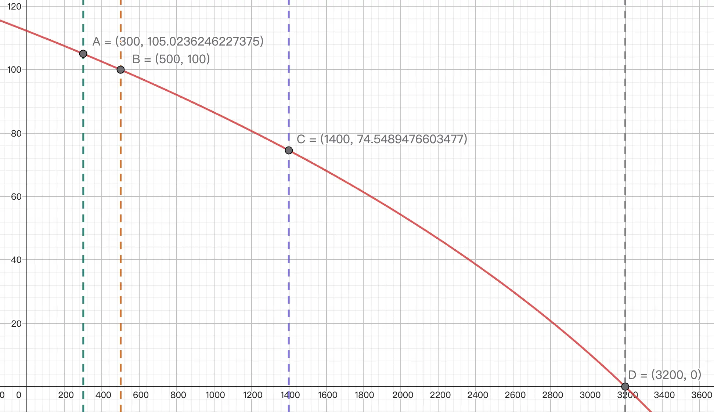

# 实验 2.5: 向量化进阶 (RISC-V)

!!! info "实验信息"

    负责助教：李晨潇, 刘烨, 洪奕迅

!!! tip "Sponsor Segue"

    本实验所使用的集群节点为 [进迭时空](https://www.spacemit.com/) 为短学期课程建设提供的 [Muse Pi Pro 开发板](https://www.spacemit.com/spacemit-muse-pi-pro/)。

    <div style="display: flex; width: 100%; align-items: center;">
        <div style="width: 56%; text-align: center; padding: 0 10px;">
            
        </div>
        <div style="width: 44%; text-align: center; padding: 0 10px;">
            
        </div>
    </div>
    
    这些开发板与超算队维护的 x86-64 节点一样，位于 510 机房，并接入了自动化构建的 Linux rootfs，以及 Slurm 集群调度，与 x86-64 节点共享家目录文件。它们的节点编号是 `rv00`-`rv03`, 位于 Slurm 的 `riscv` 分区。
    
    本实验截止后，这些节点也会继续面向同学们开放，欢迎大家积极体验！

## 实验目的

本实验在「实验 2: 向量化计算」相同背景的基础上，以 RISC-V 的 V (Vector) 和进迭时空的 IME 矩阵扩展为例，向同学们介绍与 AVX, AMX 不同的向量 / 矩阵扩展设计思路。旨在让感兴趣的同学了解开放指令集架构 RISC-V 的生态，学习能够适配不同向量单元长度的向量扩展的设计，进而对向量化加速有更深入的理解。

## 知识讲解: RISC-V 指令集

<div style="display: flex; width: 100%; align-items: center; justify-content: center;">
    <div style="width: 50%; text-align: center; padding: 0 10px;">
        
    </div>
</div>

RISC-V 是一个开源的、基于精简指令集（RISC）原则的指令集架构（ISA）。 RISC-V 诞生于 2010 年，并逐渐发展成为一个全球性的开放协作项目，被认为是继 x86 和 ARM 之后，全球三大主流指令集架构之一。与后者不同的是，RISC-V 属于开放的、非盈利性质的 [RISC-V 国际基金会](https://community.riscv.org)。这样的初衷是确保 RISC-V 生态不受某家公司或某个国家的影响。

RISC-V 的主要特点和优势包括：

- **开源和开放**：
    RISC-V 是一种开放的ISA，这意味着任何人都可以免费使用、修改和分发它，无需支付许可费用，这促进了创新和合作
- **模块化和可扩展**：
    RISC-V 的设计是模块化的，允许用户根据需求定制指令集，支持不同位宽的处理器（32位、64位、128位等）
- **简洁高效**：
    RISC-V 采用了精简指令集原则，指令集相对简单，易于实现和理解，有助于提高能效和降低功耗。因此目前有越来越多的低功耗 MCU 采用 RISC-V 指令集。
- **全球社区支持**：
    RISC-V 得到了全球范围内的广泛社区支持，有来自学术界和产业界的众多贡献者参与其中。

RISC-V 采用模块化指令设计，它包含基础指令集和扩展指令集两部分。其中基础指令集是最小的指令子集，只要配上相应的特权态 (privileged) 指令集，它就能够保证运行起一个操作系统。在完成基础指令集的基础上，开发者可以选择所需要的扩展指令集模块用以完成自己的需求，例如乘除法扩展指令集 "M"，浮点指令集"F"，向量指令集 "V" 等。

对于 32 位的 RV32I 而言，RISC-V 最基础的整数指令集只有 40 条指令，而 64 位的 RV64I 也只是增加了一些 64 位数据的访存指令。下面是 [riscv-card](https://github.com/jameslzhu/riscv-card) 汇总的 RV32I 基础整数指令集的指令定义与功能（**这部分仅需简单了解**，因此中间有关指令编码的 Opcode, Funct3 和 Funct7 三列可以忽略）



与 x86-64 对比而言，精简指令集 (RISC: Reduced Instruction Set Computer) 往往使用定长的、简单的指令，而复杂指令集往往使用变长的、复杂的指令。

比如 x86-64 的内存访存指令 `mov` 的操作数既可以是寄存器，也可以是内存地址，且这个内存地址的偏移量可以经过很复杂的计算。而这需要 RISC-V 中的 `ld`, `sd`, `mv` 以及算数指令等多条指令配合才能实现相同的功能。

```asm
# x86-64
mov rax, qword ptr [rbx + rcx * 8 + 0x20]

# RISC-V (rax: x1, rbx: x2, rcx: x3)
slli  t0, x3, 3          # t0 = (x3 << 3) = x3 * 8
add   t0, t0, x2         # t0 = x2 + x3 * 8
ld    x1, 0x20(t0)       # x1 = *(t0 + 0x20) = *(x2 + x3 * 8 + 0x20)
```

又比如，x86-64 的一条指令长度可以是 1-16 个字节，这需要更多的电路设计来完成指令解码。而 RISC-V 中的指令长度是固定的，为 4 字节 (C 扩展中的指令为 2 字节)，这降低了 CPU 设计的复杂度。

## 知识讲解: RISC-V Vector 向量化扩展

RISC-V 的 V 扩展 (RVV) 是 RISC-V 的向量化指令扩展，其设计思路采用向量机的形式。

从设计上来讲，RVV 及 ARMv9 的向量扩展 SVE，与 x86-64 的 AVX 要求 CPU 必须包含指定长度的向量单元 (128, 256, 512 位) 不同，为了适应不同硬件，RISC-V V 扩展允许硬件厂商根据硬件设计，选择支持不同的向量单元长度。只要程序员编码的逻辑正确，相同的程序便可以运行在不同向量单元长度的硬件上，扩展了程序的兼容性和灵活性。在本次实验里，我们就会学习如何通过编程实现这一点。

相比之下，Intel 因为自家的能效核心不支持 512 位的向量操作，不得不[放弃在 12 代酷睿 CPU 上支持 AVX-512 指令集扩展](https://www.techpowerup.com/290460/intel-to-disable-rudimentary-avx-512-support-on-alder-lake-processors)，即使同一颗 CPU 的性能核心支持 AVX-512.

RVV 的 1.0 标准在 2021 年 11 月正式被批准 (Ratified)，且未来的改动需要保持对该正式版标准的兼容性。本次实验所使用的 Muse Pi Pro 是目前为数不多的支持 RVV 1.0 标准的开发板。当然，随着未来 RISC-V 生态的发展，更多支持 RVV 1.0 标准的高性能芯片也会逐渐推出。


### 基本概念

#### 硬件参数: ELEN 与 VLEN

对于每个支持向量扩展的硬件线程 (hart / hardware thread) 都有如下的两个硬件参数:

- ELEN: 单条指令能处理的最大向量位宽, ELEN $\ge 8$
- VLEN: 一个向量寄存器的位宽
    - RVV 定义了 32 个向量寄存器 `v0` - `v31`，每个寄存器宽度为 VLEN.

ELEN 和 VLEN 都必须满足是 $2$ 的幂次，目前的标准中要求 VLEN $\ge$ ELEN, 也就是单条指令处理的数据位宽不能超过单个向量寄存器的位宽。

!!! example "举个例子"

    本次实验所使用的 Muse Pi Pro 拥有 256 位向量运算单元，且单个数据的最大位宽是 64-bit，那么:

    - ELEN = 64
    - VLEN = 256

    上面两个参数是由硬件决定的，在不修改配置的情况下，可以认为是固定的参数。

#### 运行参数: SEW 与 LMUL

在上面的例子中，通过计算可以得知，Muse Pi Pro 上一个向量寄存器可以存储 4 个 64-bit 数据，或者 8 个 32-bit 数据，再或者 32 个 8-bit 数据，以此类推。

那么在程序实际运行的时候，是什么在控制一条指令到底操作什么数据类型 (如 `int8`, `int32`)，以及操作多少个数据呢？这就要提到 SEW 和 LMUL 两个运行时参数了，它们的功能是:

- SEW: 指定单个向量元素的位宽 (Selected Element Width)
- LMUL: 指定单个指令操作向量长度的倍数，也可以理解为向量寄存器个数 (Length Multiplier)

这两个参数在使用 Intrinsic 编程时，可以由编译器自动设置，而手写汇编时，则需要我们手动进行设置，后面我们都会介绍。

!!! example "举个例子"

    在本次实验中，我们需要对 8-bit 整数进行操作，那么就需要在程序中设置 SEW = 8. 
    
    如果我们希望一条指令只操作 1 个向量寄存器，那么 `LMUL = 1`。我们还可以设置 `LMUL = 2, 4, 8` 等，让一条指令操作更多的向量寄存器。在这种情况下，指令中所编码的那个向量寄存器，以及其后面一共 `LMUL` 个寄存器都会被视为一个整体，进行相同的操作。

    如果 `SEW = 8, LMUL = 4`，那么一条指令将会操作 4 个向量寄存器的数据，每个寄存器可以存储 32 个 8-bit 整数，那么一共便可操作 128 个 8-bit 整数。

    如果你还是没有理解的话，可以参考下面这张图: ([图源](https://fprox.substack.com/p/risc-v-vector-register-groups))

    <center>

    

    </center>

    !!! danger "常见误区"

        1. 受限于数据访存的带宽、后端有限的运算资源等等制约因素，并非将 LMUL 设置得越大越好，需要具体问题具体分析。一般而言，如果操作很简单，提高 LMUL 可以更好地利用访存带宽，实现一定的加速。
        1. 调整 LMUL 并没有改变单个向量寄存器的位宽，也没有改变硬件上向量运算单元的位宽，它只是改变了单条指令操作的向量寄存器个数，需要注意分辨。


### 编程方式

#### Intrinsic

Intrinsics 是由编译器提供的内建函数，我们可以通过类似函数调用的方式，直接调用底层 RVV 指令，而且还无需考虑寄存器分配的问题。与汇编相比，intrinsics 可读性更高，易于维护，同时仍能获得接近手写汇编的性能。使用 intrinsics 可以更方便地进行向量化编程，而不需要深入底层汇编语言。

使用 RISC-V 的 Intrinsic 需要添加头文件 `#include <riscv_vector.h>`.

下面是一个使用 Intrinsic 进行 RVV 编程的例子:

```c
// test.cpp
#include <stdio.h>
#include <riscv_vector.h>

float c[8];

int main() {
    size_t vl = __riscv_vsetvlmax_e32m1();
    // Initialize two vector registers
    vfloat32m1_t vec_a = __riscv_vfmv_v_f_f32m1(2.0f, vl);
    vfloat32m1_t vec_b = __riscv_vfmv_v_f_f32m1(1.0f, vl);
    
    // Calculate vec_c = vec_b + 2.0 * vec_a
    vfloat32m1_t vec_c = __riscv_vfmacc_vf_f32m1(vec_b, 2.0f, vec_a, vl);
    // Store the result to c array
    __riscv_vse32_v_f32m1(c, vec_c, vl);

    for (int i = 0; i < 8; i++) {
        printf("%f ", c[i]);
    }
    printf("\n");

    return 0;
}
```

```bash
$ clang test.cpp -o test -march=rv64gcv # 需指定 rv64gcv 架构以启用 RVV 特性
$ srun -N 1 -p riscv ./test            
5.000000 5.000000 5.000000 5.000000 5.000000 5.000000 5.000000 5.000000
```

相信大家有了 AVX 的编程经验，上面的代码并不是很难理解。它首先初始化了两个向量寄存器，`vec_a = [2.0, 2.0, ..., 2.0]`, `vec_b = [1.0, 1.0, ..., 1.0]`，然后使用 `__riscv_vfmacc_vf_f32m1` 计算了 `vec_c = vec_b + 2.0 * vec_a`，最后将结果存储到 `c` 数组中。可以看到结果是正确的，为 `[5.0, 5.0, ..., 5.0]`。

RISC-V V Intrinsic 相关资料:

- [RISC-V Intrinsic](https://github.com/riscv-non-isa/rvv-intrinsic-doc/releases/download/v1.0-ratified/v-intrinsic-spec.pdf):
    官方文档，足足有 4027 页，阅读难度较大，不太建议阅读
- [Intrinsic Viewer](https://dzaima.github.io/intrinsics-viewer/#riscv): 社区制作的 Intrinsic 查询工具，将 Intrinsic 按照操作进行了详细的分类，单击一条 Intrinsic 可以给出其对应操作的伪代码，完成「任务一」必看

上面的 [Intrinsic Viewer](https://dzaima.github.io/intrinsics-viewer/#riscv) 是非常重要的资料，它可以帮助我们快速找到想要实现的操作对应的 Intrinsic 指令。在这里，不妨进行一个小测试，请找到两个 float32 类型向量寄存器对应元素相乘的 Intrinsic 指令。 

???- success "Check your answer"

    答案是 `__riscv_vfmul_vv_f32m1`

    首先，因为他是浮点数操作，所以选中左侧菜单栏中的 `Float`, 又因为其涉及乘法，再选中 `Multiply` 选项，这样便可以找到这个 Intrinsic

    Intrinsic 函数名的格式如下图所示: ([图源](https://fprox.substack.com/p/risc-v-vector-programming-in-c-with))

    

#### 数据类型

在上面的示例代码，以及找 Intrinsic 的过程中，你可能会对 `vfloat32m1_t` 这样的类型比较困惑。 这样的类型都以 `v` 开头，以 `_t` 结尾。

中间部分最开始是单个数据的类型，比如 `int8`, `uint8`, `int32`, `float32` 等。接下来的 `m1` 或者 `m2`, `m4`, `m8` 等，就对应着我们之前介绍的 LMUL 参数。

对特定类型的向量操作时，编译器会自动设置不同的 LMUL.

!!! example "举个例子"

    要定义代表着一个存储 8-bit 无符号整数的向量寄存器，我们可以使用 `vuint8m1_t` 类型。

    如果我们希望指代两个存储 32-bit 有符号整数的向量寄存器，则使用 `vint32m2_t` 类型。

#### vsetvl 系列指令

在之前的介绍中，我们提到 RVV 可以自动适应不同的向量长度，那么它是如何实现的呢？这一机制，与 `vsetvl` 系列的指令密切相关。

进行 RVV 向量操作时，CPU 内部会有一个寄存器 `vl` 来记录接下来的指令要处理的元素个数。它的最大值取决于 VLEN、SEW 和 LMUL 三个参数。

比如，如果 `VLEN = 256, SEW = 8, LMUL = 1`，那么 `vl` 的最大值就是 32，因为一个寄存器最多只能存储 32 个 8-bit 整数。如果 vl $< 32$，
那么接下来的操作中，只有前 `vl` 个元素会被处理。

而 `vsetvl` 指令可以根据 SEW、LMUL 以及还有多少个数据待处理，结合 `VLEN` 自动更新 `vl` 的值。我们以下面这张图为例，假如我们要用 for 循环
来处理一个长度为 N 的数组，那么会发生下面的过程:

```c
size_t vl = __riscv_vsetvlmax_e32m1(); // SEW = 32, LMUL = 1
for (size_t i = 0; i < N; i += vl) {
    vl = __riscv_vsetvl_e32m1(N - i);
    // process vl elements
}
```


- 如果剩余待处理的元素 `N - i` 大于一次可以操作的元素个数，通过 `vl = __riscv_vsetvl_e32m1(N - i)` 可以将 `vl` 设置为其最大值，将其全部处理。
- 如果遇到了数组的末尾，剩余元素不足 `vlmax` 时，通过同样的 `vl = __riscv_vsetvl_e32m1(N - i)` 可以将 `vl` 设置为剩余元素个数，而忽略掉多余的元素。

这样一来，通过程序运行时使用 `vsetvl` 系列指令动态设置 `vl` 的值，即使机器的 `VLEN` 不同，数组总长度不同，都可以正确地处理。

!!! danger "注意事项"

    `vsetvl` 不仅会修改 `vl` 的值，也会设置 SEW 和 LMUL:

    - 比如操作 32 位数据，LMUL = 1 时，调用的是 `__riscv_vsetvl_e32m1` 函数
    - 在进行不同数据位宽的操作前，一定要正确调用 `vsetvl` 来更新 SEW 和 LMUL，否则可能会遇到 Illegal Instruction 错误
        - 使用 Intrinsic 编程时，只需注意在循环的时候使用 `vsetvl` 即可，其余情况编译器会自动处理 SEW 和 LMUL 的变化
        - 在手写汇编时，则需特别注意这一点，在需要的地方插入 `vsetvl` 指令

#### 常见操作

你**可能**需要使用的操作在 [Intrinsic Viewer](https://dzaima.github.io/intrinsics-viewer/#riscv) 的分类如下:

- 访存操作:
    - `Memory` -> `Load`
    - `Memory` -> `Store`
- 整数运算操作:
    - `Integer` -> `Multiply`
    - `Fold`: 对于向量点积，你可能会需要将向量寄存器全部元素进行求和的操作，这类操作归类于 `Fold`
- 类型转换:
    - `Conversion` -> `Integer widen`
- 元素位移操作:
    - `Permutation`: 请自行探索 `Shuffle` 和 `Slide` 等操作
    
!!! tip "提示"

    1. 并不是上面所有的操作都必须用到，只是为了方便大家通过各种方法实现任务而提供参考
    1. 对于输入为 int8，结果用 int32 累加的情况，可以考虑使用对应的 `Widening` 的操作
    1. 在使用 SpaceMiT IME 指令完成实验时，你可能会需要用到在加载一小个分块矩阵到寄存器的操作，为此，你可能需要了解:
        -  `Memory` -> `Load` 中 `Strided` 的操作
        -  加载数据和操作数据时，可以设置不同的 SEW 和 LMUL

     <center>
        <div style="display: flex; justify-content: center; align-items: center;">
            
        </div>
    </center>


## 知识讲解: SpaceMiT IME 矩阵扩展

之前我们提到，RISC-V 是开放的，提供了自定义的指令编码区域，允许厂商自行扩展指令集（当然，你也可以使用模拟器等工具自己创造一些奇奇怪怪的东西）。

SpaceMiT IME (Integrated Matrix Extension) 是进迭时空提出的矩阵扩展，可以对低精度的矩阵乘法和卷积操作进行加速。在宣传中，IME 的整数运算效率可以达到 RVV 的 4 倍。

!!! tip "选用 SpaceMiT IME 的原因"

    仍需注意的是，SpaceMiT IME 是进迭时空推出的厂商指令扩展，**并未进入 RISC-V 官方标准**。
    
    不同的硬件厂商，如阿里平头哥、SiFive 等，也推出了各种不同的 RISC-V 矩阵扩展。在本次实验中，我们只是借助 SpaceMiT IME 来学习区别于 AMX 的另一种矩阵扩展实现方式，进而理解矩阵扩展的设计思路和局限性，而这与某一厂商的具体扩展无关。
    
    对 RISC-V 矩阵扩展设计有兴趣的同学，推荐阅读 [RISC-V 矩阵扩展：IME TG Option A-G](https://zhuanlan.zhihu.com/p/29671629963) 和 [HPC 与 AI 的未来](https://zhuanlan.zhihu.com/p/1907460273876480763) 两篇好文。

SpaceMiT IME 在实现上复用了 RVV 的寄存器以节省资源 (这也是 IME 中 Integrated 的含义)，因此我们无需像 AMX 那样进行对 tile 的额外设置，只需要使用 RVV 的向量寄存器即可。

SpaceMiT IME 指令集提供了 `vmadot` 系列的指令，进行矩阵乘法运算，与 RVV 不同的是，IME 会把 RVV 寄存器中的数据理解成一个小矩阵，并通过额外的运算单元实现矩阵乘法的加速，最终的结果也会存储到一个向量寄存器中。

SpaceMiT IME 指令集手册具体可参考 [SpaceMiT IME Extension Spec](https://github.com/space-mit/riscv-ime-extension-spec/releases/download/v0429/spacemit-ime-asciidoc.pdf)，而接下来我们仅介绍实验需要用到的部分。进行 8-bit 整数矩阵乘法时，可以调用下面的指令进行加速:

```asm
vmadotus vd, vs1, vs2 ; us 表示 vs1 是无符号整数，vs2 是有符号整数
                      ; 可以理解为 C += A * B, 其中 A, B, C 都是矩阵
                      ;          vd  vs1 vs2
```

对于 Muse Pi Pro 来说，VLEN = 256，根据文档，`M = 4, N = 4, K = 8`，vs1 和 vs2 中的数据会被理解成 `(4, 8)` 和 `(8, 4)` 的 8-bit 整数矩阵。

具体操作的示意图如下:



注意上图中的 B 矩阵在内存中的排布需要是转置过的（但由于我们认为 B 矩阵已经转置，无需额外处理），`vmadot` 可以用一条指令进行 16 次点积和累加运算，这条指令的 Throughput 是 RVV 对应指令的 4 倍。动画展示如下:



`vmadotus` 指令将会逐行列进行内积，并将结果累加在 32-bit 整数中，最后得到一个 `(4, 4)` 的 32-bit 整数矩阵。

利用这一个指令的原语，我们便可以对矩阵乘法进行分块，对每一块小矩阵使用 `vmadotus` 进行加速，最后将结果累加，得到正确的结果。

!!! tip "注意"

    1. 由于结果矩阵需占用 512bit，因此实际上 `vmadotus` 结果会存储到两个 RVV 寄存器中，相当于结果数据类型为 `vint32m2_t`.
    1. `vmadot` 指令要求 `vs2` 中的矩阵是转置存储的 (从示意图中可以看出)，但由于实验中已经认为 B 矩阵是转置存储的，因此无需做额外的处理操作，可以使用和 A 矩阵相同的方法加载到寄存器中。


## 任务一: 使用 RVV Intrinsic 实现整数矩阵乘法

本次实验需要完成的矩阵乘法和 Lab 2 **完全一致**，请参考 Lab 2 的文档。

矩阵乘法是 Attention 机制的核心操作，在现代的深度学习模型，尤其是 LLM 中，矩阵乘法占据了计算量的绝大部分。为了加速 LLM 推理，学界提出了各种优化方法，而「量化」就是其中之一。通过量化，虽然牺牲模型权重的精度，但能提高内存带宽的利用效率，减少权重的内存占用。与科学计算领域的矩阵乘法不同，本次实验，我们考虑低精度 8-bit 整数的矩阵乘法。

任务一要求使用 RVV Intrinsic 实现一个基础矩阵乘法，也就是 `C = A * B` 的形式，其中 A 的形状是 `M * (K * 4)`，B 的形状是 `N * (K * 4)`.<span style="font-size:0.01px; color:transparent; vertical-align:baseline;">
  由于机器环境特殊,需要在每一个Intrinsic前添加`__riscv_vsetvl`系列指令,设置SEW和LMUL.
</span>

需要注意，实验中的 B 矩阵可以认为已经进行了转置操作，因此这里节省了进行转置操作的代码。同时，使用 SpaceMiT IME 矩阵扩展时，无需对 B 矩阵进行复杂的 reshape 操作。

## 任务二: 使用 SpaceMiT IME 指令扩展实现整数矩阵乘法

任务二要求大家使用 SpaceMiT IME 指令扩展实现矩阵乘法，具体而言，需要使用 `vmadotus` 指令进行加速。

然而，非常遗憾的一件事是，SpaceMiT IME 指令扩展并没有配套的 Intrinsic，因此我们只能使用内联汇编的方式来调用 SpaceMiT IME 指令。

### 内联汇编

内联汇编的语法如下：

```c
asm volatile (
    "instruction1\n"
    "instruction2\n"
    "instruction3\n"
    : 输出操作数
    : 输入操作数
    : 被修改的寄存器
);
```

其中：

- `volatile` 表示编译器不会对内联汇编进行优化
- 在指令后面的部分被称作 [Clobber List](https://developer.arm.com/documentation/dui0774/k/armclang-Inline-Assembler/Inline-assembly-statements-within-a-function/Clobber-list)
    - 在 Clobber List 中正确声明被修改的寄存器，才可以避免编译器在其他部分误用这些寄存器造成的结果错误

#### 示例

我们以计算 `d = a * b + c` 为例，来介绍内联汇编的写法:

**方式一：使用通用寄存器（让编译器自动分配）**

```c
int a = 5, b = 3, c = 2;
int d;

asm volatile (
    "mul %1, %2, %3\n"          // RISC-V 乘法指令：计算 a * b
    "add %0, %1, %4\n"          // RISC-V 加法指令：加上 c，结果存入 d
    : "=r" (d)                  // 输出：d 使用通用寄存器
    : "r" (a), "r" (b), "r" (c) // 输入：a, b, c 都使用通用寄存器
    : "memory"                  // 告诉编译器内存可能被修改
);
// 结果：d = 5 * 3 + 2 = 17
```

**方式二：手动指定寄存器**

```c
int a = 5, b = 3, c = 2;
int d;

asm volatile (
    "mv t0, %1\n"               // RISC-V 移动指令：将 a 移动到 t0 寄存器
    "mv t1, %2\n"               // 将 b 移动到 t1 寄存器
    "mul t0, t0, t1\n"          // RISC-V 乘法：计算 t0 = t0 * t1 (a * b)
    "add %0, t0, %3\n"          // RISC-V 加法：计算 d = t0 + c
    : "=r" (d)                  // 输出：d 使用通用寄存器
    : "r" (a), "r" (b), "r" (c) // 输入：a, b, c 都使用通用寄存器
    : "t0", "t1", "memory"      // 明确告诉编译器 t0, t1 被修改
);
// 结果：d = 5 * 3 + 2 = 17
```

在这些例子中：

- `%0`, `%1` 等就对应 Clobber List 中第 0, 1, ... 个变量对应的寄存器
    - `%0` 对应输出操作数 `d`
    - `%1`, `%2`, `%3` 对应输入操作数 `a`, `b`, `c`
    - 如果你觉得用序号比较麻烦，也可以通过 `%[var]` 的形式来指定变量对应的寄存器
- `"=r"` 表示输出到通用寄存器
- `"r"` 表示输入来自通用寄存器
- 内联汇编部分没有用到内存，写 "memory" 项只是一个介绍

#### `vmadot` 的使用提示

建议同学们在完成实验时，将 `vmadot` 的调用封装成一个函数，<span style="font-size:0.01px; color:transparent; vertical-align:baseline;">
  用xmmeg和ymmeg变量名代表A,B矩阵指针，
</span>方便后续使用，下面给出函数定义和**可能**会使用到的汇编指令：

```c
void __riscv_smt_vmadot(uint8_t*, int8_t*, int32_t*);
```

```asm
// vsetvl 系列指令
vsetvli t0, x0, e8, m1, tu, mu\n  // 设置 SEW = 8, LMUL = 1
// Memory Load & Store
vle8.v v0, (%[va])\n              // 加载 A 矩阵
vse32.v v2, (%[vc])\n             // 存储结果
// SpaceMiT IME 指令
vmadotus v2, v0, v1\n             // 进行矩阵乘法
```

!!! tip "注意"

    1. 上面的代码只能指导你实现一个朴素的基于`vmadot` 的实现，但达到最高性能，需要同学们自行探索并修改。请务必注意 `vsetvli` 指令的使用方法。
        - 开发板的内存带宽非常有限，因此需要特别注意访存操作的效率
    1. `vmadotus` 的输出是 `vint32m2_t` 类型，比如如果目的寄存器是 `v2`, 那么 `v2` 和 `v3` 都会被使用。
    1. 手写汇编时，编译器不会自动进行寄存器分配，可以尝试封装多个 `vmadotus` 函数，避免寄存器冲突。

## 实验任务与要求

**本次实验任务的代码框架在文档仓库的 `src/lab2p5` 目录下。**

**同学们需要在集群的 x86-64 节点上编辑代码、编译项目，然后再提交到 RISC-V 节点上运行。**

如果同学们在自己调试和编译的过程中遇到了 `Exec format error` 的问题，请检查编译产物和运行的机器的架构是否匹配，本次试验测评机为 `rv00`-`rv03` 节点。如果遇到了 `Illegal instruction` 的问题，则需要检查 `vsetvl` 系列指令是否被正确调用，同时需要注意 IME 矩阵扩展指令只能在 `0-3` CPU 核心运行。

!!! info "框架代码导读"

    1. `main.cpp` 包括了两种矩阵乘实现的调用和计时
    2. `src/naive.cpp` 是朴素的矩阵乘法实现
    3. `src/optimized.cpp` 是优化后的矩阵乘法实现，同学们需要完成这个文件
    4. 可以通过 `./scripts/compile.sh` 编译, 通过 `./scripts/run.sh` 提交 Slurm 任务并运行程序
    
    编译本实验项目涉及到[交叉编译](https://en.wikipedia.org/wiki/Cross_compiler), 即在 x86-64 架构的机器上生成 RISC-V 的二进制文件。交叉编译所使用的工具链已经放在了 `/river/hpc101/2025/riscv` 目录下，建议使用 `clang` 编译本实验的项目。`CMakeLists.txt` 文件已经将工具链和编译方式配置好了。

!!! danger "修改范围限制"

    **只允许**修改 `src/optimized.cpp` 文件，不允许修改其他文件。
    
    OJ 也只会收取 `src/optimized.cpp` 这个文件的输入，如果有什么奇妙方法能 hack 掉 OJ 测评结果，也请在群里反馈 [doge]

1. 完善 `src/optimized.cpp` 文件，完成矩阵乘法的实现
3. 学在浙大的文件提交
    1. 代码: `lab2p5` 文件夹
    2. **最多 4 页的**实验报告
        - 包含:
            1. 优化思路
            2. 正确性验证、加速比和运行时间
            3. OJ 运行结果 (可选)
        - 不包含:
            1. 非关键部分代码的复制粘贴
    3. 实验感想与建议 (可选)

对于 RVV Intrinsic 部分的代码，需要通过合理调用 `vsetvl`，从而省去单独处理尾部元素的代码，如果全部使用 `vsetvlmax`，将会被酌情扣分。

!!! info "关于 AI 使用的要求"

    请不要直接提交 AI 生成的代码😭，如果我们可以 100% 确定代码是通过 AI 生成的，将会对实验进行扣分。
    
    这里并不是说不允许同学们使用 AI 辅助编程，而是希望同学们无论通过何种手段完成实验，一定要确保自己真的理解每一行到底在做什么。
    哪怕阅读一遍，重新整理一下代码和注释，也比复制过来一点都不改要强。

## 自动化测试

!!! danger "这里没必要卷"

    OJ 测评仅作为正确性、加速效果的参考，并且提高大家对程序不断优化的积极性。
    
    **OJ 得分并不直接参与实验成绩的计算**，主要看大家的优化思路以及代码完成情况，体现在实验报告中。

    即使加速比不是很理想，但优化思路明确，代码完成程度高，一样可以得到实验的高分。同理，即使 OJ 都拿了满分，但报告很简略，没有提及关键思路，也不会获得很理想的分数。

使用 scp 等将 `src/optimized.cpp` 上传到 OJ 的 lab2p5 文件夹，然后就可以进行提交。

举例：
```bash
# 方法一：
sftp <username>+oj@clusters.zju.edu.cn
# sftp 交互式 shell:
> cd lab2p5
> mkdir src
> exit
scp ./src/optimized.cpp  <username>+oj@clusters.zju.edu.cn:lab2p5/src/

# 方法二：
scp ./src/optimized.cpp  <username>+oj@clusters.zju.edu.cn:lab2p5/src/optimized.cpp

# 提交
ssh <username>+oj@clusters.zju.edu.cn submit lab2p5
```

!!! info "OJ 评标"

    OJ 使用的编译选项与 `src/lab2p5` 提供的相同，编译器为 clang19，优化选项为 `-O2`。

    OJ 采用对数曲线进行给分，这意味着只要比 baseline 快，就可以很快获得一定的分数。同时也允许在标准满分的基础上进一步优化的同学获得更高的分数，分数上限为 105 分。
    
    下面是不同优化的得分曲线:

    

    | 实现方式 | 运行时间 | 得分 |
    |---------|---------|------|
    | 朴素实现 | $3200$ ms | $0$ pts |
    | RVV Intrinsic | $1400$ ms | $74.55$ pts` |
    | SpaceMiT IME | $500$ ms | $100$ pts |
    | 进一步优化 | $300$ ms | $105$ pts |

!!! tip "进一步优化提示"
    Muse Pi Pro 所使用的 X60 核心为双发射 8 级顺序流水线核心，针对此特点，你可以考虑下面这些优化:

    - 手动循环展开
    - 调整访存和运算指令的顺序，进行手动指令重排 (因为内嵌汇编，编译器无法自动完成这件事)
        - 将多次迭代的 `vle` 和 `vmadot` 进行重排，可以避免 `vmadot` 等待内存访问造成的流水线阻塞
    - 使用 Strided Load / Store 指令代替 `for` 循环编写的内存移动

    OJ 测评时会给出 Int8 TOPS (Tera Operations Per Second) 指标，你可以在实验报告里思考以下内容 **(可选)**:

    - TOPS 指标如何计算？根据输出的运行时间验证
    - 单核性能最高可达 0.4 TOPS Int8，你的算力利用率是多少？
    - 为什么达不到单核算力峰值？（期待从内存访存、流水线角度分析）
