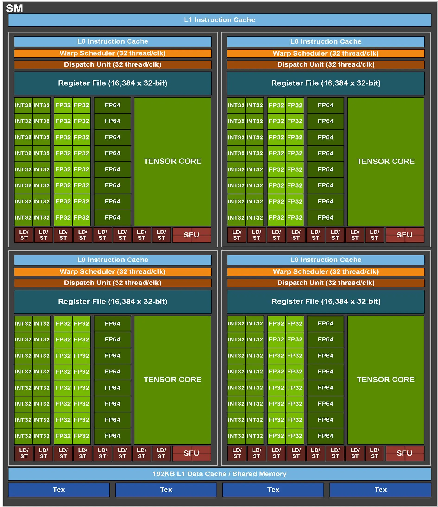
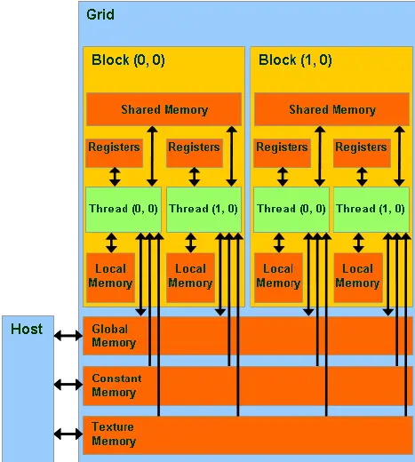

# 实验三：GPU 通用矩阵乘法

## 实验简介

**BLAS**（英语：**Basic Linear Algebra Subprograms**，基础线性代数程序集）是一个[应用程序接口](https://zh.wikipedia.org/wiki/应用程序接口)（API）标准，用以规范发布基础线性代数操作的数值库（如矢量或矩阵乘法）。该程序集最初发布于 1979 年，并用于创建更大的数值程序包（如 [LAPACK](https://zh.wikipedia.org/wiki/LAPACK)）。在高性能计算领域，BLAS 被广泛使用，numpy 的底层也依赖于 BLAS。

通用矩阵乘法（[General matrix multiply](https://en.wikipedia.org/wiki/General_matrix_multiply), GEMM）是 BLAS 中经典的子程序之一。作为当今科学计算最常见的计算任务之一，GEMM 需要实现一个非常高效的矩阵乘法。优化 GEMM 也是 HPC 界非常基础的任务。

本次实验需要你使用 CUDA 完成一个高性能单精度浮点数 GEMM 实现 (sgemm)。尽管已经有了很多优秀的 GEMM 库，如 [cuBLAS](https://docs.nvidia.com/cuda/cublas/) 或者 [cutlass](https://github.com/NVIDIA/cutlass)，但是通过实现一个 GEMM 你可以更好地理解 GPU 的计算模型，以及如何利用 GPU 的特性来提高计算性能。

所以尽管 sgemm 是一个非常基础的任务，并且网络上有很多优化的实现，我们仍然希望你能够在实现的过程中理解 GPU 的特点。

## 实验环境

同 Lab3 和 Lab4，现有两张 A100 40G，一张 A100 80G 和两张 2080Ti 显卡供大家使用。

!!! warning "请在实验报告中指出测出的数据所使用的显卡类型"

## 实验基础知识：GPU 总览

> 以下内容以 [AI Chips: A100 GPU with Nvidia Ampere architecture](https://jonathan-hui.medium.com/ai-chips-a100-gpu-with-nvidia-ampere-architecture-3034ed685e6e) 为参考，如果有不清楚的地方可以参考原文章、自行搜索或者向我们询问。

类比计算机层次存储结构，我们对 GPU 结构，尤其是存储方面进行一定的了解。进行以 Nvidia Ampere 架构为例，完整的 GA100 核心如下所示（A100 并不是完整的 GA100 核心）：

<div align="center">

</div>

它包含：

- 8 GPC and 16 SM/GPC and 128 SMs per full GPU.
- 6 HBM2 stacks and 12 512-bit Memory Controllers.

下面将回顾一些可能对完成本次 Lab 比较有帮助的一些内容。

### Streaming Multiprocessor

每一个 Streaming Multiprocessor（下简称 SM），包含有：

- 4 processing block per SM, 1 Warp scheduler per processing block.
- 64 INT32 CUDA Cores/SM, 64 FP32 CUDA Cores/SM, 32 FP64 CUDA Cores/SM.
- 192 KB of combined shared memory and L1 data cache.
- 4 Tensor Cores/SM.

<div align="center">
  
</div>

#### Warp

一个 block 在一个 SM 上执行，并在执行时进一步被细分为 warp。每个 warp 一次可以处理 32 threads。为了提高利用率，**推荐你按照 warp 进行块的划分**。下图为一个 block 包含 256 threads（即 8 warps）时执行的示意图：

<div align="center">
  
</div>

### Shared Memory

上面提到过一个 SM 包含 192KB 的 L1 Data Cache / Shared Memory。这些内存相对于 Global Memory（与 GPU 的关系可以被类比于 CPU 和 RAM）来说相对而言更快、访问延迟更低，能为一个 block 内的所有线程共用且可以被编程人员安排存储的内容。如果能够合理利用 Shared Memory 从而减少对延迟更高、速度更慢的 Global Memory 的访问，那么也可以提高程序的执行效率。需要额外注意的是，**Shared Memory 大小是有限的**，需要进行合理的取舍与安排。

<div align="center">
  
</div>

### Bank

Bank 的概念在不同种类的存储器中都有涉及，其是为了解决存储器并行访问的问题而提出的。以一个具有 4 个 bank 的存储器为例，我们往常在编程时认为逻辑上认为连续的内存在 4 个 bank 中的物理存储方式如下图所示：

```text
Bank 0    Bank 1    Bank 2    Bank 3

MEM[0]    MEM[1]    MEM[2]    MEM[3]
MEM[4]    MEM[5]    MEM[6]    MEM[7]
MEM[8]    MEM[9]    MEM[10]   MEM[11]
...       ...       ...       ...
```

于是在同一时间我们访问诸如 `MEM[0], MEM[9], MEM[6], MEM[3]` 的存储空间就不会产生冲突，大大提高了程序的效率；否则，最差的情况下，若连续的访存序列均位于同一 bank，则效率等于串行的 4 次存储访问。

需要注意的是，若存储器的 bank 进行过针对性的优化，多个线程访问同一 bank 的同一位置可以通过同时向所有线程广播数据进行解决，同样不会产生 bank conflict 问题。

<!-- #### Tensor Core

为了高效地进行浮点数运算，我们可以使用浮点运算单元。那为了加速矩阵运算，是不是我们也同样可以设计一些专门用于矩阵运算的单元？Tensor Core 就是为了达成类似目的而设计的组件。部分参考文档如下：

- [CUDA C++ Programming Guide](https://docs.nvidia.com/cuda/cuda-c-programming-guide/index.html#wmma)
- [Tips for Optimizing GPU Performance Using Tensor Cores](https://developer.nvidia.com/blog/optimizing-gpu-performance-tensor-cores/) -->

## 实验步骤

接下来我们讨论的优化需求是针对两个 32 位浮点数稠密矩阵的乘法。我们给出以下形式化定义：

给定矩阵 $A, B, C$：

$$
\mathbf{A} =\begin{pmatrix}a_{11}&a_{12}&\cdots &a_{1n}\\a_{21}&a_{22}&\cdots &a_{2n}\\\vdots &\vdots &\ddots &\vdots \\a_{m1}&a_{m2}&\cdots &a_{mn}\\\end{pmatrix}, \quad
\mathbf {B} =\begin{pmatrix}b_{11}&b_{12}&\cdots &b_{1p}\\b_{21}&b_{22}&\cdots &b_{2p}\\\vdots &\vdots &\ddots &\vdots \\b_{n1}&b_{n2}&\cdots &b_{np}\\\end{pmatrix}, \quad
\mathbf {C} =\begin{pmatrix}c_{11}&c_{12}&\cdots &c_{1p}\\c_{21}&c_{22}&\cdots &c_{2p}\\\vdots &\vdots &\ddots &\vdots \\c_{m1}&c_{m2}&\cdots &c_{mp}\\\end{pmatrix}
$$

矩阵乘法 $C = AB$ 定义为对任意 $c_{ij}$ 有：

$$
 c_{ij}=a_{i1}b_{1j}+a_{i2}b_{2j}+\cdots +a_{in}b_{nj}=\sum _{k=1}^{n}a_{ik}b_{kj}
$$

为了简化问题，我们可以假设所有的矩阵都是 $N \times N$ 的方阵。在本次 Lab 中，我们需要您针对下述问题进行优化：

### 问题描述

输入矩阵 $A, B$，计算矩阵乘积 $C = AB$。其中 $A$ 的大小为 $M\times K$, $B$ 的大小为 $K\times N$，$C$ 的大小为 $M\times N$ 为了方便起见，我们对矩阵的存储顺序做了一些调整。其中，$A$ 矩阵为行优先存储（即第二维空间上连续，$A_{ij}$ 存储在 $A[i * k + j]$ 处），$B$ 矩阵为列优先存储（即第一维空间上连续，$B_{ij}$ 存储在 $B[i + j * k]$ 处），$C$ 矩阵为列优先存储（同 $B$ 矩阵）。

> 实际上在 Fortran 中，矩阵的存储顺序是列优先的，这正好和 C/C++ 中相反。而 BLAS 的 API 也是以 Fortran 为基础设计的，因此在 BLAS 中矩阵的存储顺序也是列优先的。对于 BLAS 接口来说，上述的配置需要在计算前对矩阵 $A$ 做转置，你可以在提供的代码中找到这一点（CUBLAS_OP_T）。
>
> 这个配置是为了让你在写 CUDA 代码时更加方便。这样你在访问两个矩阵元素时都是连续的，有利于提高访存效率。

### 基准

最基础的矩阵乘法自然是三层循环，即对二维矩阵 $C$ 的每一项通过单层循环计算其结果。

``` c++
__global__ void sgemm_kernel(const float* __restrict__ A,
        const float* __restrict__ B, float* __restrict__ C,
        const int m, const int n, const int k) {
 int row = blockIdx.y * blockDim.y + threadIdx.y;
 int col = blockIdx.x * blockDim.x + threadIdx.x;

 if (row < m && col < n) {
  float sum = 0.0f;
  for (int i = 0; i < k; i++) {
   sum += A[row * k + i] * B[i + col * k];
  }
  C[row + col * m] = sum;
 }
}
```

具体的基准代码可见 [baseline.cu](code/src/sgemm_kernel.cu)。

### Shared Memory

正如课上所讲及上文所提及的，GPU 中有一块共享内存被同一线程块中的线程共享，在存储层级中，Shared Memory 与 L1 Cache 同级，部分 GPU 架构中还可以手动分配 L1 Cache 与 Shared Memory 的大小；利用 Shared Memory 将线程块的密集访存加速能够获得极低的访存延迟且大大节省内存带宽。

<div align="center">
  
</div>

为了减少单个线程的内存访问量，可以让每个线程块中的线程合作访问有共同依赖的部分；共享内存是有限的，将访存重叠度高的线程安排在单个线程块中，从全局内存中加载访问更密集的数据到共享内存，都可以提升程序效率。

### Tiling

Baseline 代码效率并不高，原因是它需要两次对 Global Memory 的访存才能进行一次乘加运算 (MAC)。考虑到 GPU 的算力于带宽的比例远大于此，这样会导致计算资源的浪费。所以减少对 Global Memory 的访存是提高性能的一个关键点。于是有了 Tiling 技术。

<div align="center">
  
</div>

Tiling 的本质类似于分块矩阵计算，我们此时将结果矩阵 $C$ 分块，每个块的大小为 $TileM \times TileN$。对于每一个块，我们需要计算 $TileM \times K$ 和 $K \times tileN$ 的矩阵的乘积，我们进一步对 $K$ 进行分块，并对 $K$ 这一维的分块遍历，于是每个 Threadblock 需要计算 $K / TileK$ 个 $TileM \times TileK$ 和 $TileK \times TileN$ 的矩阵乘积的累加。这个时候，我们每次计算时先将 $A$ 和 $B$ 的 Tile 读入 Shared Memory，然后进行计算。此时总的访存量为
$$
\begin{align}
&(K / TileK) \times (TileM \times TileK + TileK \times TileM) \times (M / TileM) \times (N / TileN)
\end{align}
$$
$$
 = MNK (1 / TileM + 1 / TileN)
$$

进一步的，我们可以继续对一个 Threadblock 内部继续分块，以降低对 Shared Memory 的访存量。

[11] 中给出了一种 Tiling 的实现，你可以参考这个实现。

> 然而和大部分地方的资料讲的不太一样的地方是，实际上由于 L1 和 L2 Cache 的存在，Baseline 的访存量没有那么差（见思考题 4），但访存和计算操作交替执行造成的数据依赖使得指令级并行度 (ILP) 很差，严重影响性能，而 Tiling 技术将访存和计算操作分离，提高了 ILP，从而提高了性能。

### Double Buffering && Pipeline

如上面所说，我们可以将计算和访存操作分离，这样可以提高 ILP。但是在实际的计算中，我们可以进一步提高性能。我们可以使用 Double Buffering 技术，即在计算一个 Tile 的同时，我们可以同时读取下一个 Tile 的数据。这样可以进一步提高性能。

Double Buffering 可以进一步扩展为 Pipeline，在 SM80 架构中你可以通过 `cp.async` 系列指令实现硬件加速的流水线，不过这部分内容涉及到了内嵌 PTX 汇编，所以作为 Bonus。[16] 展示了如何使用这些指令。

### Virtual Thread Split

为了提高线程读写带宽，GPU 中的共享内存会被划分成若干个 bank，理想状况下，各个线程同一时间访问的 bank 应该是不同的。在这一部分中，您可以尝试重新组织线程的编号方式与执行顺序（自由发挥），尽可能的防止 bank conflict，最大化利用显存带宽。

### Bonus: Tensor Core && Cute

关于 Tensor Core 的使用作为 Bonus。思考你能否用 Tensor Core 加速 sgemm？（思考题 6）

如果你要使用 Tensor Core 的话，建议优化 hgemm 。相关的资料可以参考 [12, 15, 16]。

`cute` 是一个很新的 NVIDIA 的计算库（作为 `cutlass` 的底层接口），简而言之它帮你实现了 1. 数据在内存中的表示 2. 计算任务到 Thread 的划分 3. 对底层硬件 PTX 接口的封装，使得你可以很方便地调用 Tensor Core。

你可以参考 [16, 17] 来了解如何使用 `cute`。`cute` 的样例 [17] 带有一个 sgemm 的例子，你也可以参考这部分实现你自己的 sgemm。
<!-- ### Hint & Bonus

如果程序遇到难以解决的正确性问题，不妨考虑两个关键词： `sync` 和 `atomic`。

另外在我们本次实验提供的 GPU 上，包含上述提及的 Tensor Core 模块。合理的使用它能够进一步加速卷积的计算。在 Cuda 9.0 之后，你可以使用内嵌 `PTX` 汇编或者 CUDA 的 C++ 扩展 `nvcuda::wmma` 的方式来显式地调用 Tensor Core 来进行计算。

正如前文提及，Tensor Core 能在一个周期内完成一个小矩阵乘法，因而提高计算效率，但是 Tensor Core 对作矩阵乘法的两个矩阵的形状要求比较高（例如 4x4x4，8x8x8 等），你需要合理地对矩阵进行切分和对 Wrap 和 Block 中的线程进行分配来最大化 Tensor Core 的计算性能。了解如何调用 Tensor Core，可以查阅文档尾部的参考文献。

使用 Tensor Core 完成本次实验，你将会获得 Bonus。

 -->

## 评测方式及其他说明

### 编写提示

在本次实验中，我们提供了一份 [基准代码](code/src/sgemm_kernel.cu)，在其中包含非常基础的矩阵乘法基本实现。框架的其他部分使用了 cuBLASLt 测试正确性以及作为性能参考标准。您可以修改的部分包含 `code/src/sgemm_kernel.cu` 中的所有部分，但需要保持 `run_custom` 的接口。最终测试的参数暂定为：

- 矩阵大小：$A: 8192 \times 8192$，$B: 8192 \times 8192$，$C: 8192 \times 8192$
- 元素类型：`float`

参考的编译参数见 [CMakeLists](code/CMakeLists.txt)。如果出现编译问题，可以尝试删除 当前目录下的 `build` 和 `nvbench` 文件夹重新编译。

```bash
module load nvhpc/24.5 # 加载 CUDA 环境
cmake -B build
cmake --build build -j
./build/check_sgemm # 请在计算节点上运行
./build/bench_sgemm # 请在计算节点上运行
```

`main.cu` 中提供了一个简单的检查正确性的代码，你可以自由更换矩阵大小进行 Debug。 `bench_sgemm` 通过 `nvbench` 进行测试，你可以通过 `bench_sgemm --help` 查看帮助。

实际上框架里还带了一个 hgemm（half precision, fp16）。不过它的内容和 sgemm 基本一致，这部分的性能不作为评判依据，Tensor Core Bonus 仅在报告中描述即可。

除此之外，你还可以通过 Nsight Compute 来分析自己代码的性能，以下是一个示例：

```bash
ncu --clock-control none -k regex:".*gemm.*" --page details -o gemm%i --section ComputeWorkloadAnalysis --section InstructionStats --section LaunchStats --section MemoryWorkloadAnalysis --section MemoryWorkloadAnalysis_Chart --section MemoryWorkloadAnalysis_Tables --section Occupancy --section SchedulerStats --section SpeedOfLight --section WarpStateStats --section SourceCounters ./build/bench_sgemm -a M=1024 -a N=1024 -a K=1024 --profile
```

集群上的 Nsight Compute 版本是 2024.1.1，你可以本地下载一个 Nsight Compute 对结果进行可视化分析。

> 另外，你会发现框架里没有计时代码，这是因为我们用了 `nvbench`，它可以自动读取 kernel 的执行时间。保证你的实现只有一个 kernel，这样评测机才能正常读取结果。
>
> 编译出来的 bench_sgemm 由 `nvbench` 启动，它会自动调用 `nvbench` 的 main 函数。调用 `bench_sgemm --help` 以获得 `nvbench` 的用法。
>
> 你可以通过 -a M=1024 -a N=1024 -a K=1024 来指定矩阵大小（以防太大的矩阵难以 profile），并且通过 --profile 来指明每个 kernel 只需执行一次，以便 Nsight Compute 进行 profile.

如果你有各种难以调试的问题，可以尝试使用 [Compute Sanitizer](https://docs.nvidia.com/compute-sanitizer/ComputeSanitizer/index.html) 进行检查。
### 评测方式

我们使用您的程序和 cuBLAS 的程序在相同的输入下进行测试，使用相对性能作为评测标准。相对性能定义为：

$$
Relative\ Performance = \frac{Your\ Time\ Cost}{cuBLAS\ Time\ Cost}
$$

!!! danger "这里也没必要卷 😭"

    **请注意，OJ 上的得分仅供性能参考，不会直接折算进 Lab 得分，更不会按照加速比排行榜次序来评分。**

    我们更注重优化的思路和过程分析，因此 OJ 测评得分与实验得分并无直接关系。请不要过度追求 OJ 得分进行优化，也不要因为较高的 OJ 得分而忽视了实验报告的撰写，希望同学们能够理解。

请先阅读 [使用在线测评 - ZJUSCT OpenDocs](https://zjusct.pages.zjusct.io/ops/opendocs/guide/oj/) 来熟悉 OJ 的操作方法。

OJ 使用 ssh 进行操作，sftp 进行上传，连接方式为 `<用户名>+oj@clusters.zju.edu.cn`，如在校外需指定端口 `443`。只需要上传 `sgemm_kernel.cu` 文件即可（这意味着你本地可以任意更改其他文件，评测时只交这一个文件）。

```bash
scp -P 443 sgemm_kernel.cu <用户名>+oj@clusters.zju.edu.cn:lab3/sgemm_kernel.cu
ssh -p 443 <用户名>+oj@clusters.zju.edu.cn submit lab3
```

评测时，先通过 `check_sgemm` 检查正确性，然后通过 `bench_sgemm` 进行性能测试。

最终评分仅考虑 A100-80G 上的 sgemm 的性能。不过你可以在其他机器上进行测试。

### 注意事项

1. 请独立完成本次实验。你可以使用 LLM 工具，网络上的相关优化代码也十分多，但理解并自己实现是本次实验的目的。
2. 攻击平台、恶意浪费节点资源等干扰他人的行为，以作弊论处。
3. 任何有疑惑的问题请联系群内助教。
4. 我们鼓励你用 `cutlass` 中的 `cute` 库来帮助实现，但请不要直接调用 `cutlass` 或者 `cublas` 的 GEMM 实现。
5. 如果 Profile 不出来或者运行太慢的话，可以尝试减小矩阵大小，并在报告中注明。

### 思考题

你需要在报告中回答如下问题：

1. 如何计算 GEMM 的 Flops 数？你的实现和 cublas 的实现的 Flops 分别是多少？
2. sgemm 在 2080Ti 和 A100-80G 上的理论性能上限是多少（即 2080Ti 和 A100-80G 的 FP32 算力是多少）？你可以在 [13] [14] 中找到答案。
3. 转置其中一个矩阵的操作对提高访存性能有什么帮助（或者你觉得有没有什么更好方法）？提示：考虑 L2 Cache 和 Memory Coalescing。
4. Tiling 在优化 GEMM 中的作用是什么？为什么会提高性能？
5. 你选择了怎样的 Tiling 配置？
6. 你的代码对 Global Memory 的访存量是多大？
7. 通过 Nsight Compute 工具，查看 Baseline 代码在 $M = N = K = 1024$ 下的 Global Memory 的访存量，比较它们和 cublas 代码的访存量差异。回顾上面 Tiling 一节中所讲，不做 Tiling 的 Baseline 是否真的存在 Global Memory 访存上的冗余？为什么没有这种冗余？
8. FP32 的矩阵乘 (sgemm) 能否用 Tensor Core 加速？为什么？
9. （如果你写了 Pipeline 代码） `cp.async` 有没有什么硬件限制？你选了多长的 Pipeline？可以参考 [18]
10. （如果你用了 cute）cute 是如何帮助你实现 GEMM 的？或者说你是如何通过 cute 完成 Tiling/Pipeline/处理 Bank Conflict/调用 Tensor Core 的？

## 实验任务与要求

1. 优化 sgemm 的性能
2. 测试实现的正确性和相对于 cuBLAS 的性能
3. 提交代码 `sgemm_kernel.cu` 和简要的思路，回答思考题
4. 报告中需要提交 OJ 运行结果的截图
5. 如有余力，可以考虑以下 Bonus 部分
   1. 使用 Tensor Core 加速 hgemm
   2. 在 A100-80G 上使用 `cp.async` 进行 Pipeline 优化
   3. 使用 `cute` 完成 sgemm 或者 hgemm

## 参考资料

1. [Basic Linear Algebra Subprograms](https://en.wikipedia.org/wiki/Basic_Linear_Algebra_Subprograms)
2. [Locality of reference](https://en.wikipedia.org/wiki/Locality_of_reference)
3. [AI Chips: A100 GPU with Nvidia Ampere architecture](https://jonathan-hui.medium.com/ai-chips-a100-gpu-with-nvidia-ampere-architecture-3034ed685e6e)
4. [CUDA C++ Programming Guide](https://docs.nvidia.com/cuda/cuda-c-programming-guide/index.html#wmma)
5. [Tips for Optimizing GPU Performance Using Tensor Cores](https://developer.nvidia.com/blog/optimizing-gpu-performance-tensor-cores/)
6. [how-to-optimize-gemm](https://github.com/flame/how-to-optimize-gemm/wiki)
7. [How to optimize GEMM on CPU](https://tvm.apache.org/docs/tutorials/optimize/opt_gemm.html)
8. Huang J, van. BLISlab: A Sandbox for Optimizing GEMM. arXiv.org. Published 2016. Accessed July 10, 2021. <https://arxiv.org/abs/1609.00076>
9. [cuBLAS](https://docs.nvidia.com/cuda/cublas/)
10. [cutlass](https://github.com/NVIDIA/cutlass)
11. CUDA SGEMM 矩阵乘法优化笔记——从入门到 cublas - nicholaswilde 的文章 - 知乎
<https://zhuanlan.zhihu.com/p/518857175>
12. Nvidia Tensor Core-CUDA HGEMM 优化进阶 - 木子知的文章 - 知乎
<https://zhuanlan.zhihu.com/p/639297098>
13. <https://images.nvidia.com/aem-dam/en-zz/Solutions/design-visualization/technologies/turing-architecture/NVIDIA-Turing-Architecture-Whitepaper.pdf>
14. <https://images.nvidia.com/aem-dam/en-zz/Solutions/data-center/nvidia-ampere-architecture-whitepaper.pdf>
15. cute 之 高效 GEMM 实现 - reed 的文章 - 知乎
<https://zhuanlan.zhihu.com/p/675308830>
16. 如何用 CUDA 写有 CuBLAS 90% 性能的 GEMM Kernel - 郑思泽的文章 - 知乎
<https://zhuanlan.zhihu.com/p/631227862>
17. <https://github.com/NVIDIA/cutlass/tree/main/examples/cute/tutorial>
18. 浅析 GEMM 优化 multistage 数怎么算 - 郑思泽的文章 - 知乎
<https://zhuanlan.zhihu.com/p/714353243>
