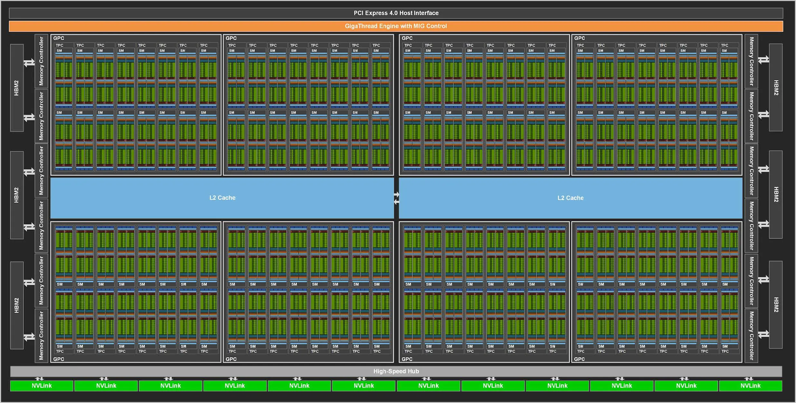
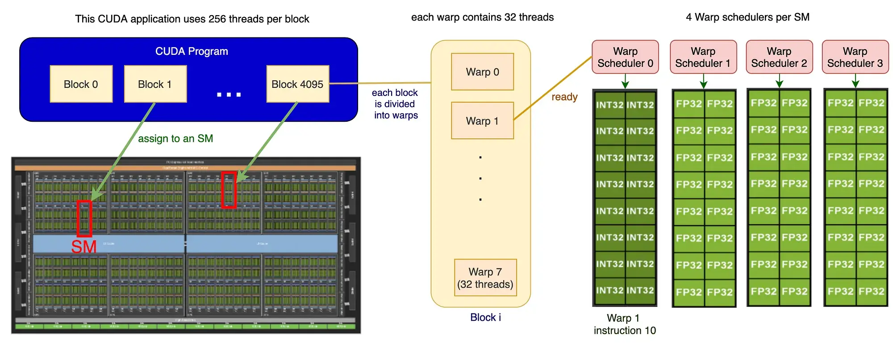
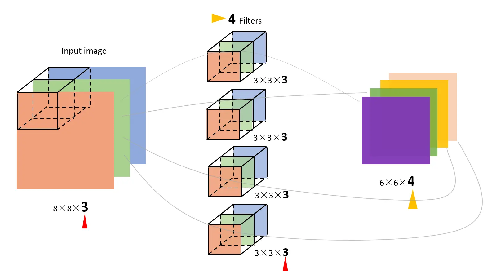
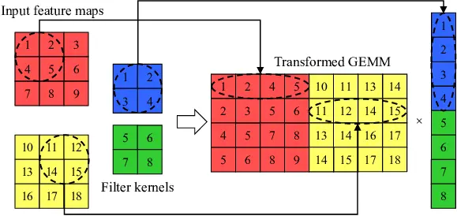
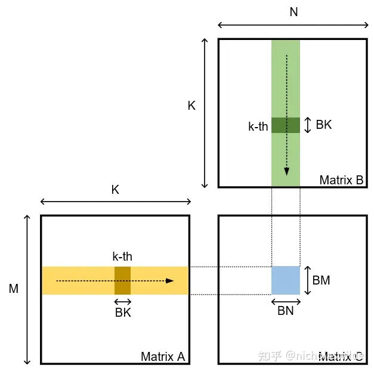
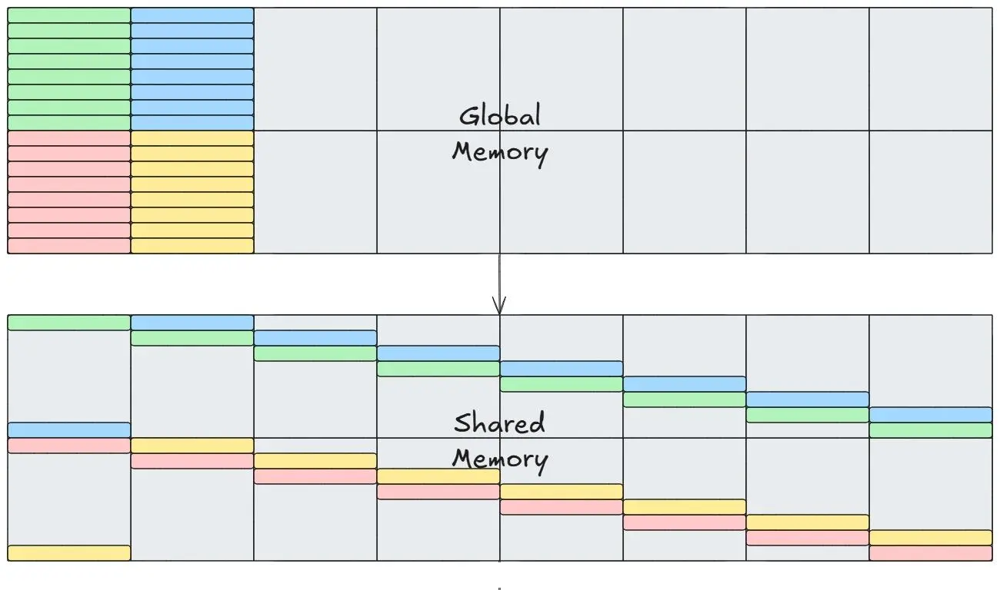

# 实验三：CUDA 卷积

!!! info "实验信息"

    负责助教：陈楷骐, 郝星星, 任朱明	

## 实验目的

卷积([Convolution](https://en.wikipedia.org/wiki/Convolution))是一种基本的数学运算, 想必大家在微积分,概率论与数理统计等数学基础课程中都一定程度上接触过. 作为一种基本的数学计算, 其在图像处理,机器学习等领域都有重要应用. 

本次实验需要你使用 CUDA 完成一个 GPU 上的二维离散卷积. 

你可以自由选择使用 CUDA Runtime API 或者 CUDA Driver API 进行编程, 但不能调用高性能计算的Library代替你自己实现卷积. 本实验推荐采用 CUDA Runtime API, 使用更加简单方便, 相较Driver几乎不损失性能. 

<center></center>

<!-- ## 实验环境

### 警告

由于登录节点(H248)配置很低, 禁止在上面使用 vscode-remote 等大量消耗资源的程序

### 编译器加载

```
. /opt/spack/share/spack/setup-env.sh
spack load cuda@11.5.0 # 当然, 你也可以选择别的 cuda 版本
```

### 运行

实验环境与 Lab 4 一致, 请使用 GPU 这个 Partition, 为防止看到的 GPU 数量不正常, 请使用下列命令申请节点：

``` bash
srun -p GPU -N 1 --gres=gpu:1 --cpus-per-task=16 --pty bash
```

### Profile

* Nsight Compute 在 /opt/NVIDIA-Nsight-Compute-2022.2 下
* Nsight System 在 `spack load cudnn` 后直接使用 `nsys` 即可 -->

## 实验基础: 数学知识

该部分简要介绍和实验相关的基础数学知识, 为方便理解, 不保证数学上的严谨性. 

### 张量 (Tensor)

张量概念是矢量概念的推广, 矢量是一阶张量. 张量是一个可用来表示在一些矢量,标量和其他张量之间的线性关系的多线性函数. 

同构意义下, 第零阶张量 (r = 0) 为标量 (Scalar), 第一阶张量 (r = 1) 为向量 (Vector), 第二阶张量 (r = 2) 则为矩阵 (Matrix). 

实验中的卷积运算本实验涉及两个四维张量的运算. 


### 卷积 (Convolution)

本实验只涉及离散运算, 连续形式的卷积不做介绍, 感兴趣的同学可以自行了解. 

#### 一维离散卷积

定义 $\left(f*g\right)\left(n\right)$ 为函数  $f$ 与  $g$ 的卷积

$$
\left(f*g\right)\left(n\right)=\sum_{t=-\infty}^{+\infty}f\left(t\right)g\left(n-t\right)
$$

函数 $f$ 和 $g$ 定义域可以不是所有整数, 修改上式中 $t$ 的遍历范围可得到新的定义；另一种方式是定义超出定义域的函数值视为 0, 可得到相同的结果. 

需要注意的是, 两个函数的卷积结果仍是函数. 

可以形象地理解为沿着不断移动的 $x+y=n$ 直线, 将两个函数卷成一个新的函数, 每条直线对应新函数的一组对应关系. 

#### 二维离散卷积

二维离散卷积可以视为一维离散卷积的推广. 

$$
\left(f*g\right)\left(n,m\right)=\sum_{i=-\infty}^{+\infty}\sum_{j=-\infty}^{+\infty}f\left(i,j\right)g\left(n-i,m-j\right)
$$

我们在实验中的定义卷积与数学上的定义存在差别, 我们认为其在广义上属于二维离散卷积. 

简化起见, 考虑两个方阵 $f$ 和 $g$, $f$ 的大小为 $a*a$, $g$ 的大小为 $b*b$, 我们将 $g$ 称为核 (kernel) 函数, 且要求 $b$ 为奇数. $f$ 行列下标均从 0 开始, 
$g$ 的行列下标则从 $-\lfloor b/2\rfloor$ 到 $+\lfloor b/2\rfloor$ (包括0), 此时卷积的结果可以定义为:

$$
\left(f*g\right)\left(n,m\right)=\sum_{i=-\lfloor b/2\rfloor}^{+\lfloor b/2\rfloor}\sum_{j=-\lfloor b/2\rfloor}^{+\lfloor b/2\rfloor}f\left(n+i,m+j\right)g\left(i,j\right)
$$

若 $f$ 的下标范围超出定义范围, 本实验的方式是填充一个默认值 (0) 以解决问题, 卷积结果与 $f$ 大小相同. 注意这里求和的时候下标之差是一个定值, 和卷积的定义有所不同. 这种定义在计算机视觉里非常常见, 有时人们将这里的卷积核称为滤波器 (Filter), 卷积运算称为滤波 (Filtering). 

一些算子库 (如 CUTLASS) 将下标之和为定值的操作称为卷积 (Convolution), 而将下标之差为定值的操作称为互相关 (Cross-Correlation). 本实验中卷积定义为这种下标之差为定值的运算. 

## 实验基础: GPU 总览

!!! tips "参考内容"
    以下内容以 [AI Chips: A100 GPU with Nvidia Ampere architecture](https://jonathan-hui.medium.com/ai-chips-a100-gpu-with-nvidia-ampere-architecture-3034ed685e6e) 为参考, 如果有不清楚的地方可以参考原文章, 自行搜索或者向我们询问.

    集群上使用的是 NVIDIA V100 GPU, 是 A100 的前一代产品, 架构有相似之处, 下面的内容仅以 A100 为例. V100 的相关参数可以在 [NVIDIA V100 ARCHITECTURE](https://images.nvidia.cn/content/volta-architecture/pdf/volta-architecture-whitepaper.pdf) 中找到.

类比计算机层次存储结构, 我们对 GPU 结构, 尤其是存储方面进行一定的了解. 进行以 Nvidia Ampere 架构为例, 完整的 GA100 核心如下所示 (A100 并不是完整的 GA100 核心)：

<div align="center">

</div>

它包含：

- 8 GPC and 16 SM/GPC and 128 SMs per full GPU.
- 6 HBM2 stacks and 12 512-bit Memory Controllers.

下面将回顾一些可能对完成本次 Lab 比较有帮助的一些内容. 

### Streaming Multiprocessor

每一个 Streaming Multiprocessor (下简称 SM), 包含有：

- 4 processing block per SM, 1 Warp scheduler per processing block.
- 64 INT32 CUDA Cores/SM, 64 FP32 CUDA Cores/SM, 32 FP64 CUDA Cores/SM.
- 192 KB of combined shared memory and L1 data cache.
- 4 Tensor Cores/SM.

<div align="center">
  
</div>

### Warp

一个 block 在一个 SM 上执行, 并在执行时进一步被细分为 warp. 每个 warp 一次可以处理 32 threads. 为了提高利用率, **推荐你按照 warp 进行块的划分**. 下图为一个 block 包含 256 threads (即 8 warps) 时执行的示意图：

<div align="center">
  
</div>

### Shared Memory

上面提到过一个 SM 包含 192KB 的 L1 Data Cache / Shared Memory. 这些内存相对于 Global Memory (与 GPU 的关系可以被类比于 CPU 和 RAM)来说相对而言更快, 访问延迟更低, 能为一个 block 内的所有线程共用且可以被编程人员安排存储的内容. 如果能够合理利用 Shared Memory 从而减少对延迟更高, 速度更慢的 Global Memory 的访问, 那么也可以提高程序的执行效率. 需要额外注意的是, **Shared Memory 大小是有限的**, 需要进行合理的取舍与安排. 

<div align="center">
  
</div>

### Bank

Bank 的概念在不同种类的存储器中都有涉及, 其是为了解决存储器并行访问的问题而提出的. 以一个具有 4 个 bank 的存储器为例, 我们往常在编程时认为逻辑上认为连续的内存在 4 个 bank 中的物理存储方式如下图所示：

```text
Bank 0    Bank 1    Bank 2    Bank 3

MEM[0]    MEM[1]    MEM[2]    MEM[3]
MEM[4]    MEM[5]    MEM[6]    MEM[7]
MEM[8]    MEM[9]    MEM[10]   MEM[11]
...       ...       ...       ...
```

于是在同一时间我们访问诸如 `MEM[0], MEM[9], MEM[6], MEM[3]` 的存储空间就不会产生冲突, 大大提高了程序的效率；否则, 最差的情况下, 若连续的访存序列均位于同一 bank, 则效率等于串行的 4 次存储访问. 

需要注意的是, Shared Memory 的 bank 进行过针对性的优化, 多个线程访问同一 bank 的同一位置可以通过同时向所有线程广播数据进行解决, 同样不会产生 bank conflict 问题. 


## 基础任务

### 任务描述

在实际的卷积计算中, 一次会进行多批(batch)的处理, 比如一次处理多张图片($H\times W$大小). 以及同一个坐标具有多通道(channel)值, 比如图片里的R,G,B三通道. `batch_size` 和 `in_channel`, `out_channel`定义于代码的开头. 

`in_channel`即为输入的通道数, Filter(多通道的卷积核)的`in_channel`需要和输入保持一致. 每个 Filter 与输入产生一个二维的输出. `out_channel`即为输出的通道数, 其值实际上就是 Filter 的数量, `out_channel`个 Filter 与输入进行卷积运算, 产生`out_channel`个通道的结果. 



图片上经过卷积计算, 输出的尺寸变小了, 而我们的实验中是为输入加上了值为0的 padding, 所以输入和输出的二维尺寸是一致的. 

代码中的注释和变量名遵循以下习惯：

- 输入输出张量的尺寸: `size`, `H`, `W`
- 输入,输出张量的批(batch)的大小: `batch_size`, `N`
- 输入张量的通道数: `in_channel`, `C`
- 输出张量的通道数: `out_channel`, `K`
- 卷积核的尺寸: `kernel`, `R`, `S`

我们看到, 卷积运算中涉及的三个张量都是四维的, 我们规定它们的形状分别为：

- Input (A): `N x H x W x C`
- Kernel (W): `K x R x S x C`
- Output (B): `N x H x W x K`

在上述二维矩阵的二维离散卷积的数学表达式基础上, 我们添加批和通道两个维度, 得到本次实验最终二维卷积的表达式如下:

$$
\begin{align*}
\left(f*g\right)\left(n,x,y,k\right)&=\sum_{r=0}^{R-1}\sum_{s=0}^{S-1}\sum_{c=0}^{C-1}f\left(n,p(x, r),q(y, s),c\right)g\left(k,r,s,c\right) \\
p(x, r) &= x - \lfloor R/2\rfloor + r \\
q(y, s) &= y - \lfloor S/2\rfloor + s \\
\end{align*}
$$

二维卷积计算的 CPU 版本已在 `conv.cu` 中的`conv2d_cpu_kernel`给出, 用以验证正确性. 即通过批,输入通道,输出通道,卷积核高,卷积核宽的五层循环轮流计算结果矩阵中每个位置的值. 其中做了 padding 的0填充等处理. 

### 基准代码


基准代码为程序中的`conv2d_cuda_kernel`核函数, 是未经优化的五层循环嵌套GPU实现, 你可以在此基础上进行改进, 亦或者重新自己实现. 

```c++ linenums="1"
__global__ void conv2d_cuda_kernel(const int8_t *__restrict__ a, 
                                   const int8_t *__restrict__ w,
                                   int8_t *__restrict__ b) {
  const int i = blockIdx.x * blockDim.x + threadIdx.x;
  const int j = blockIdx.y * blockDim.y + threadIdx.y;
  if (i < size && j < size) {
    for (int n = 0; n < N; ++n) {
      for (int k = 0; k < K; ++k) {
        int result = 0;
        for (int c = 0; c < C; ++c) {
          int x = i - R / 2, y = j - S / 2;
          for (int r = 0; r < R; ++r) {
            for (int s = 0; s < S; ++s) {
              if (!(x < 0 || x >= size || y < 0 || y >= size)) {
                result += static_cast<int>(a(n, x, y, c)) 
                        * static_cast<int>(w(k, r, s, c));
              }
              y++;
            }
            x++;
            y -= S;
          }
        }
        b(n, i, j, k) = static_cast<int8_t>(result);
      }
    }
  }
}
```

理论上你只需要修改 `src/lab3/conv.cu` 中的 `conv2d_cuda_kernel` 函数的 `int8` 实现和 `float16` 实现, 以及相应的获得 kernel 启动参数配置的函数. 自动评测时只需要提交 `src/lab3/conv.cu`. 

这里拆分成两种类型单独实验主要是为了后面的进阶任务, V100 上的 Tensor Core 只支持 `float16` 类型, 而 `int8` 类型的卷积可以使用 DP4A 指令加速.

如果你需要修改其他函数, 请联系助教.

!!! warning "注意"

    由于正确性验证中用到了 OpenMP, 你可能需要设置环境变量：
    ```shell
    export OMP_NUM_THREADS=4
    ```

    这里需要先将输入转为 `int32` 类型或者 `float32` 类型, 然后再进行乘加运算, 最后再将结果转为 `int8` 或者 `float16` 类型. 并且输入都是较小的整数, 这样做可以保证结合律, 减少正确性方面的问题.

### Shared Memory

正如课上所讲, GPU 中有一块共享内存被同一线程块中的线程共享, 在存储层级中, Shared Memory 与 L1 Cache 同级, 部分 GPU 架构中还可以手动分配 L1 Cache 与 Shared Memory 的大小；利用 Shared Memory 将线程块的密集访存加速能够获得极低的访存延迟且大大节省内存带宽. 

<center></center>


### Im2Col
<center></center>

上述的卷积任务其实可以转换为矩阵乘法任务, 这就是 Im2Col. 如图, 对于一个 $(N, H, W, C)$ 的输入矩阵和 $(K, R, S, C)$ 的卷积核矩阵, 我们可以将输入矩阵转换为一个 $(N \times H \times W, R \times S \times C)$ 的矩阵 (图里没有考虑 padding), 卷积核矩阵转换为一个 $(R \times S \times C, K)$ 的矩阵. 这样我们就可以将卷积操作转换为矩阵乘法操作.

但这里我们不需要先将输入矩阵转换成 Im2Col 的形式, 这样做效率比较低. 我们只需要借用这个转换的思路, 从矩阵乘法的角度来理解卷积.

### Tiling

Baseline 代码效率并不高, 原因是它需要两次对 Global Memory 的访存才能进行一次乘加运算 (MAC). 考虑到 GPU 的算力于带宽的比例远大于此, 这样会导致计算资源的浪费. 所以减少对 Global Memory 的访存是提高性能的一个关键点. 于是有了 Tiling 技术. 

<div align="center">
  
</div>

Tiling 的本质类似于分块矩阵计算, 我们此时将结果矩阵 $C$ 分块, 每个块的大小为 $T_M \times T_N$. 对于每一个块, 我们需要计算 $T_M \times K$ 和 $K \times T_N$ 的矩阵的乘积, 我们进一步对 $K$ 进行分块, 并对 $K$ 这一维的分块遍历, 于是每个 Threadblock 需要计算 $\frac{K}{T_K}$ 个 $T_M \times T_K$ 和 $T_K \times T_N$ 的矩阵乘积的累加. 这个时候, 我们每次计算时先将 $A$ 和 $B$ 的 Tile 读入 Shared Memory, 然后进行计算. 此时总的访存量为

$$
\frac{K}{T_K} \times (T_M \times T_K + T_K \times T_M) \times \frac{M}{T_M} \times \frac{N}{T_N}
$$

$$
 = MNK (\frac 1 {T_M} + \frac 1 {T_N})
$$

进一步的, 我们可以继续对一个 Threadblock 内部继续分块, 以降低对 Shared Memory 的访存量. 

!!! tip "思考"
    然而和大部分地方的资料讲的不太一样的地方是, 实际上由于 L1 和 L2 Cache 的存在, Baseline 的访存量没有那么差, 但访存和计算操作交替执行造成的数据依赖使得指令级并行度 (ILP) 很差, 严重影响性能, 而 Tiling 技术将访存和计算操作分离, 提高了 ILP, 从而提高了性能. 

### Double Buffering

如上面所说, 我们可以将计算和访存操作分离, 这样可以提高 ILP. 但是在实际的计算中, 我们可以进一步提高性能. 我们可以使用 Double Buffering 技术, 即在计算一个 Tile 的同时, 我们可以同时读取下一个 Tile 的数据. 这样可以进一步提高性能. 

### Bank Conflict

<center></center>

你可以通过 Padding 或者 Swizzling 的方式来避免 Bank Conflict. Padding 是通过在共享内存数组中添加额外的元素来改变内存访问模式, 而 Swizzling 则是对每个线程访问的内存地址进行置换. 这两种方式都可以避免 Bank Conflict, 从而提高性能.

### Cooperative Fetching

为了减少单个线程的内存访问量, 可以让每个线程块中的线程合作访问有共同依赖的部分；共享内存是有限的, 将访存重叠度高的线程安排在单个线程块中, 从全局内存中加载访问更密集的数据到共享内存, 都可以提升程序效率. 


## 进阶任务

如果你完成了基础任务并且精力充沛, 可以尝试下面的任务. 

### DP4A

DP4A 指令是一个特殊的指令, 它可以在一个周期内完成 4 个整数的乘加运算, 其计算结果为一个整数. 该指令可以在 CUDA 中通过内嵌 PTX 汇编或者 `__dp4a` 函数调用.

你可以尝试在 `conv_int8` 的实现里使用 DP4A 来加速计算.

### Tensor Core

V100 上有名为 Tensor Core 的硬件, 它能够进一步加速卷积的计算, 你可以使用内嵌 PTX 汇编或者 CUDA 的 C++ 扩展 `nvcuda::wmma` 的方式
来显式地调用 Tensor Core 来进行计算. 

Tensor Core 能在一个周期内完成一个小矩阵乘法, 因而提高计算效率, 但是 Tensor Core 对作矩阵乘法的两个矩阵的形状有要求 (例如 16x16x16), 你需要合理地对矩阵进行切分和对 Warp 和 Block 中的线程进行分配来最大化 Tensor Core 的计算性能. 

这两种指令都支持使用更高精度的类型做累加计算, 然后再将结果写回到低精度的类型中. V100 之后的 GPU 才开始支持整数类型的 Tensor Core, 并且 `ldmatrix` 指令在 `SM75` (比如 2080Ti) 才开始支持, 编写时需要注意.

### CUTLASS / CuTe

如果你精力充沛, 我们鼓励你使用 [CUTLASS](https://github.com/NVIDIA/cutlass/) 以及 CUTLASS 里的底层 Tensor 接口 CuTe 来实现本实验. 

不幸的是, CUTLASS 几乎没有什么文档, 只有一些 example 和 tutorial, 你大概率需要自己去阅读源码来了解如何使用 CUTLASS.


考虑到 OJ 只允许提交 `conv.cu` 里的 `__global__` Kernel, 你也许无法直接调用 CUTLASS 的 device 级别和 kernel 级别的 API. 你可以考虑通过 CUTLASS 的 `threadblock` 级别的 API 或者直接使用 CuTe 来实现.

不过你仍然可以探索一下 device 级别和 kernel 级别的 API.

`conv_int8` 的参考实现原本也是用 CUTLASS 实现的, 可以自动调用 DP4A 指令, 然而助教并没有调出来能够通过编译的版本. 

`conv_half` 的参考实现的模板参数是随便选的, 需要调整这些参数才能得到更高的性能.

你可以尝试解决 `conv_int8` 的 bug, 并对模板参数进行调优获得更高的性能, 体现在报告里即可.


### cuDNN

NVIDIA 的 cuDNN 库提供了高性能的卷积实现, 你可以考虑测试一下这些实现的性能, 体现在报告里即可.

### OpenAI Triton / TileLang / CuteDSL

如果你对这些比较新的 GPU 编程工具感兴趣, 也可以尝试用这些工具来实现卷积并测试性能. 体现在报告里即可.


!!! danger "你还是得自己写一个 CUDA C Kernel"
    无论你尝试了什么东西, 最终还是要自己写一个 CUDA C Kernel, 这部分的性能会作为实验成绩的主要部分. 

!!! question "我能不能用 Winograd?"
    当然可以, 请左转[大作业](../Final-Project/index.md). 不过本实验评测时会使用较大的卷积核, 只有一个 F(2x2, 3x3) 的 Winograd 是不够用的, 不推荐你在本实验里花太多时间在 Winograd 上.

## 实验任务与要求

1. 优化 conv2d 的性能
2. 测试实现的正确性和性能
3. 提交代码 `conv.cu` 和简要的思路
4. 使用 Nsight Compute 对你的 kernel 进行 Profile, 并指出你的 kernel 的访存大小, Compute 和 Memory 利用率
5. 报告中需要提交 OJ 运行结果的截图
6. 进阶任务部分需要体现在报告里, 即使是不成功的性能优化尝试也可以


### 自动化测试

!!! info "OJ 说明"

    同学们除了自己在集群上手动测试加速比之外, 还可以使用 OJ 提交优化代码 (和同学们一起打榜 ac01)

    OJ 使用方法请阅读: [使用在线测评](../../guide/oj.md)

!!! danger "这里没必要卷"

    OJ 测评仅作为正确性, 加速效果的参考, 并且提高大家对程序不断优化的积极性. 
    
    **OJ 得分并不直接参与实验成绩的计算**, 主要看大家的优化思路以及代码完成情况, 体现在实验报告中. 

    即使加速比不是很理想, 但优化思路明确, 代码完成程度高, 一样可以得到实验的高分. 同理, 即使 OJ 都拿了满分, 但报告很简略, 没有提及关键思路, 也不会获得很理想的分数. 

OJ 施工中...


### 注意事项

1. 请独立完成本次实验。你可以使用 LLM 工具, 网络上的相关优化代码也十分多, 但理解并自己实现是本次实验的目的。
2. 攻击平台、恶意浪费节点资源等干扰他人的行为, 以作弊论处。
3. 任何有疑惑的问题请联系群内助教。
4. 我们鼓励你用 `cutlass` 中的 `cute` 库来帮助实现, 但请不要直接调用 `cutlass` 或者 `cublas` 的 GEMM 实现。
5. 如果 Profile 不出来或者运行太慢的话, 可以尝试减小矩阵大小, 并在报告中注明。

## 参考文献

1. `nvcuda::wmma` CUDA C++ Extension [NVIDIA CUDA C Programming Guide](https://docs.nvidia.com/cuda/cuda-c-programming-guide/index.html#wmma)
2. Parallel Thread Execution [NVIDIA PTX ISA](https://docs.nvidia.com/cuda/parallel-thread-execution/index.html)
3. <https://images.nvidia.cn/content/volta-architecture/pdf/volta-architecture-whitepaper.pdf>
4. <https://github.com/NVIDIA/cutlass/blob/main/media/docs/cpp/implicit_gemm_convolution.md>
5. [CUDA Programming Guide](https://docs.nvidia.com/cuda/cuda-c-programming-guide/index.html#maximize-instruction-throughput)
6. [CUDA Best Practices Guide](https://docs.nvidia.com/cuda/cuda-c-best-practices-guide/)
