# 实验四：Solver Challenge

!!! info "实验信息"

    负责助教：李晨潇 ([@YooLc](https://github.com/YooLc)), 黄钰([@514InParadox](https://github.com/514InParadox)), 周俊康([@cryin](https://github.com/lxazjk))

## 实验简介

### 背景介绍

在科学计算领域，求解线性方程组是非常重要的课题。使用计算机来求解线性方程组，主要有如下的两种思路：

- **直接法**：直接法通过一步一步地消去未知数，最终得到方程组的精确解。

    我们在「线性代数」课程中学习过的**高斯消元法**，以及「数值分析」课程中会介绍的 **LU 分解法**，均属于直接法。虽然直接法能够给出精确解，但在处理较大的矩阵时，既会消耗大量的内存和算力，还难以并行化。

- **迭代法**：与直接法不同的是，迭代法试图从一个初始解开始，通过不断迭代解的估计值，来逐步逼近方程组的解。

    「数值分析」课程会介绍比较基础的 **Gauss-Seidel 迭代法**和 **Jacobi 迭代法**。与直接法相比，迭代法在处理大规模稀疏矩阵时更为高效。它的计算量通常较小，且容易并行化。迭代法的解不是精确的，但它通常能够在较短时间内找到一个足够接近的近似解，这使得它在科学计算中非常实用，尤其是在需要快速处理大规模问题时。

在结构力学、复杂流动、生物医疗、集成电路等领域的实际应用中，经常需要**求解大规模的稀疏线性方程组**。在这些应用场景中，迭代法可能是更为合适的求解方法。

!!! info "矩阵的稀疏性"

    稀疏矩阵（Sparse Matrix）是指矩阵中大部分元素为零的矩阵，如下图所示 (有颜色的部分表示非零元素)：

    <div align="center">
      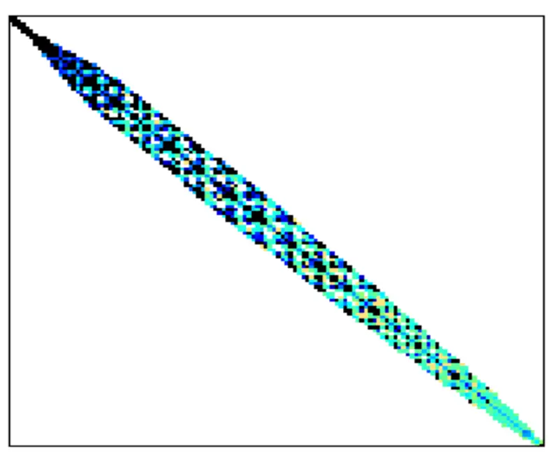
      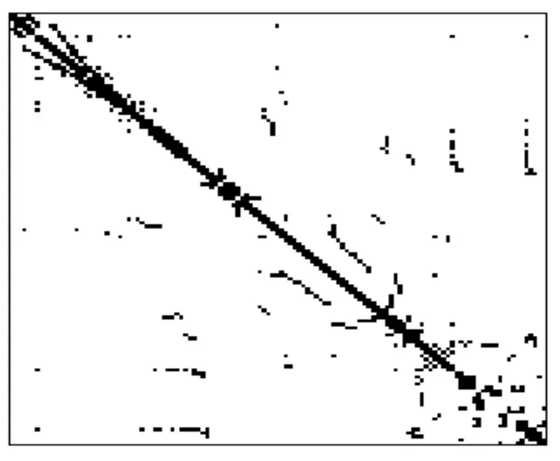
    </div>

    在科学计算领域中，许多问题的求解涉及稀疏的线性方程组，其系数矩阵为稀疏矩阵。[SuiteSparse Matrix Collection](https://sparse.tamu.edu/) 收集了将近 3000 个来自各个领域的稀疏线性方程组数据，你可以点击查看每个矩阵所属的学术类别。

本次实验中，我们将会对一种求解线性方程组的迭代算法进行优化，它的名字是 **BiCGSTAB**. 

[**BiCGSTAB**](https://en.wikipedia.org/wiki/Biconjugate_gradient_stabilized_method) (**Biconjugate Gradient Stabilized Method**, 稳定双共轭梯度法) 是一种迭代求解非对称线性系统的方法。它是 [**BiCG**](https://en.wikipedia.org/wiki/Biconjugate_gradient_method) (**Biconjugate Gradient Method**, 双共轭梯度法) 的变种，有着更快速平缓的收敛表现。在接下来的「知识讲解」部分我们会对该算法进行更详细的介绍。

在本次实验中，我们会提供串行且未作任何优化的 BiCGSTAB 算法的实现，而各位同学将会利用包括 **OpenMP 线程级并行和 MPI 进程级并行**在内的优化技术，加速该算法的求解过程，挑战机器运算性能的极限。这也是除了大作业之外，同学们遇到的第一个需要进行多机并行优化的实验。

???- info "本次实验中对问题的简化"

    出于实验难度的考量，我们对上面的场景进行了一定的简化，采用**稠密的**、**随机生成的**矩阵数据，来方便大家进行优化。

    - 稀疏与稠密:

        稀疏矩阵中大部分的元素为 0 元素，因此如果依旧按照常规矩阵的存储方式来存储，会浪费大量的内存空间。因此在编程实现中，稀疏矩阵往往采用 CSR (Compressed Sparse Row) 格式来存储，其存储结构如下图所示：

        <div align="center">
        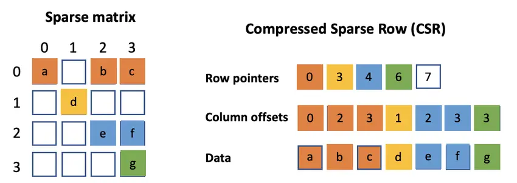
        <a href="https://arxiv.org/abs/2112.13896">图源</a>
        </div>

        这样一来，算法中最核心的 GEMV (矩阵乘向量) 会转化成 SpMV (稀疏矩阵乘向量)，如果直接采用 CSR 格式，对访存不是特别友好。如果想要优化访存，需要考虑重新设计数据排列方式，而这不是本次实验主要考察的内容。
    
    - 真实数据与随机数据:

        `BiCGSTAB` 算法通常用于求解大规模的稀疏矩阵，但由于求解大规模稀疏矩阵涉及到矩阵的结构分析、性质分析等问题，这一点可以通过刚刚结束的 [SolverChallenge 25](https://www.solver-conference.cn/solverchallenge25/index.html) (第五届线性解法器算法与性能优化竞赛) 赛题来感受。如果使用本次实验中比较简单的预条件处理和原始的 BiCGSTAB 算法，在真实矩阵数据上可能会出现无法收敛、数值不稳定等情况。

        为了减少大家优化过程中遇到的与数值计算相关的困难，本次实验将选择随机生成的、性质较好的矩阵数据进行求解，可以顺利地使用 BiCGSTAB 算法进行求解。


## 知识讲解: BiCGSTAB

### 算法原理

!!!danger "前方高能预警"

    对于我们这样非专业背景的同学，BiCGSTAB 算法的原理可能非常难以理解💥。但是，请坐和放宽 😇，在不理解原理的情况下，我们完全可以通过分析代码来找到可以优化的地方。不过，简单了解算法的原理，会对你调试在优化时出现的数值运算的错误 (**比如残差不下降，或出现了 `NaN`**) 有所帮助。
    
    为感兴趣的同学，我们准备了下面的算法推导，帮助你更好地理解 BiCGSTAB 算法的原理。**原理为选读内容，对完成实验影响不大**。

    ???+ info "说明"

        推导部分由助教 [@514InParadox](https://github.com/514InParadox) 完成。

        此处提供的相关数学内容可能不够专业。如果你发现其中不合理的地方，欢迎联系助教。

        本内容参考了[王何宇老师的课件](https://github.com/wangheyu/Optimization/blob/master/lecture_notes/Conjugate_Gradient_Methods.md)，进一步的严格证明请阅读这份资料。

???- "CG"

    如何通过迭代的方式求解线性方程组呢？我们可以把它看作一个优化问题，假设我们要求解 $\mathbf{x}$，使得:

    $$
    \mathbf{Ax}=\mathbf{b}
    $$

    对于向量 $\mathbf{x}$，其中已知 $n\times n$ 矩阵 $\mathbf{A}$ 是对称（即 $\mathbf{A}^T=\mathbf{A}$），正定（即 $\mathbf{x}^T\mathbf{Ax}>0$，对于所有非零向量 $\mathbf{x}\in \mathbf{R}^n$），且为实数，而且 $\mathbf{b}$ 已知。首先尝试转化，这个问题等价于优化问题：

    $$
    \begin{aligned}
    \min \phi(\mathbf{x}) &\overset{\mathrm{def}}=\frac12 \mathbf{x}^T\mathbf{Ax}-\mathbf{b}^T\mathbf{x} \\
    \frac{\mathrm{d} \phi}{\mathrm{d}\mathbf{x}}&=\mathbf{Ax}-\mathbf{b}
    \end{aligned}
    $$

    也就是说，$\phi$ 函数的极值点对应的 $\mathbf{x}$ 就是原方程的解。对于优化问题，我们就可以引入一类很强力的方法：迭代法。我们耳熟能详的**梯度下降法**便是迭代法大家族中的一员。在迭代法的语境下，我们记 $\mathbf{x}_k$ 为第 $k$ 次迭代得到的解 $\mathbf{x}$，$\mathbf{r}_k=\mathbf{A}\mathbf{x}_k - \mathbf{b}$ 为残差。

    对于 $\mathbf{A}$ 的对称正定良好性质，存在更加优异的算法。让我们引入向量组共轭的概念：向量组 $\{\mathbf{p}_0, \mathbf{p}_1, \cdots, \mathbf{p}_{n-1}\}$ 被称为是关于 $n$ 阶对称正定矩阵 $\mathbf{A}$ 共轭的，若

    $$
    \mathbf{p}_i^T\mathbf{A}\mathbf{p}_j = 0, \forall i \neq j.
    $$

    我们有共轭向量组是线性无关向量组，故至多包含 $n$ 个向量。当我们有共轭向量组后，依次沿各个向量对 $\phi$ 的最小值做精确探索：

    $$
    \begin{align}
    \mathbf{x}_{k+1} &= \mathbf{x}_k+\alpha_k\mathbf{p}_k \\
    \alpha_k &= -\frac{\mathbf{r}_k^T\mathbf{p}_k}{\mathbf{p}_k^T\mathbf{A}\mathbf{p}_k}
    \end{align}
    $$

    则不论初值如何取，第 $n$ 步的结果 $\mathbf{x}_n$ 就是全局最优解 $\mathbf{x}^*$。这便是 **共轭方向法(Conjugate Direction Methods, CD)**。

    但是，一般来说我们不会再最开始就求出矩阵 $\mathbf{A}$ 的一个共轭向量组。而这便引入了 CG 算法。其关键是在已知 $\mathbf{p}_0, \mathbf{p}_1, \cdots, \mathbf{p}_{k - 1}$ 的基础上构建 $\mathbf{p}_k$。并且，我们只需要利用 $\mathbf{p}_{k - 1}$ 和 $\mathbf{r}_k$ 就够了。更早的方向并不需要用到，因为 $\mathbf{r}_k$ 的性质，$\mathbf{p}_k$ 会自然和它们共轭，令

    $$
    \begin{aligned}
    \mathbf{p}_k &= -\mathbf{r}_k + \beta_k \mathbf{p}_{k - 1} \\
    \beta &= \frac{\mathbf{r}_k^T\mathbf{A}\mathbf{p}_{k - 1}}{\mathbf{p}_{k - 1}^T\mathbf{A}\mathbf{p}_{k - 1}}
    \end{aligned}
    $$

    这样，我们在前式中两边同左乘 $\mathbf{p}_{k - 1}^T\mathbf{A}$，有

    $$
    \mathbf{p}_{k - 1}^T\mathbf{A}\mathbf{p}_k = -\mathbf{p}_{k - 1}^T\mathbf{A}\mathbf{r}_k + \beta \mathbf{p}_{k - 1}^T\mathbf{A}\mathbf{p}_{k - 1} = 0
    $$

    注意到我们已经构建出了一组共轭向量，所以理论上讲 CG 在 $n$ 步内就能计算出精确解。

???- "BiCG & BiCGSTAB"

    但是 CG 算法的局限在于其严重依赖于 $\mathbf{A}$ 的对称正定性。为了解决 CG 算法无法处理非对称矩阵的问题，引入了 BiCG 算法：[Biconjugate gradient method - Wikipedia](https://en.wikipedia.org/wiki/Biconjugate_gradient_method)，也可以参考这篇博客：[双共轭梯度法 | wjin](https://w-jin.github.io/tech/bicg/)

    其核心思路是通过引入 $\mathbf{A}^T$ 来恢复一种新的对称关系。同时考虑两个方程：

    $$
    \begin{aligned}
    \mathbf{A}\mathbf{x} &= \mathbf{b} \\
    \mathbf{A}^T\mathbf{\tilde{x}} &= \mathbf{\tilde{b}}
    \end{aligned}
    $$

    这引入了残差的双正交性和方向的双共轭性：

    $$
    \begin{aligned}
    \mathbf{\tilde{r}}^T_i \mathbf{r}_j &= 0, \forall i \neq j \\
    \mathbf{\tilde{p}}^T_i \mathbf{A} \mathbf{p}_j &= 0, \forall i \neq j
    \end{aligned}
    $$

    同样对 $\alpha_k, \beta_k$ 进行计算以保证性质：

    $$
    \begin{aligned}
    \mathbf{x}_{k+1} &= \mathbf{x}_k+\alpha_k\mathbf{p}_k \\
    \mathbf{r}_{k+1} &= \mathbf{r}_k - \alpha_k\mathbf{A}\mathbf{p}_k \\
    \tilde{\mathbf{r}}_{k+1} &= \tilde{\mathbf{r}}_k - \alpha_k\mathbf{A}^T\tilde{\mathbf{p}}_k \\
    \mathbf{p}_{k+1} &= \mathbf{r}_{k+1} + \beta_k\mathbf{p}_k \\ 
    \tilde{\mathbf{p}}_{k+1} &= \tilde{\mathbf{r}}_{k+1} + \beta_k\tilde{\mathbf{p}}_k \\
    \alpha_k &= \frac{\tilde{\mathbf{r}}_k^T\mathbf{r}_k}{\tilde{\mathbf{p}}_k^T\mathbf{A}\mathbf{p}_k} \\ \beta_k &= \frac{\tilde{\mathbf{r}}_{k+1}^T \mathbf{r}_{k+1}}{\tilde{\mathbf{r}}_k^T \mathbf{r}_k}
    \end{aligned}
    $$

    但是，BiCG 算法虽然成功地将共轭梯度思想推广到了非对称矩阵，其收敛过程中可能会发生剧烈的震荡，这有时会导致难以接受的后果。BiCGSTAB 的出现就是为了解决这个问题。需要注意的是，BiCGSTAB 更多是一个偏向工程的算法，数学上能证明其有限终止性，但算法本身并不完全遵循 BiCG 算法的数学原理。

    例如，其在 BiCG 的算法基础上，直接用初始的影子残差计算 $\alpha_k =\frac{\tilde{\mathbf{r}}_0^T\mathbf{r}_k}{\tilde{\mathbf{r}}_0^T\mathbf{A}\mathbf{p}_k}$。

    BiCGSTAB 在基本保留 BiCG 步骤的情况下，继续处理 BiCG 中某一次迭代结束得到的 $\mathbf{x}'_{k+1} = \mathbf{x_k} + \alpha \mathbf{p_k}$ 和 $\mathbf{r}'_{k+1} = \mathbf{r}_k - \alpha \mathbf{A} \mathbf{p}_k$。

    把计算出来的残差 $\mathbf{r}'_{k+1}$ 看作一个新下降方向，并在 $\mathbf{A} \mathbf{r}_{k+1}'$ 的方向对其再进行修正。这个修正是一个简单的最小二乘问题：

    $$
    \min_{\omega_k} \Vert \mathbf{r}'_{k+1} - \omega_k \mathbf{A} \mathbf{r}'_{k+1} \Vert $$

    $$
    \omega_k = \frac {(\mathbf{A} \mathbf{r}'_{k+1})^T \mathbf{r}'_{k+1}} {(\mathbf{A} \mathbf{r}'_{k+1})^T(\mathbf{A} \mathbf{r}'_{k+1})}
    $$

    最终，用 $\omega_k$ 完成最终更新：

    $$
    \begin{aligned}
    \mathbf{x}_{k+1} &= (\mathbf{x}_k+\alpha_k\mathbf{p}_k) + \omega_k \mathbf{r}'_{k+1} \\
    \mathbf{r}_{k+1} &= \mathbf{r}'_{k+1} - \omega_k \mathbf{A} \mathbf{r}'_{k+1}
    \end{aligned}
    $$

### 预条件处理

研究完迭代法之后，我们还需要关注矩阵本身的特性。事实上，对于某些矩阵而言，其在真实场景中求解的难度过大，以至于无法达到一个收敛的结果。这也是我们选择让大家求解随机生成的矩阵的原因，因为真实矩阵**往往非常难解**。

但是，通过预条件子技术，我们可以人为地调整矩阵的易解程度。基本思想是：迭代算法的收敛速度一般可以由系数矩阵 $\mathbf{A}$ 的[**条件数**](https://en.wikipedia.org/wiki/Condition_number) $\kappa (\mathbf{A})$ 来评估：

- $\kappa (\mathbf{A})$ 越大，收敛越慢，同时计算误差的影响也就越大
- 如果 $\kappa (\mathbf{A})$ 很大，通常使用预条件处理（precondition）将原始系统 $\mathbf{Ax-b=0}$ 替换为 $\mathbf{M^{-1}(Ax-b)=0}$，使得 $\kappa (\mathbf{M^{-1}A})$ 小于 $\kappa (\mathbf{A})$

其中的 $\mathbf{M}$ 被称为预条件子 (preconditioner)。预条件处理能够加速迭代算法的收敛速度，在应对实际的科学计算问题时，我们往往需要应用预条件子来保证迭代算法的快速求解。

需要注意的是，预条件子的选取也是一门技术活。常见的 $\mathbf{M}$ 选取至少有两种：对角线预处理和不完备的 Cholesky 预处理，**本实验选择 Jacobi 对角线预处理**，即 $\mathbf{M}$ 矩阵为原始系数矩阵 $\mathbf{A}$ 的对角线矩阵。在知名的开源有限元软件 FEAPpv 中，就是采用的这种方法进行预处理。此外，现代的预条件子有代数多重网格实现、区域分解法等，这些生产级别的条件子通常都非常复杂。

### 算法流程

之前介绍的 **CG** 算法要求待求矩阵必须为对称正定矩阵，而 **BiCG** 算法则通过构造双共轭的搜索方向和基于双共轭的残差修正，从而支持对非对称线性系统的求解。**BiCGSTAB** 算法在 **BiCG** 的基础上，又加强了其在求解过程中的数值稳定性，使其收敛更加迅速平缓。

在本实验中，我们要优化的是 **带预条件处理的 BiCGSTAB 算法**，其[算法流程](https://en.wikipedia.org/wiki/Biconjugate_gradient_stabilized_method#Preconditioned_BiCGSTAB)如下：

1. $r_0 = b - \mathbf{A}x_0$
2. Choose an arbitrary vector $\hat{r_0}$ such that $(\hat{r_0}, r_0)\ne 0$, eg. $\hat{r_0} = r_0$
3. $\rho_0 = (\hat{r}_0, r_0)$
4. $p_0 = r_0$
5. For $i = 1, 2, 3, \ldots$
    1. $y = \mathbf{M^{-1}} p_{i-1}$
    2. $v = \mathbf{A}{y}$
    3. $\alpha = \rho_{i-1} / (\hat{r}_0, v)$
    4. $h = x_{i-1} + \alpha y$
    5. $s = r_{i-1} - \alpha v$
    6. If $s$ is within the accuracy tolerance then $x_{i-1} = h$ and quit.
    7. $z = \mathbf{M^{-1}} s$
    8. $t = \mathbf{A}z$
    9. $\omega = (t, s) / (t, t)$
    10. $x_i = h + \omega z$
    11. $r_i = s - \omega t$
    12. If $r_i$ is within the accuracy tolerance then quit.
    13. $\rho_i = (\hat{r}_0, r_i)$
    14. $\beta = (\rho_i / \rho_{i-1}) (\alpha / \omega)$
    15. $p_i = r_i + \beta (p_{i-1} - \omega v)$

在算法流程中，可以观察到大量的向量与矩阵运算，这给我们提供了充足的优化的空间。

## 知识讲解: 优化思路

!!! abstract "导言"

    为了帮助同学们更好地掌握并行优化的技巧，我们将在下面提供相关优化思路作为参考。我们按照章节，按照顺序由浅入深地介绍了找出一段程序性能瓶颈并持续优化的基本流程，相信如果能够走完一遍，你能够收获很多实战经验。
    
     **这部分文档会比较长，请做好心理准备**。推荐在进行某种特定优化时，再对照着相应章节进行阅读。在每一章节的开头处，我们用 **Subtask** 讲述了同学们在阅读完该章节内容后，可以进行的尝试、以及建议在报告中描述的内容，除了标记为 **必做** 的章节，其他章节可以自行选择是否进行尝试。

    在本实验中，你可以对下面的优化思路一一进行尝试，也可以自己尝试创新性的优化策略。请在报告里详细描述你对优化策略所做的尝试，哪怕结果不是很理想。

### Profile 性能分析

???+ success "Subtask: Profile 任务 (必做)"

    你需要在下面两个时间进行 Profile:

    - **开始优化程序之前**，请使用 Intel VTune Profiler 分析你的程序，并在报告中展示:
        - 耗时最长的函数
        - 程序运行的 Flame Graph
    - **使用 MPI 优化程序之后**，请使用 Intel VTune Profiler 或者 ITAC 分析你的程序，并在报告中展示:
        - 耗时最多的三个 MPI 函数 (请区分 MPI 与 OpenMP)
        - 程序在 MPI 上消耗的总时间

    除此之外，Profiler 还会提供更多其他的信息。我们鼓励同学们探索 Profiler 给出的数据和图表，并尝试进行简单的分析，以指导进一步的优化。

!!! danger "Profile 很重要"

    拿到一段陌生的程序，不知从何入手？Profile 是一个很好的起点。

    Profiler 能够提供与程序性能相关的的重要信息，包括运行时间统计、程序热点、MPI通信开销、通信复杂均衡、访存开销等一系列可能对程序优化有帮助的信息，现代的 Profiler 还能够直接提供优化的建议。比如在 [:simple-bilibili: 极客湾Geekerwan: 绝区零性能分析与优化指南：如何流畅玩？](https://b23.tv/BV1eT421k7Be/) 中，VTune Profiler 分析出了当时绝区零的内存访存瓶颈，为玩家的硬件选择和游戏性能的优化提供了重要的参考。

    我们**强烈建议**同学们在优化的过程中使用 Profiler 来帮助你更好地理解程序的性能瓶颈，对症下药，更好地进行优化。

Intel OneAPI 是 Intel 提供的 HPC 工具链，涵盖了从编译、调试、性能分析的完整流程的工具。Intel OneAPI 中的性能分析工具主要有 VTune Profiler, ITAC (Intel Trace Analyzer and Collector) 和 APS (Application Performance Snapshot)。下图展示了 Intel OneAPI 中不同层级 (跨界点、单机、单核) 的性能分析工具与他们的职责:

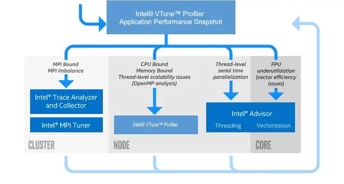

你可以使用如下的 spack 指令安装这些工具:

```bash
spack install intel-oneapi-vtune # VTune & APS
spack install intel-oneapi-itac  # ITAC
```

#### VTune Profiler

在集群上，你可以通过 `spack load` 加载 VTune。通过附加不同的参数，往往可以得到程序运行不同方面的信息。你可以将集群上的 VTune 分析报告下载到本地，使用本地的 VTune 图形界面打开，查看分析结果，也可以使用集群提供的 X11 转发功能，启动集群上的 VTune 图形界面。这里对使用 VTune Profiler 分析程序进行简单的说明，更详细的使用方法请阅读文档最后的参考资料。

我们通常会使用 VTune Profiler 的 `hotspots` (热点) 和 `uarch-exploration` (微架构探究) 两种模式来分别分析程序热点与并行状况、硬件使用情况与硬件瓶颈。

???+ info "Hotspot 模式"
  
    对于程序的热点分析，在课程中同学们已经学会了使用 Perf 来分析程序的热点，VTune Profiler 的 hotspot 模式与 Perf 的功能类似，能够提供程序的热点信息，包括函数调用、循环、访存等。
    但是，对于多线程并行的应用程序来说，我们很多时候需要知道线程间的并行模式与并行状况，这种时候尤其需要使用 VTune Profiler 的 Hotspot 模式来分析程序。

    你可以使用如下的指令来进行分析：

    ```bash
    vtune -collect hotspots -result-dir r000hs ./your_program
    ```

    在采样结束后，可以把结果下载到本地，也可以在集群上，使用 X11 Forwarding 功能直接查看分析结果 (不推荐后者，因为比较卡且不方便)。

    首先我们看到的是 Summary，显示了程序运行的总时间、程序热点函数、CPU使用率等关键信息：

    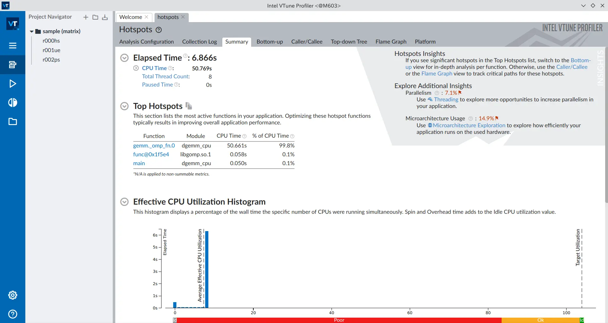
    
    而在 Top-down Tree 等地方，我们可以更加详细地看到每个函数的性能信息，Flame Graph 则让我们更直观地看到程序的热点与调用关系。此时你可以分析出程序耗费时间最长的函数是哪一个，以及其对应的代码的位置 (需编译时添加 `-g` 选项)。

    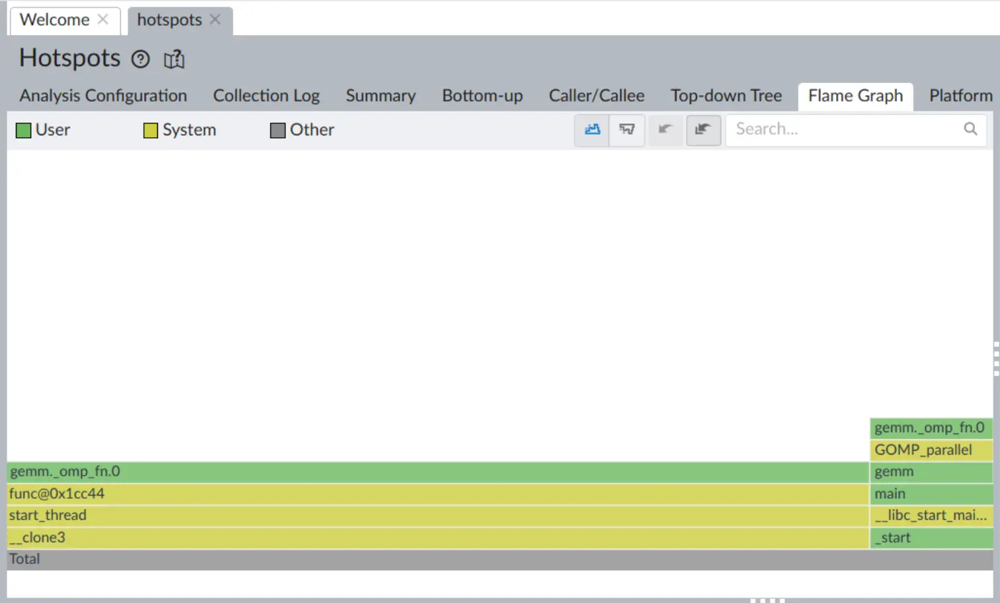

    同时还能看见 Threads 的工作情况，可以用来分析并行程序中的并行状况：

    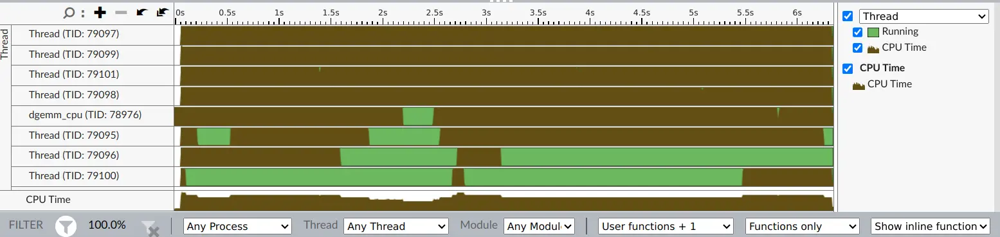
    
    如果线程间存在大量的空闲，则提示可能需要优化并行的方式。

???+ info "Uarch Exploration 模式"
  
    Intel 提出了一种基于微架构视角的性能分析方法，称为 TMAM (Top-down Microarchitecture Analysis Method)。这种[自顶向下的微架构分析方法](https://www.intel.cn/content/www/cn/zh/docs/vtune-profiler/cookbook/2023-0/top-down-microarchitecture-analysis-method.html)能够帮助用户从微架构的角度分析程序的性能瓶颈，从而更有效地进行性能优化。对于给定的计算平台而言，HPC优化的理想是最大化计算单元的利用率。所以通常情况下，我们希望计算单元能充分被使用，而不是在其他部件（如访存部件）的等待中浪费。

    你可以使用如下的指令来进行分析：

    ```bash
    vtune -collect uarch-exploration -result-dir r000ue ./your_program
    ```

    然后采用同样的方法查看分析结果：

    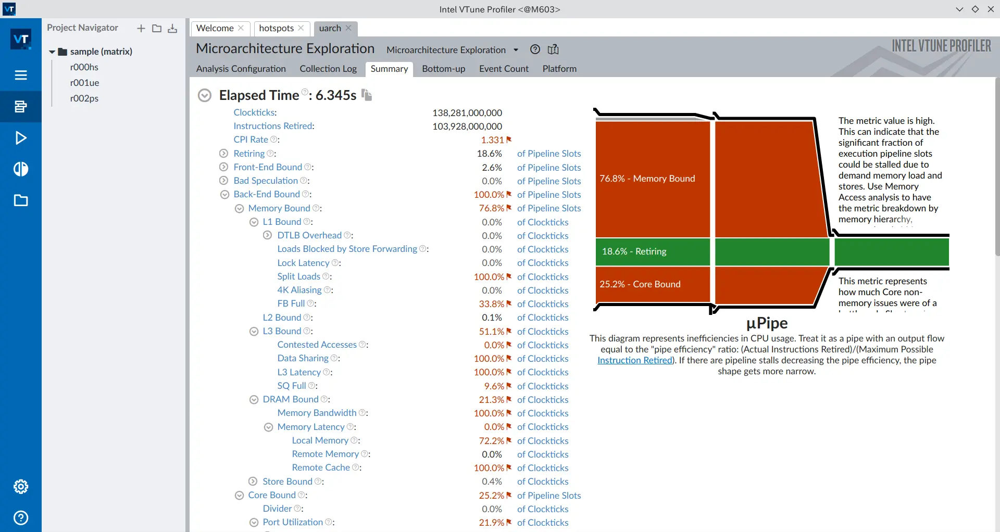

    在 Summary 中，我们可以看到程序运行的**总时间**、**CPU使用率**、**访存带宽**、**访存延迟**等关键信息。对于这个 demo 程序，我们可以看到访存带宽和访存延迟都达到了瓶颈，这就是程序性能瓶颈的重要来源。
    同样的，在 Bottom-up 中，我们可以仔细分析到每个函数对微架构的使用情况，从而进行针对性的优化：
    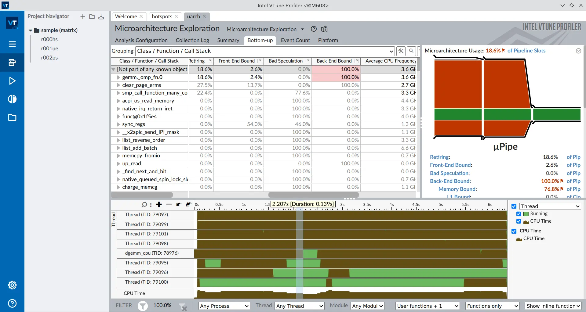

#### ITAC

???+ quote "有关 Intel Trace Analyzer and Collector 停止支持的问题"

    根据 [Intel Trace Analyzer and Collector](https://www.intel.cn/content/www/cn/zh/developer/tools/oneapi/trace-analyzer.html) 的说明，这款性能分析工具已于 2025 年停止支持。其已不再被包含在 Intel HPC Toolkit 中，并且功能将逐渐转移至 VTune Profiler。

    但是目前，VTune Profiler 还没有支持 MPI 程序进程间通信的详细分析。在软件功能迁移的过渡阶段，如果同学们希望对 MPI 程序进行深入的分析，需要单独安装 Intel Trace Analyzer and Collector。但是目前 Intel 已经关闭了 ITAC 的官方下载渠道，所以同学们可以选择:

    1. 在本地 Linux 机器使用 spack 安装 ITAC，并且运行 ITAC 的 GUI 界面
    1. 配置 X11 转发，使用集群上利用 spack 安装的 ITAC

你可以通过 `spack load intel-oneapi-itac` 加载 ITAC。当然这里同样建议同学们把 ITAC 安装到本地，在本地查看集群的分析结果。

???+ info "ITAC 使用方法"

    对于 MPI 应用，通信开销的影响变得尤为重要，ITAC 提供了 MPI 程序通信开销的详细分析，能够帮助用户理解 MPI 程序的通信模式，从而进行优化。

    如果你希望使用 ITAC 来分析你的程序，你可以使用 Intel MPI 的 `mpirun` 的 `-trace` 选项:

    ```bash
    spack load intel-oneapi-mpi
    mpirun -n 4 -trace your_program
    ```

    采样结束后，你可以使用 ITAC 来查看分析结果：

    ```bash
    # 启动 Trace Analyzer GUI (需 x11 forwarding)
    traceanalyzer your_trace.stf
    # 或者命令行分析
    itacstats your_trace.stf
    ```

    在 GUI 中，你可以直观地看到 MPI 函数的耗时与首要的 MPI 函数：

    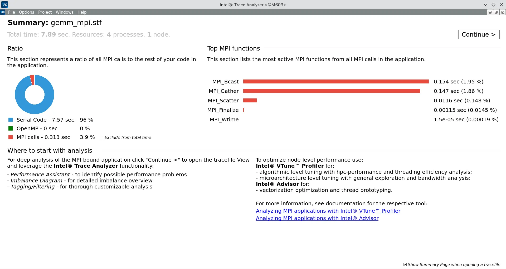

    同时，对于 MPI 程序可能出现的进程间 workload 不均衡问题，ITAC 也提供了详细的统计信息：

    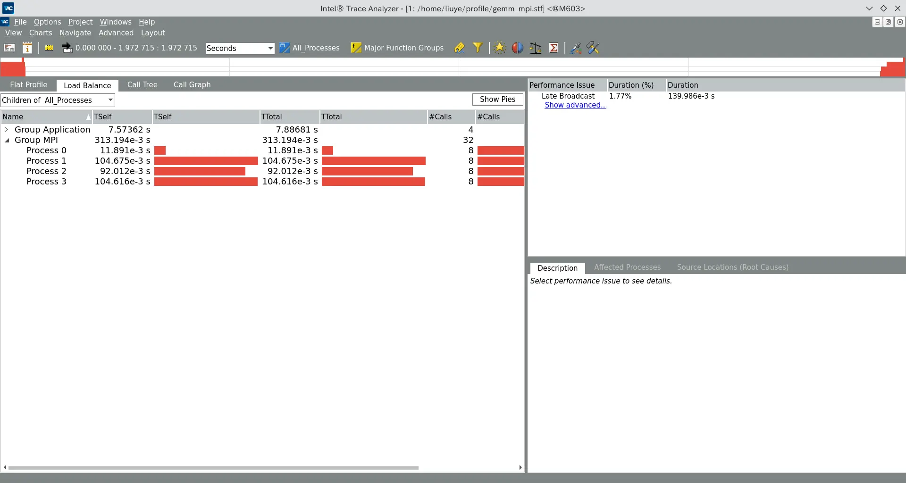

    对于 MPI进程的 Timeline，可以在 Charts 选项中选择 Event Timeline，然后就可以查看 MPI 函数的调用时间线了：

    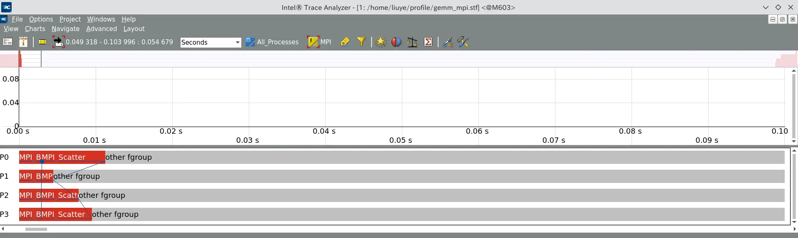


### 编译优化

???+ success "Subtask: 编译优化"

    你可以在优化过程中的任意一个时间点进行这方面的尝试，推荐你进行以下的探索:

    - 对比 `g++` 和 `icpx` 编译器编译出来的程序的运行时间
    - 对比不添加额外选项，与添加了指导优化的编译选项后，对比:
        - 程序的运行时间
        - 程序迭代次数
        - 最终结果的误差

    同学们还可以根据本章节的内容，进行其他方向的探索和分析，并包含在报告中。

!!! tip "让编译器替你负重前行"

    编译器优化是最简单的优化方式之一。如果程序的代码比较规范的话，你可以在**完全不修改任何代码**的情况下，通过尝试不同的编译器、调整编译器的优化等级、添加编译器优化选项等方式，**轻松实现程序性能的提升**。

    本次实验中，我们的基准程序没有开启任何优化参数，期待同学们自行探索编译器优化带来的性能提升。

编译优化包括两方面:

- 你既可以尝试使用不同的编译器优化选项，比如 `-O2`、`-O3`、`-Ofast` 等，来提高程序的性能。优化等级更高时，编译器会采取更加激进的优化策略，实现程序的加速。
    - 同学们还可以自行查询 `-march`, `-mtune` 等编译选项的使用方法，来调整编译器对具体 CPU 微架构的优化。
    - 在使用 `-ffast-math` 之类的编译选项时，请留意程序数值运算的精度问题。
- 你还可以使用不同的编译器，比如 `g++`、`icpx`、`clang++` 等，来比较不同编译器的优化效果。同一个编译器的不同版本，优化效果也可能会有所不同，推荐使用最新版本进行尝试。
    - 如果集群提供的编译器版本不满足你的需求，你可以使用 `spack` 安装新版本的编译器。

在进行编译优化的过程中，我们推荐使用 [Compiler Explorer](https://godbolt.org/) 来直观地从汇编语言的角度，快速观察不同编译器、不同编译选项对代码的优化是否有效，比如:

- 是否使用了 `ymm` / `zmm` 系列的向量化寄存器 (对应 AVX / AVX512 指令集扩展)
- 是否进行了循环展开，是否进行了分支预测的优化等等 (`icpx` 会标记分支推测的跳转概率)

???+ info "Godbolt 使用方法"

    比如，把 `gemv()` 函数放到 Godbolt 中观察，使用 `x86-64 clang 20.1.0` 编译器，开启 `-O3 -ffast-math` 优化选项时，编译器生成了左侧的汇编代码:

    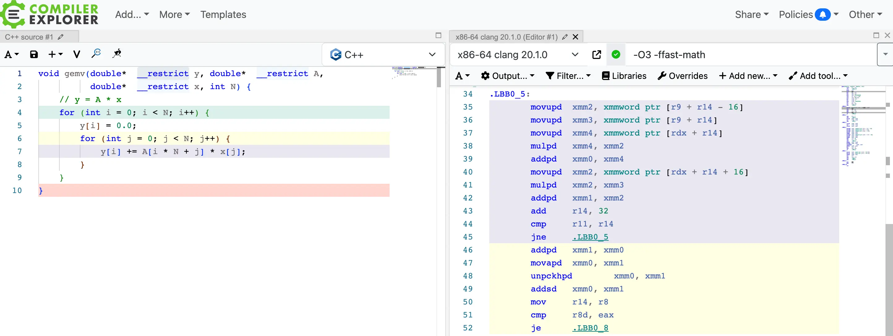

    发现编译器默认只使用了 128 位向量化指令，对应 `xmm` 寄存器。而我们加入 `-mavx512f` 优化选项后，编译器生成了如下的汇编代码:

    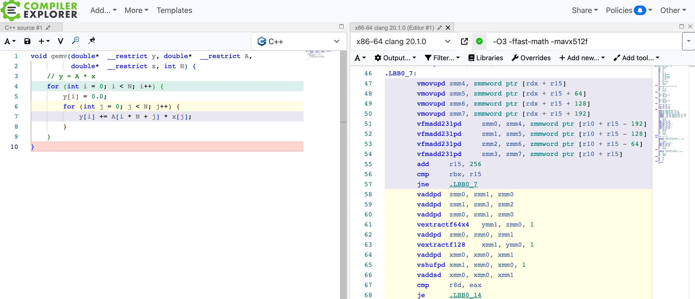

    可以观察到编译器使用了 `vfmadd213pd` 等指令，操作了 AVX512 的 `zmm` 寄存器，实现了更进一步的向量化运算。

    当你使用手写向量化 Intrinsic，以及其他优化时，也可以使用 Godbolt 来和编译器自动优化对比，明确性能提升 / 下降的原因。

### 访存优化

???+ success "Subtask: 访存优化"

    如果你尝试进行访存优化，请在实验报告中描述你的思路，并给出 Intel VTune Profiler 中 Memory Bound 数值的前后对比，进行简要分析。

程序局部性 (Locality) 指的是应用程序在访问内存的时候，倾向于访问内存中较为靠近的值。

一般来说，程序的局部性分为两种形式，一种是时间局部性，另一种是空间局部性。时间局部性指的是，程序在运行时，最近刚刚被引用过的一个内存位置容易再次被引用，比如在调取一个函数的时候，前不久才调取过的本地参数容易再度被调取使用。空间局部性指的是，最近引用过的内存位置以及其周边的内存位置容易再次被使用。空间局部性比较常见于循环中，比如在一个数列中，如果第 3 个元素在上一个循环中使用，则本次循环中极有可能会使用第 4 个元素。

在计算机的硬件实现中有大量基于局部性的优化技术，比如缓存 (Cache)、预取 (Prefetch) 等。这对应了 Profiler 提供的 **Memory Bound 中的 L1 / L2 / L3 Bound** 等指标。

如果你通过 Profiler 观察到这些指标不是很理想，就可以考虑通过加强程序的局部性来提高程序的性能。你可以在互联网上找到大量的对 GEMV 等操作进行访存优化的资料。反之，如果 Profiler 提示 Memory Bound 并非最主要瓶颈，则应优先考虑其他优化方式。

<div align="center">
    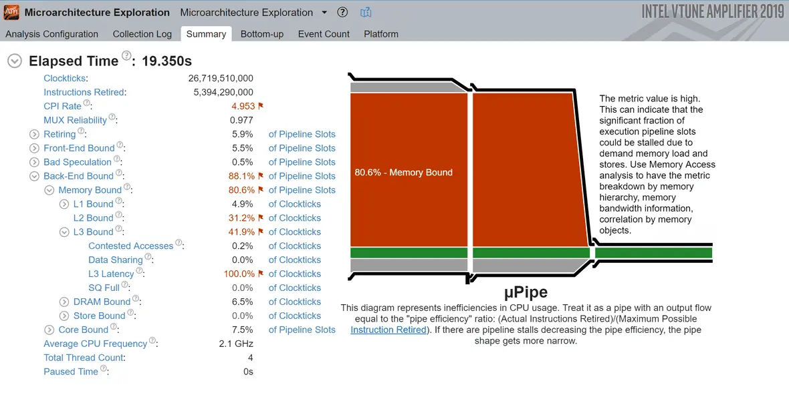
    <p>常见的 Memory Bound 情况 <a href="https://mahdytech.com/vtune-cache-miss">(by Ahmed Mahdy)</a></p>
</div>

### SIMD 数据级并行

???+ success "Subtask: 数据级并行"

    推荐通过手写 AVX Intrinsic 的方式完成 SIMD 的优化，除了运行时间降低以外，推荐使用下面两种方法**之一**分析 SIMD 优化的有效性:

    1. 对比手写 AVX Intrinsic 和编译器自主优化时，使用 Godbolt 生成的汇编代码
        - 可以从指令条数、Latency、Throughput 等方面进行分析
    1. 对比手写 AVX Intrinsic 前后 VTune Profiler 有关指标的变化

???- abstract "并行的层级"

    在计算机体系结构的视角下，并行可以分为**指令级并行** (ILP, Instruction-Level Parallelism)、**数据级并行** (DLP, Data-Level Parallelism)和**线程级并行** (TLP, Thread-Level Parallelism)。

    <div align="center">
        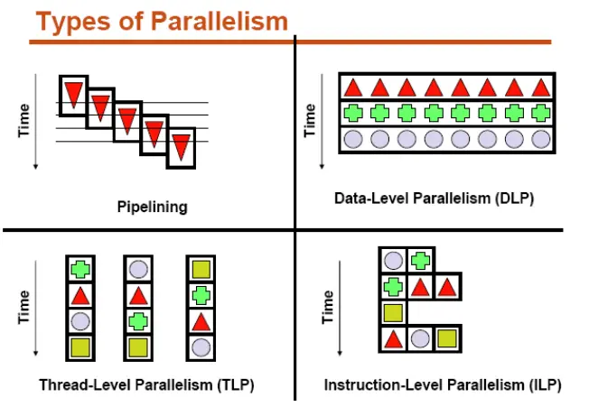
    </div>

    - **ILP** 主要发生在单个处理器核心内部，它依赖于核心的硬件机制（如多发射、超标量执行、乱序执行、分支预测）来同时执行多条指令。
    
        现代处理器一般都会使用流水线技术来同时执行多条指令的不同阶段，从而实现指令间的并行。传统流水线因为需要解决流水线中的各种冲突，不可避免的会在流水线中带来空泡，而由于现代处理器里其实还包含指令的乱序发射，出现空泡的几率已经大大降低，所以在编程时不太需要考虑这方面的问题。

        <div align="center">
            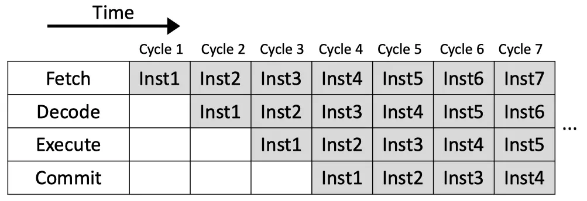
        </div>
    - **DLP** 的核心思想是单指令流操作多数据流 (SIMD)。它可以在单个核心上通过向量化指令集（如 SSE, AVX, NEON）实现，也可以在专门的并行硬件（如 GPU）上大规模实现。其关键特征是对大量数据元素应用相同的操作。

        <div align="center">
            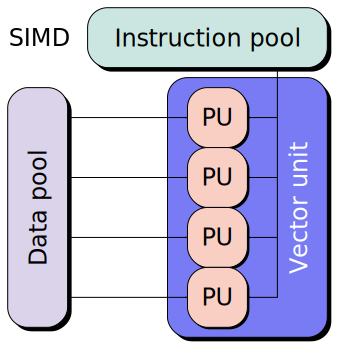
        </div>
    - **TLP** 发生在多个独立的控制流（线程） 层面。这些线程可以：
        - 在单个多核处理器的多个核心上并发执行（此时涉及核心间通信和缓存一致性协议）
        - 在多个处理器（如多路服务器）上并发执行（此时可能涉及NUMA架构及其访问延迟问题）

对于单个运行中的线程 (对应单个 CPU 核心)，**数据级并行**可以提高程序的并行度和吞吐量。

`SIMD` 是一种数据并行技术，它通过提供支持向量运算的指令，同时对一组数据执行相同的计算，从而实现空间上的并行，进而提高程序的并行度和吞吐量。当程序中出现大量完全一致的运算需要对一批数据进行处理时，你可以考虑使用 `SIMD` 对其进行并行。

<div align="center">
    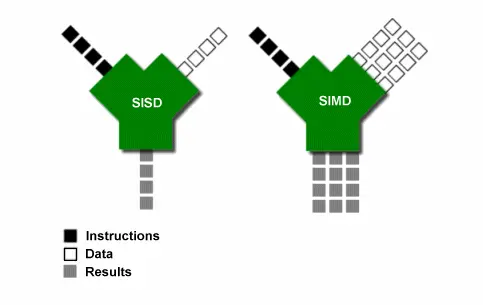
</div>

`BiCGSTAB`算法中有大量的矩阵和向量操作，比如**矩阵与向量相乘、向量点乘、向量加法**等，这些运算都很适合使用`SIMD`进行加速。一般而言，使用编译器的自动向量化就能够获得很可观的加速。不同编译器对于向量化有不同的开关，请同学们自行查阅编译器的文档或网络资料进行尝试。

如果编译器的自动向量化效果不佳，你还可以考虑使用 AVX / AVX512 的 Intrinsic 来进行手写向量化优化。如果你已经遗忘了该如何手写向量化，请回顾 [Lab 2: 向量化计算 - HPC101 (2025)](https://hpc101.zjusct.io/lab/Lab2-Vectorization/) 的内容。

???+ info "查询 Intrinsic 的具体信息并进行分析"

    在选取具体 Intrinsic 的过程中，你需要使用 [Intel Intrinsics Guide](https://www.intel.com/content/www/us/en/docs/intrinsics-guide/index.html) 来查询不同指令的性能和使用方法。你可以在右侧勾选所需指令的种类来找到相应的 Intrinsic 操作。

    你还可以点击某条 Intrinsic 的名称，来查看该 Intrinsic 的详细信息。对于 CPU 执行指令的流水线来说，你最需要关注的是 **Latency** (延迟) 和 **Throughput** (吞吐量) 两个指标。除了内存访存指令之外，其他指令基本上都会给出这两个指标。

    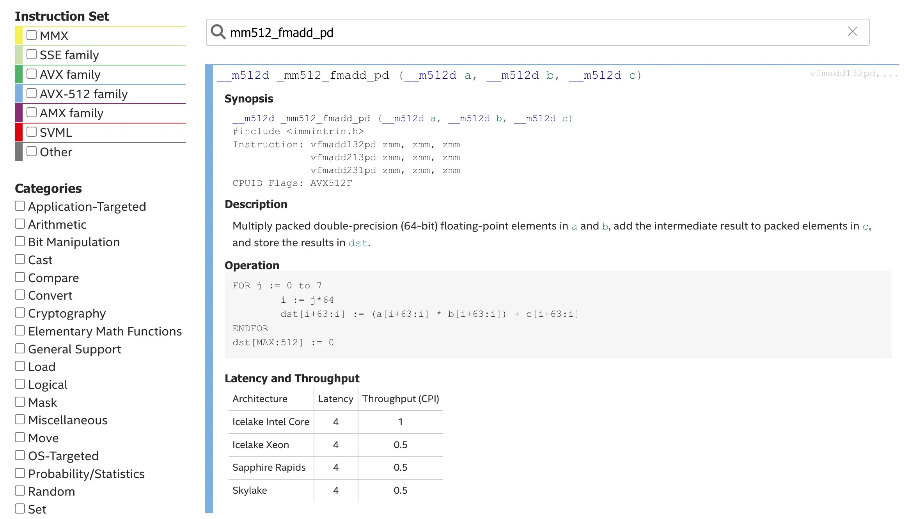

    M602-M604 的 CPU 为 Intel(R) Xeon(R) Gold 5320 CPU @ 2.20GHz，为第三代志强可扩展处理器，其微架构代号为 Icelake. 从上面可以看出，对于一条 512 位双精度乘加 (`_mm512_fmadd_pd`) 指令，其首条指令的结果需要等待 4 个时钟周期，随后每个周期可以完成 2 条乘加指令 (CPI = 0.5)。

    以上两个指标可以辅助你**分析 CPU 流水线停顿的原因和 CPI 的瓶颈**，尤其是配合 VTune Profiler 的 Uarch Exploration 分析时。


### OpenMP 线程级并行

???+ success "Subtask: 线程级并行 (必做)"

    在使用 OpenMP 线程级并行时，请在报告中记录使用的**线程数**以及**加速比**，思考: **加速比能随着线程数的增加而线性增长吗？** 你可以使用 Profiler 的结果来进行简要的分析。

    同学们还可以探索 (选做):

    - 调度方式和调度粒度对并行效果的影响

        比如，从访存连续性的角度考虑，一个线程执行 `for` 循环的连续数次迭代可能会比跳跃执行同样次数的迭代要更高效，这与我们在课程中提到的“伪共享”问题是一致的。
        可以使用 OpenMP 的 `schedule` 子句和 `size` 参数来调整调度方式和调度粒度，也可以手动分配任务。
    - OpenMP 和向量化 Intrinsic 的粒度之间的权衡

在单机 / 单个 NUMA 节点上，我们往往使用**线程级并行**来进行并行化。

`OpenMP` 是一种简单易用的多线程并行编程模型，你可以通过在代码中插入 `#pragma omp parallel for` 来实现简单的并行化。更详细的使用方法请参考 `OpenMP` 的[短学期课程内容](https://github.com/ZJUSCT/HPC101/tree/main/beamer/pdf/day8_am.pdf)和 `OpenMP` 的[官方文档](https://www.openmp.org/wp-content/uploads/OpenMP-RefGuide-6.0-OMP60SC24-web.pdf)。

在本实验中，你可以考虑对矩阵向量乘法、向量点乘、向量加法等运算进行并行化，这通常能够获得非常好的加速效果。但**需要注意**的是，为了保证计算的正确性，你需要仔细分析计算中可能出现的数据访问冲突，合理使用 `reduction` 等关键字保证并行化的代码是**线程安全**的。

???+ quote "悄悄告诉你"

    其实，只需要给所有向量操作的 for 循环都加上 `#pragma omp parallel for`，就可以获得非常可观的加速效果哦

### MPI 进程级并行

???+ success "Subtask: 进程级并行 (必做)"

    你需要完成程序的 MPI 多进程并行化，并且能在至少 2 台机器上同时运行，并得到正确的结果。之后，还可以探索 [MPI 调优](#mpi-调优) 中介绍的方法。在完成后请不要忘记 [Subtask: Profile 任务](#profile-性能分析)。

由于计算机硬件的限制，我们不可能在单节点上无限制地增加计算资源。因此，想要扩展计算规模，就需要必然涉及**多节点**的计算。而这时 `MPI` 就派上用场了。

#### MPI 编程

在课程中我们提到，`MPI` 是一种**非共享内存**的进程级并行编程模型，因此在使用 `MPI` 进行并行化时，你需要**手动进行进程间的通信**来实现数据在进程间的传输。

你可以通过在代码中插入 `MPI_Send` 和 `MPI_Recv` 等函数来实现进程间的通信，也可以通过 `MPI` 提供的一系列通信函数来实现更高级的通信操作。更详细的使用方法请参考 `MPI` 的[短学期课程内容](https://github.com/ZJUSCT/HPC101/tree/main/beamer/pdf/day8_am.pdf)。

!!! info "MPI 函数功能速查"

    强烈推荐在 [Rookie HPC MPI Documentation](https://rookiehpc.org/mpi/docs/index.html) 中快速查询 MPI 函数的具体功能。对于每个 MPI 函数，该文档都有详细的功能介绍，并附带示例代码。

在本次实验的实现过程中，你主要需要明确下面这三个问题，并进行合理实现:

- **任务划分**: 分析计算任务的特征，将大的计算任务拆分成多个互不依赖的子任务，并分配给不同的进程进行计算。

    比如，对于 GEMV (矩阵乘向量) 计算，你可以通过矩阵分块的形式进行任务划分，如下图:

    <div align="center">
        
    </div>

- **数据分发与结果收集**: 在并行计算开始前，需要把数据分发给每个进程。同理，完成计算后，需要将结果收集起来。为了完成这个任务，你需要了解两种通信方式，并进行合理选择:

    - **集合通信** (Collective Communication) ，如 `MPI_Bcast`、`MPI_Scatter`、`MPI_Gather`.
    - **点对点通信** (Point-to-Point Communication) ，如 `MPI_Send`、`MPI_Recv`.

- **并行计算**: 你需要分析 BiCGSTAB 算法的迭代过程中，哪些部分可以充分并行计算，哪些部分必须串行计算。

    你可以将进程分成 Master 和 Worker 两类，可以并行的部分由全部进程并行计算，由 Master 进程负责数据分发和结果收集，而串行部分，则由 Master 进程独立完成。

需要注意的是，与 `OpenMP` 相比，`MPI` 的创建进程的开销和进程间通信开销往往较大。因此在使用 `MPI` 进行并行化时，你需要在并行化带来的加速效果和进程间通信的额外开销之间进行权衡。你可以通过调整进程数量、合理安排通信的时间和通信量等方式来优化 `MPI` 的并行效果。


!!! danger "常见错误"

    在往年的实验中，有同学使用了 MPI，但是程序并没有任何加速效果。这是因为这位同学只是调用了 MPI_Init 和 MPI_Finalize 等函数，并没有进行**任务划分、并行计算、数据通信**等操作，导致实际上是每个进程独立地完成了全部的计算。请注意使用 MPI 时，上面的操作都需要通过手动编程实现。

#### MPI 调优

为了提高 MPI 程序通信和运算效率，同学们可以进一步尝试:

**异步通信**: 你可以使用异步通信，尽量在计算的同时传输后续需要的数据，提高通信的效率。

???- info "使用 ITAC / VTune 分析 MPI 通信"

    如果使用 ITAC 对程序进行 Profile 分析，可以观察到程序运算 (蓝色) 和 MPI 通信 (红色) 占用的时间。VTune 也类似，但没有 ITAC 这么详细。
    
    下图中第一个结果使用同步通信，而后面两个使用了 `Isend` / `Irecv` 的异步通信，可以观察到通信产生的空泡 (红色部分) 占比降低。

    <div align="center">
        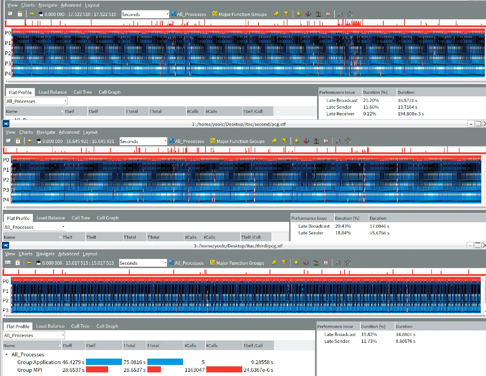
    </div>

**编译优化**: 在编译 MPI 程序时，你可以使用 `mpicc -cc=gcc` 这样的选项来指定编译器。

在使用 Intel oneAPI 中的 Profiler 时，推荐使用 Intel oneAPI 提供的 `mpiicx` 编译器。搭配使用 OpenMP 的时候，请参考下表：

|   | C | C++ | Fortran | 加载 OpenMP 的选项 |
| --- | --- | --- | --- | --- |
| GCC | `mpicc` | `mpicxx` | `mpifc` | `-fopenmp` |
| LLVM | `mpicc -cc=clang` | `mpicxx -cc=clang` | `mpifc` | `-fopenmp` |
| Intel oneAPI | `mpiicx` | `mpiicpx` | `mpiifx` | `-qopenmp` |

!!! info inline end "阅读材料"
    如果你对 MPI 通信和高性能网络感兴趣，可以阅读 [MPI 通信算法调优 - ZJUSCT Open Docs](https://docs.zjusct.io/optimization/parallel/cpu/mpi/#mpi-%E9%AB%98%E7%BA%A7%E8%AF%9D%E9%A2%98) 中的相关内容，不过这已经超出了本次实验的考察范围。

**MPI 实现选择**: 你也可以探究不同 `MPI` 实现对性能的影响，如 `Intel MPI`、`OpenMPI` 等。比如 Intel MPI 可以自动利用集群节点之间的 Infiniband 通信，在带宽和延迟上都要优于以太网互联。

**MPI 绑核设置**: 你可以通过绑核设置，将进程绑定在指定的 CPU 核心上，以提高程序的 CPU 亲和性。OpenMPI 和 Intel MPI 都支持绑核设置，但是具体参数不同。推荐阅读 [Binding/Pinning HPC Wiki](https://hpc-wiki.info/hpc/Binding/Pinning) 来了解具体的绑核方式。

!!! tips "mpirun 参数设置提醒"

    1. 在使用 `mpirun` 启动 MPI + OpenMP 程序时，如果 OpenMP 的线程全部运行在了一个核心上，请添加 `-map-by NUMA` 参数
    1. 如果要使用想在 Slurm 的任务中使用 Intel MPI, 请在 `run.sh` 中加入 
    
    ```bash
    export I_MPI_PMI_LIBRARY=/slurm/libpmi2.so.0.0.0
    ```

## 实验任务和要求

### 实验任务

在 [知识讲解: 优化思路](#知识讲解-优化思路) 中，每个章节都给出了一个子任务，同学们**必须完成**以下三个任务:

- [Subtask: Profile 任务](#profile-性能分析)
- [Subtask: OpenMP 线程级并行](#openmp-线程级并行)
- [Subtask: MPI 进程级并行](#mpi-进程级并行)

同时，还需要完成以下任务中的**至少一个**:

- [Subtask: 编译优化](#编译优化)
- [Subtask: 访存优化](#访存优化)
- [Subtask: SIMD 数据级并行](#simd-数据级并行)
- 其他方法进行的优化

请在实验报告中详细描述实验过程及结果，包括但不限于以下内容：

1. Profile 结果和分析
2. 优化思路和实现 (OpenMP, MPI 的使用...)
3. 每一步优化后的性能提升情况

我们会根据同学们所进行的尝试以及完成程度进行给分，同时我们还会**复测**同学们提交的代码:

 - 代码在测试时将测试 4 组固定的输入，其中三组输入公开，相对应的矩阵 $\mathbf{A}$ 规模分别为 $2001\times 2001$、$4001\times 4001$、$6001\times 6001$，最后一组输入不公布，用于检验算法实现的正确性。
- 我们将检查代码的合法性（包括是否替换为了其他算法、是否调用了数学库、是否修改了禁止修改的部分等），重新编译，并检查程序是否能够正确运行

因此建议同学们在提交前确认自己的代码在加载好环境后，能够顺利编译运行。推荐使用 git 进行版本管理，以便编写报告时可以快速找到历史优化的代码。

!!! danger "可修改的部分"

    本次实验不再限制仅修改单文件，可以根据自己的需要，增加新的文件，或者修改别的文件。
    
    但请注意，在优化过程中，**严禁修改计时区**:
    
    - 对于 `src/main.cpp` 的修改，请仅限于添加 MPI 相关的代码
    - `src/judger.cpp`, `include/judger.h` 不可以修改
    - **其他部分都可以进行修改**

    如果希望提交到 OJ 测评，请注意:

    - `src/judger.cpp`, `include/judger.h` 在 OJ 测评时会被替换，因此修改并不会生效。
    - 如果有新增文件并希望可以被 OJ 测评，请将新文件放在 `src` 或 `include` 文件夹中。OJ 会使用的文件为：`src` 文件夹，`include` 文件夹，`CMakeLists.txt`, `run.sh`, `compile.sh`，其他的文件不会生效。

### 实验环境

!!! info "环境使用方法"

    实验环境的使用方法请阅读:
    
    - [软件环境 - HPC101 (2025)](https://hpc101.zjusct.io/guide/env/): 包含如何使用 spack 安装与加载环境
    - [提交作业 - HPC101 (2025)](https://hpc101.zjusct.io/guide/job/): 包含如何使用 Slurm 提交 MPI 多机任务

    **请注意 Slurm 中申请的线程数包含了超线程，并不对应物理核心数。**

    为了防止 sbatch 参数设置错误导致程序最终只分配到了一个 CPU 物理核心，**请务必参考 [Slurm 官方文档](https://slurm.schedmd.com/sbatch.html)**，其中:

    - `--ntasks-per-node` 对应每个节点上的进程数
    - `--cpus-per-task` 对应每个进程的线程数

    你可以使用 `bash -c "hostname && taskset -cp \$\$"` 检测是否申请到正确的核心，比如:

    ```bash
    M600:~$ srun -p solver1 -N 1 -c 10 bash -c "hostname && taskset -cp \$\$"
    M602
    pid 273240's current affinity list: 0-4,52-56
    ```

    也可以添加到 sbatch 脚本中。

我们提供 `BiCGSTAB Solver` 代码的串行版本作为[基准代码](https://github.com/ZJUSCT/HPC101/tree/main/src/lab4)。

数据文件在集群的 `/river/hpc101/2025/lab4/data` 中，你可以在代码的根目录下，通过 

```bash
ln -s /river/hpc101/2025/lab4/data data
```

来引用它们。如果直接复制数据的话，请注意**不要向 OJ 或者学在浙大提交数据文件**。

Lab 4 实验在 SLURM 集群上进行，提供了以下两个计算分区供使用：

- solver1 分区：

    - 单次任务限制： 最多可申请 1 个计算节点。

    - 最长运行时间： 15 分钟。

- solver2 分区：
    - 单次任务限制： 最多可申请 3 个计算节点。

    - 最长运行时间： 2 分钟。

所有计算节点配置相同，每个节点提供：

- 物理核心： 52 个 (2 × Intel(R) Xeon(R) Gold 5320 CPU @ 2.20GHz)

- 内存： 503 GiB

注意： 每个分区最多同时运行一个任务。

如果你希望更多的时间用于调试，可以**在 `solver1` 分区申请单个节点**，**时限为 15 分钟**。

你可以使用上述条件范围内的任意节点数和核心数的组合完成本次实验，请在提交的 SBATCH 脚本中调整对应参数，并在最终报告中加以说明。

!!! info "分区时间限制"

    在临近实验截止日期时，提交的同学会越来越多，我们会根据情况调整 solver1 / solver2 分区任务时间上限，请合理安排进度。基准程序可能无法在 15 分钟内完成大数据的计算，因此在优化前期请使用**单机、小样例**进行测试。

    为了避免 Slurm 队列拥挤，**强烈建议**同学们在使用 Slurm 时:

    - 使用 `sbatch` 提交长时间的任务
    - 使用 `srun` 来运行短时间任务
    - 尽量不要使用 `salloc` 来独占某个节点，如果必须要使用，请在使用结束后**检查任务是否释放节点资源**

### 实验要求

!!! danger "注意事项"

    1. 严禁抄袭。我们会对提交的代码进行严格查重，一旦发现，按 0 分处理。
    1. 禁止恶意浪费节点资源、恶意攻击 OJ 和集群等干扰他人的行为。
    1. 禁止使用其他的算法来代替 `BiCGSTAB` 算法完成方程求解；我们考察的是并行化，而非对算法本身的改造。在代码测试时会着重检查这一点。
        - 尝试实现 Pipeline BiCGSTAB 算法除外
    1. 禁止调用库函数完成计算过程，包括但不限于调用矩阵乘法库函数、调用线性方程组求解库函数等。
    1. 如对题目有疑惑或认为说明文档/基准代码有缺漏，请联系助教。

请将「实验报告 pdf」和「代码压缩包 (.zip 格式)」提交到学在浙大:

- 实验报告 `学号-姓名-solver.pdf`
- 实验代码压缩包 `学号-姓名-solver.zip`，具体内容要求如下:
    - 请将优化任务的源代码文件放在 `code` 文件夹内，文件夹内存放：
        - 源代码文件夹 `src` : 为了节省空间，**请不要提交输入数据文件**。
        - `CMakeLists.txt`: 为了让大家熟悉 CMake 的使用，我们要求使用 CMake 来构建代码。基准代码中已经提供了 CMakeLists.txt，你可以根据需要进行修改。
        - `run.sh`: 请在 `run.sh` 中编写 Slurm 的 SBATCH 脚本，并正确指定你所用的节点数和核心数，如果你需要设置环境变量，也可以在这里设置。
        - `compile.sh` 以及其他你需要上传的文件。
    - 请将 Profile 任务的文件放在 `profile` 文件夹内　(如果有需要上传的)

### 常见问题

???+ success "Q: 使用 OpenMP 后，我的程序变慢了许多 / 没有什么作用，该怎么做？"

    请使用 `btop` 等工具查看程序运行时 CPU 的实时占用率以及核心数，确认程序真的跑在了多个核心上，如果没有，可以按照这些步骤来排查:

    1. 请确认自己的计算程序运行在计算节点上，如 M602-M604. 不建议在登录节点 `sct101` 上运行计算程序
    1. 请检查 `CMakeLists.txt` 中是否添加了启用 OpenMP 的选项，如果你有些忘记了，请查看 [MPI 调优](#mpi-调优) 所列的表格
    1. 请检查 `run.sh` 中 SBATCH 参数的设置是否正确，可以参考 [实验环境](#实验环境) 中的提示，可以使用 `srun` 添加相同参数运行一个测试程序 (请自己实现，可以让每个线程输出自己的 `tid`) 来确认
    1. 如果尝试了绑核参数，可以使用 `mpirun` 相关的参数，在程序运行前输出绑核策略，来确认绑核是否有效地将 OpenMP 的线程绑定在指定的核心上 

???+ success "Q: 在本地安装的 VTune Profiler 会闪退，怎么办？"

    请确认 VTune Profiler 安装路径不包含非英文字符

???+ success "Q: 实验文档太长了，我都要做哪些任务，可不可以简单讲一下?"

    TLDR: 只需要完成 OpenMP + MPI 优化、Profiler 使用和任意一个其他优化这三个任务，并在实验报告中记录自己的尝试过程就可以。

    如果你还有时间和余力，欢迎尝试更多的优化方法和 Bonus 任务。你也可以通过完成 Bonus 任务，来减免要求的三个任务中的一个，但请注意 Bonus 也需要花费精力来完成，直接使用 AI 生成的代码将不会被接受。

## Bonus 任务

本部分**选做**, 感兴趣的同学可以尝试完成。

??? example inline end "Fortran Meme 太多了!"

    === "🚨"
    
        甲：我们穿越成功了！
    
        乙：但现在是哪一年？
    
        甲：问问那边的路人。
    
        甲：现在增长趋势最快的编程语言是什么？
    
        路人：Fortran 和 COBOL.
    
        甲：1970 年
    
        
    
    === "🤓"
    
        在古籍馆借到了 FOTRAN 教材:
    
        
    
        (不要真的去学这本书，拜托了orz)
        
    === "💀👋😀"
    
    	

Fortran 是世界上第一个被正式采用并流传至今的高级编程语言，它因较为容易学习而被大量用于科学计算领域的代码编写。在其[官方主页](https://fortran-lang.org/index)上，Fortran 被定义为“**高性能并行编程语言**”。可以说，在科学计算领域，Fortran 是一门非常重要的编程语言。Fortran 最突出的特点就是数组下标默认从 1 开始，符合研究者的习惯，这一点与 C/C++ 不同。

Fortran 的编译器往往会随 C/C++ 的编译器一同安装，且其编译流程和 C/C++ 类似，故其能和 C/C++ 程序进行混合编译，最终链接成一个程序。我们一般接触到的 Fortran 代码至少是 Fortran 90 标准（这也是其后缀名 `.f90` 的由来），而最新的标准是 Fortran 2023，甚至已经有了[包管理器](https://fpm.fortran-lang.org/)和 [http 包](https://http-client.fortran-lang.org/)。

在本部分，你需要使用 Fortran 完成 `BiCGSTAB` 算法的实现，并使其能够被基准代码中的 C 语言代码调用。你可以在 [Fortran 代码编写](#fortran-代码编写) 部分找到一些学习资料。

我们在 CMakeLists.txt 中给出了混合编译 C 和 Fortran 代码时需要用到的配置，所以可以直接在 `src` 文件夹内创建 `solver.f90` 文件，然后编写 Fortran 代码。根据 CMakeLists.txt 中的配置，会自动编译生成 `bicgstab-fortran` 程序。

同时你也可以尝试在 Fortran 上尝试你的一系列优化策略，并比较两个版本的性能差异。

Bonus 部分完成即有加分 (完成 Bonus 部分实验要求，且能够通过编译与测试)，我们将根据完成质量提供 10 分以内的加分(与 Lab 4 权重相同)，不过实验最高得分为 100 分。

!!! tip "模板代码"

    你可以参考下面的模板代码，并根据需要进行修改:

    ```fortran
    function bicgstab(N, A, b, x, tol, maxit) result(iter) bind(C, name="bicgstab")
        use, intrinsic :: iso_c_binding
        implicit none

        ! Add parameter binding here, eg:
        integer(c_int), intent(in), value :: N

        ! Add local variables here, eg:
        integer(c_int) :: iter

        ! Start your implementation here
        iter = 0
    end function bicgstab
    ```

!!! info "关于 AI 使用的要求"

    对于 Fortran 部分，请不要直接提交 AI 生成的代码:

    - 一方面，Fortran 是比较古老的编程语言，语料较少，使用 AI 辅助可能会导致完成 Bonus 更加困难
    - 另一方面，Fortran 从语言设计上就是贴近科学计算和公式表示的，当你掌握基本的语法后，转写代码会相对容易
    
    如果你提交的代码充斥着 AI 生成的痕迹，将不能获得 Bonus 代码实现部分的加分。

## OJ 使用说明

!!! danger "这里没必要卷 😭"

    **请注意，OJ 上的得分仅供性能参考，不会直接折算进 Lab 得分，也不会按照加速比排行榜次序来评分。**

    我们更注重优化的思路和过程分析，因此 OJ 测评得分与实验得分并无直接关系。请不要过度追求 OJ 得分进行优化，也不要因为较高的 OJ 得分而忽视了实验报告的撰写，希望同学们能够理解。
    
    即使加速比不是很理想，但优化思路明确，代码完成程度高，一样可以得到实验的高分。同理，即使 OJ 都拿了满分，但报告很简略，没有提及关键思路，也不会获得很理想的分数。

请阅读 [使用在线测评](https://hpc101.zjusct.io/guide/oj/) 来熟悉 OJ 的操作方法。

上传文件时，请使用 `scp` 或者 `sftp` 命令，将你的仓库文件夹上传到 OJ 的 `lab4` 文件夹内，保持文件夹结构不变：

```
.   <--- OJ 的 lab4 文件夹, <用户名>+oj@clusters.zju.edu.cn:lab4
├── CMakeLists.txt
├── run.sh
├── compile.sh
├── include
│   └── judger.h
└── src
    ├── bicgstab
    │   └── solver.c
    ├── judger.cpp
    └── main.cpp
```

请注意不要上传数据文件，上传成功后，可以使用 `ssh <用户名>+oj@clusters.zju.edu.cn submit lab4` 提交测评。

由于实验需要提交多个文件和文件夹，请务必注意上传到 OJ 的文件是否满足要求，如果需要操作文件结构，例如不小心上传错误文件，可以使用 `sftp` 交互式操作。

??? info "OJ 的测评流程"

    为了方便大家排查错误，公布 OJ 测评的工作流如下:

    1. 替换 `src/judge.cpp` 为用于测评系统的代码
    2. 使用 `compile.sh` 编译代码，你可以在 `compile.sh` 中加载编译环境。
    3. 使用 `sbatch run.sh /river/hpc101/2025/lab4/data/case_<数据规模>.bin` 命令提交任务到集群。
        如果针对数据规模有不同的线程/进程规划策略，请在 `run.sh` 中进行相应的修改，通过 `$1` 代表脚本的第一个参数。
    4. 根据各组数据运行结果，首先检查输出是否正确，然后根据运行时间计算得分。

    OJ 对每一组数据采用对数曲线进行给分，这意味着只要比 baseline 快，就可以很快获得一定的分数。同时也允许在标准满分的基础上进一步优化的同学获得更高的分数，分数上限为 105 分。最终得分为全部三组数据的平均值。

    分数计算的参考运行时间如下：

    | 数据 | 得分时间 | 满分时间 | 计算方式 |
    | --- | --- | --- | --- |
    | 2001 | 20s | 3s | 对数 |
    | 4001 | 100s | 15s | 对数 |
    | 6001 | 500s | 75s | 对数 |
    
    以第一组数据为例，直观感受对数计算方式：
    
    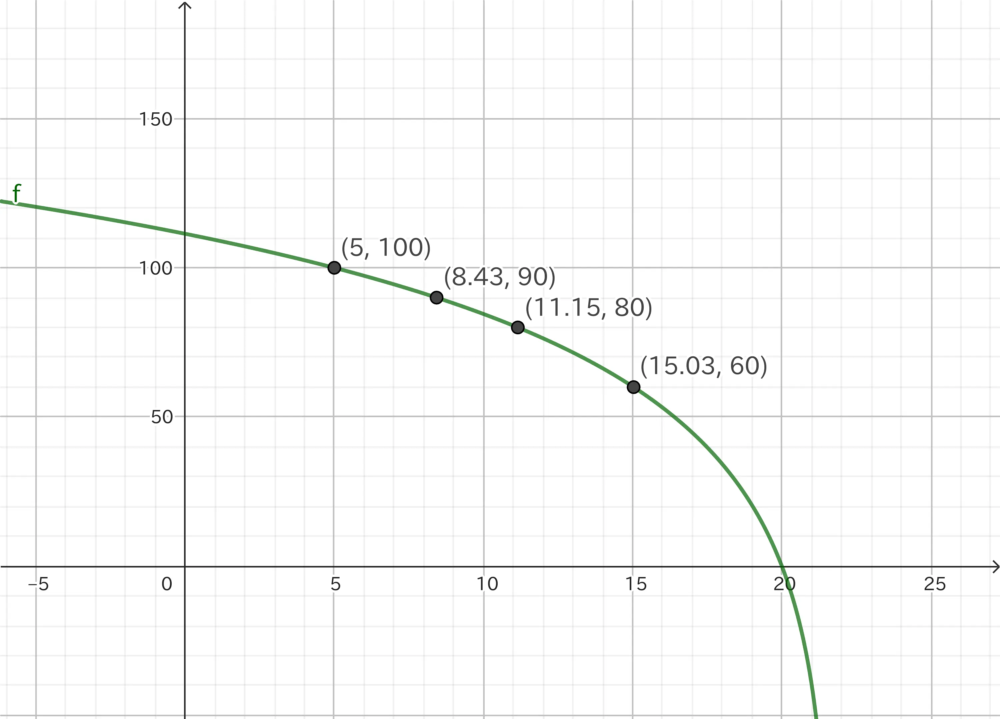

???+ success "OJ 上如何加载编译与运行环境"
    
    在 OJ 测评时，**只能访问集群 spack**, 因此如果你使用 spack 提供的编译器，需要在 `compile.sh` 和 `run.sh` 中添加:

    ```bash
    source /pxe/opt/spack/share/spack/setup-env.sh
    # 加载你需要的环境，如:
    spack load intel-oneapi-mpi intel-oneapi-compilers
    ```

    同时，需要注意 OJ 编译使用的机器与计算节点架构不同，使用 `-march=native` 时，AVX512 将不可用。因此，你可以在 `CMakeLists.txt` 中根据需要选择下面的编译选项:

    - `-march=icelake-server`: M600-M604 节点的架构 [Icelake](https://en.wikipedia.org/wiki/Ice_Lake_(microprocessor)#Ice_Lake-SP_(Xeon_Scalable))
    - `-march=sapphirerapids`: M700-M701 节点的架构 [Sapphire Rapids](https://en.wikipedia.org/wiki/Sapphire_Rapids) (如果你想尝试在 M7 运行的话)

## 推荐阅读资料

### Profiler 的使用

- VTune, 一般用这个：[Get Started with Intel® VTune™ Profiler](https://www.intel.com/content/www/us/en/docs/vtune-profiler/get-started-guide/2025-4/overview.html)

- ITAC, MPI 程序就用它：[Get Started with Intel® Trace Analyzer and Collector](https://www.intel.com/content/www/us/en/docs/trace-analyzer-collector/get-started-guide/2021-10/overview.html)

- APS: [Get Started with Application Performance Snapshot for Linux* OS](https://www.intel.com/content/www/us/en/docs/vtune-profiler/get-started-application-snapshot/2021-3/overview.html)

### Fortran 代码编写

- 官网教程，请重点了解 Fortran 中函数传参的细节，以及与 C 程序混合编译的部分：[Quickstart tutorial - Fortran Programming Language (fortran-lang.org)](https://fortran-lang.org/learn/quickstart), [Organising code structure](https://fortran-lang.org/en/learn/quickstart/organising_code/), [Procedures for binding to C interfaces](https://fortran-lang.org/en/learn/intrinsics/cfi/)

- [Introduction to Fortran (ourcodingclub.github.io)](https://ourcodingclub.github.io/tutorials/fortran-intro/)
