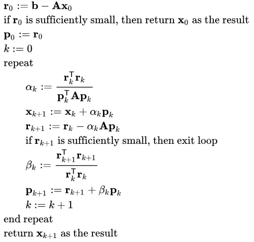
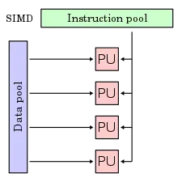

# 实验四：Solver Challenge

## 实验简介

### 背景介绍

在科学计算领域，求解线性方程组是非常重要的课题。使用计算机来求解线性方程组，主要有如下的两种思路：

- 直接法：我们在线性代数课程学习过的高斯消元法，以及将会在数值分析课程中介绍的 LU 分解法，均属于直接法。这些方法通过一步一步地消去未知数，最终得到方程组的精确解。虽然直接法能够给出精确解，但在处理较大的矩阵时，既会消耗大量的内存和算力，还难以并行化。

- 迭代法：迭代法试图通过不断更新解的估计值，逐步逼近方程组的解。数值分析课程会介绍比较基础的 Gauss-Seidel 迭代法和 Jacobi 迭代法。与直接法相比，迭代法在处理大规模稀疏矩阵时更为高效。它的计算量通常较小，且容易并行化。尽管迭代法的解不是精确的，但它通常能够在较短时间内找到一个足够接近的近似解，这使得它在科学计算中非常实用，尤其是在需要快速处理大规模问题时。

在激光聚变、复杂流动、结构力学、生物医疗、电子学系统、集成电路等领域的实际应用中，通常需要求解大规模的稀疏线性方程组。在这些问题中，迭代法往往是更为合适的求解方法。

[**BiCGSTAB**](https://en.wikipedia.org/wiki/Biconjugate_gradient_stabilized_method) (**Biconjugate gradient stabilized method**, 稳定双共轭梯度法) 正是一种迭代求解非对称线性系统的方法。它是 [**BiCG**](https://en.wikipedia.org/wiki/Biconjugate_gradient_method) (**Biconjuagate gradient method**, 双共轭梯度法) 的变种，有着更快速平缓的收敛表现。

在刚刚结束的 [SolverChallenge 24](https://www.solver-conference.cn/solverchallenge24/index.html) (第四届线性解法器算法与性能优化竞赛) 中，使用更高效的、高度并行化的 BiCGSTAB 算法也是比赛过程中的重要求解方法。

在本次实验中，我们将提供串行版本的 BiCGSTAB 算法的实现，你需要利用包括 OpenMP 线程级并行 **和** MPI 进程级并行在内的优化技术，加速该算法的求解过程，挑战机器运算性能的极限。

为了简化实验，在本次实验中我们将使用 BiCGSTAB 算法来求解随机生成的、稠密的线性方程组。

### 实验环境

实验环境的使用方法请阅读 [使用说明 - ZJUSCT OpenDocs](https://zjusct.pages.zjusct.io/ops/opendocs/guide/) 和 [提交作业 - ZJUSCT OpenDocs](https://zjusct.pages.zjusct.io/ops/opendocs/guide/job/)。

实验最终的测评环境是 Slurm 上的 Solver 分区，将提供 3 个节点 (`M602-M604`），每个节点最多使用 52 个物理核心 (2 × Intel(R) Xeon(R) Gold 5320 CPU @ 2.20GHz)，以及 503 GiB 内存，每个任务的时间上限 1 小时 (在临近实验截止日期时，会逐渐缩短时间上限，请合理安排进度)。你可以使用允许范围内的任意节点数和核心数的组合完成本次实验，请在提交的 SBATCH 脚本中调整对应参数，并在最终报告中加以说明。

## 实验内容

### 题目描述

我们提供 `BiCGSTAB Solver` 代码的串行版本作为[基准代码](http://git.zju.edu.cn/zjusct/summer_hpc101_2024/hpc-101-labs-2024/-/tree/main/docs/Lab4-Solver-Challenge/baseline )。

!!! danger "可修改的部分"

    在优化过程中，**严禁修改计时区**，因此对于 `src/main.cpp` 的修改，请仅限于添加 MPI 相关的代码。还有 `src/judger.cpp`, `include/judger.h` 不可以修改，其他部分都可以进行修改。

    如果希望提交到 OJ 测评，请注意:

    - `src/judger.cpp`, `include/judger.h` 在 OJ 测评时会被替换，因此修改并不会生效。
    - 如果有新增文件并希望可以被 OJ 测评，请将新文件放在 `src` 或 `include` 文件夹中。OJ 会使用的文件为：`src` 文件夹，`include` 文件夹，`CMakeLists.txt`, `run.sh`, `compile.sh`，其他的文件不会生效。

数据文件在 `/river/hpc101/2024/lab4/data` 中，你可以在代码的根目录下，通过 `ln -s /river/hpc101/2024/lab4/data data` 来引用它们。如果直接复制数据的话，请注意不要向 OJ 或者学在浙大提交数据文件。

本实验包含优化和 Profile 两个任务：

**优化任务：**

- 你需要对基准代码进行优化，使其能够在集群上并行运行，并在实验报告中详细描述你的优化思路和优化效果。你可以使用包括但不限于我们在 **优化思路参考** 一节中提到的技术进行优化。
- 代码在测试时将测试 4 组固定的输入，其中三组输入公开，相对应的矩阵 $\mathbf{A}$ 规模分别为 $2001\times 2001$、$4001\times 4001$、$6001\times 6001$，最后一组输入不公布。
- 我们将检查代码的合法性（包括是否替换为了其他算法、是否调用了数学库、是否修改了禁止修改的部分等），并重新编译检查是否能够正确运行。

**Profile 任务：**

- 你需要在代码上进行 Profile。依据 Profile 结果，你需要找到：

    - 耗时最多的三个 MPI 函数；

    - 程序在 MPI 上消耗的总时间。

- Profiler 还会提供更多其他的信息。我们希望你能够尝试分析从 Profile 获得的一部分数据和图表，或者能够根据 Profile 的结果对程序进行有效的优化。

请在实验报告中详细描述实验过程及结果，包括但不限于以下内容：

1. Profile 结果和分析
2. 优化思路和实现 (OpenMP, MPI 的使用...)
3. 每一步优化后的性能提升情况

推荐使用 `git` 进行版本管理，以便编写报告时可以快速找到历史优化的代码。

### 提交说明

请将优化任务的源代码文件放在 `code` 文件夹内，文件夹内存放：

- 源代码文件夹 `src` : 为了节省空间，**请不要提交输入数据文件**。
- `CMakeLists.txt`: 为了让大家熟悉 CMake 的使用，我们要求使用 CMake 来构建代码。基准代码中已经提供了 CMakeLists.txt，你可以根据需要进行修改。
- `run.sh`: 请在 `run.sh` 中编写 Slurm 的 SBATCH 脚本，并正确指定你所用的节点数和核心数，如果你需要设置环境变量，也可以在这里设置。
- `compile.sh` 以及其他你需要上传的文件。

请将 Profile 任务的文件放在 `doc` 文件夹内，文件夹内存放：

- 实验报告 `report.pdf`

最后将两个文件夹打包到 `学号-姓名-solver.zip` 中，上传到学在浙大。

## 实验指导

### BiCGSTAB 算法

在本实验中，我们要优化的是 **带预条件处理的 BiCGSTAB 算法**，其[算法流程](https://en.wikipedia.org/wiki/Biconjugate_gradient_stabilized_method#Preconditioned_BiCGSTAB)如下：

1. $r_0 = b - \mathbf{A}x_0$
2. Choose an arbitrary vector $\hat{r_0}$ such that $(\hat{r_0}, r_0)\ne 0$, eg. $\hat{r_0} = r_0$
3. $\rho_0 = (\hat{r}_0, r_0)$
4. $p_0 = r_0$
5. For $i = 1, 2, 3, \ldots$
    1. $y = \mathbf{M^{-1}} p_{i-1}$
    2. $v = \mathbf{A}{y}$
    3. $\alpha = \rho_{i-1} / (\hat{r}_0, v)$
    4. $h = x_{i-1} + \alpha y$
    5. $s = r_{i-1} - \alpha v$
    6. If $s$ is within the accuracy tolerance then $x_{i-1} = h$ and quit.
    7. $z = \mathbf{M^{-1}} s$
    8. $t = \mathbf{A}z$
    9. $\omega = (t, s) / (t, t)$
    10. $x_i = h + \omega z$
    11. $r_i = s - \omega t$
    12. If $r_i$ is within the accuracy tolerance then quit.
    13. $\rho_i = (\hat{r}_0, r_i)$
    14. $\beta = (\rho_i / \rho_{i-1}) (\alpha / \omega)$
    15. $p_i = r_i + \beta (p_{i-1} - \omega v)$

现在来说，上面的算法可能非常🤯难以理解。但是，请坐和放宽，在不理解原理的情况下，完全可以通过分析代码来找到可以优化的地方。不过，了解一下算法的原理，会对你调试在优化时出现的数值运算的错误 (比如残差不下降，或出现了 `NaN`) 有所帮助。为感兴趣的同学，我们准备了下面两张卡片，帮助你更好地理解 BiCGSTAB 算法的原理：

???+ "从梯度下降法到 BiCGSTAB"

    如何通过迭代的方式求解线性方程组呢？我们不妨借鉴梯度下降的思路，假设我们要求解 $\mathbf{x}$，使得:

    $$
    \mathbf{Ax=b}
    $$

    其中 $\mathbf{A} \in R^{n \times n}$ 是对称 ($\mathbf{A}^T=\mathbf{A}$) 且正定 ($\mathbf{x}^T\mathbf{Ax}>0$，对于所有非零向量 $\mathbf{x}\in \mathbf{R}^n$) 的矩阵，而且 $\mathbf{b}$ 已知。

    我们可以构造一个函数

    $$
    f(\mathbf{x})=\frac{1}{2}\mathbf{x}^T\mathbf{A}\mathbf{x}-\mathbf{b}^T\mathbf{x}+c
    $$

    对 $\mathbf{x}$ 求导，便可以得到
    $$
    \frac{df}{d\mathbf{x}}=\mathbf{Ax}-\mathbf{b}
    $$

    这意味着，我们构造的函数 $f$ 在 $\mathbf{Ax=b}$ 的时候取得极值，该函数的极值点对应的 $\mathbf{x}$ 就是原方程的解。

    这样一来，我们成功地把线性方程组求解问题，转化为了求极值的优化问题。梯度下降法，就是在每一次迭代时求出 $f$ 的梯度，并且沿着梯度方向下降，试图找出极值点，作为原方程组的解。

    然而，梯度下降法很容易陷入局部最优解。[**CG**](https://en.wikipedia.org/wiki/Conjugate_gradient_method)（共轭梯度算法）在梯度下降算法的基础上改进了下降方向的选择策略，它选择在上一步的下降方向 $p_k$ 和当前的梯度方向 $r_{k+1}$ 所张成的平面上重新选择当前下降的方向 $p_{k+1}$，从而达到更好的收敛效果。具体的算法推导在此略过，有兴趣的同学可以参考文末的参考资料。

    **CG** 算法的流程：

    <div align="center">
      
    </div>

    然而 **CG** 算法要求待求矩阵必须为对称正定矩阵，**BiCG** 算法则通过构造双共轭的搜索方向和基于双共轭的残差修正，从而支持对非对称线性系统的求解。**BiCGSTAB** 算法在 **BiCG** 的基础上，加强了其在求解过程中的数值稳定性，使其收敛更加迅速平缓。

???+ "预条件处理"

    迭代算法的收敛速度一般可以由系数矩阵 $\mathbf{A}$ 的[**条件数**](https://en.wikipedia.org/wiki/Condition_number) $\kappa (\mathbf{A})$ 来评估：$\kappa (\mathbf{A})$ 越大，收敛越慢，同时计算误差的影响也就越大。如果 $\kappa (\mathbf{A})$ 很大，通常使用预条件处理（precondition）将原始系统 $\mathbf{Ax-b=0}$ 替换为 $\mathbf{M^{-1}(Ax-b)=0}$，使得 $\kappa (\mathbf{M^{-1}A})$ 小于 $\kappa (\mathbf{A})$。其中的 $\mathbf{M}$ 被称为预条件子（preconditioner）。预条件处理能够加速迭代算法的收敛速度，在应对实际的科学计算问题时，我们往往必须应用预条件子来保证迭代算法的快速求解。

    常见的 $\mathbf{M}$ 选取至少有两种：对角线预处理和不完备的 Cholesky 预处理，**本实验选择对角线预处理**，即 $\mathbf{M}$ 矩阵为原始系数矩阵 $\mathbf{A}$ 的对角线矩阵。在知名的开源有限元软件 FEAPpv 中，就是采用的这种方法进行预处理。一般情况下，该方法对系数矩阵严格对角占优的情况下才比较有效。

### 优化思路参考

为了帮助你更好地掌握并行优化的技巧，我们将在下面提供相关优化思路作为参考。在本实验中，你可以对下面的优化思路一一进行尝试，也可以自己尝试创新性的优化策略。请在报告里详细描述你对优化策略所做的尝试和结果。

#### Profile

!!! danger "Profile 很重要"

    拿到一段陌生的程序，不知从何入手？Profile 是一个很好的起点。

    Profiler 能够提供与程序性能相关的的重要信息，包括运行时间统计、程序热点、MPI通信开销、通信复杂均衡、访存开销等一系列可能对程序优化有帮助的信息，现代的 Profiler 还能够直接提供优化的建议。比如在 [:simple-bilibili: 极客湾Geekerwan: 绝区零性能分析与优化指南：如何流畅玩？](https://b23.tv/BV1eT421k7Be/) 中，VTune Profiler 分析出了目前绝区零的内存访存瓶颈，为玩家的硬件选择和游戏性能的优化提供了重要的参考。

    我们**强烈建议**同学们在优化的过程中使用 Profiler 来帮助你更好地理解程序的性能瓶颈，对症下药，更好地进行优化。

在 Intel oneAPI 中，提供了 VTune Profiler, Intel Trace Analyzer and Collector, Application Performance Snapshot 等分析工具。

在集群上，你可以通过 `module load` 加载 VTune。通过附加不同的参数，往往可以得到程序运行不同方面的信息。你可以将集群上的 VTune 分析报告下载到本地，使用本地的 VTune 图形界面打开，查看分析结果，也可以使用集群提供的 X11 转发功能，启动集群上的 VTune 图形界面。

具体使用方法的文档在文末参考资料中。

??? quote "有关 Intel Trace Analyzer and Collector 停止支持的问题"

    根据 [Intel Trace Analyzer and Collector](https://www.intel.cn/content/www/cn/zh/developer/tools/oneapi/trace-analyzer.html) 的说明，这款性能分析工具将会在 2025 年停止支持。其现已不再被包含在 Intel HPC Toolkit 中，并且功能将逐渐转移至 VTune Profiler。

    但是目前，VTune Profiler 还没有支持 MPI 程序进程间通信的详细分析。在软件功能迁移的过渡阶段，如果同学们希望对 MPI 程序进行深入的分析，需要单独安装 Intel Trace Analyzer and Collector。

#### 编译器优化

编译器优化是最简单的优化方式之一。在修改代码之前，你可以通过尝试不同的编译器、调整编译器的优化等级、添加编译器优化选项等方式来提高程序的性能。

在本实验中，你既可以尝试使用不同的编译器优化选项，比如 `-O2`、`-O3`、`-Ofast` 等，来提高程序的性能。还可以使用不同的编译器，比如 `gcc`、`icx`、`clang` 等，来比较不同编译器的优化效果。在编译 MPI 程序时，你可以使用 `mpicc -cc=gcc` 这样的选项来指定编译器。在使用 Intel oneAPI 中的 Profiler 时，推荐使用 Intel oneAPI 提供的 `icx` 编译器。使用 OpenMP 的时候，请参考下表：

|   | C | C++ | Fortran | 加载 OpenMP 的选项 |
| --- | --- | --- | --- | --- |
| GCC | `gcc` | `g++` | `gfortran` | `-fopenmp` |
| clang | `clang` | `clang++` | `flang` | `-fopenmp` |
| Intel oneAPI | `icx` | `icpx` | `ifx` | `-qopenmp` |

推荐使用 [Compiler Explorer](https://godbolt.org/) 来直观地从汇编语言的角度，观察不同编译器、不同编译选项对代码的优化是否有效：比如是否使用了 `ymm` / `zmm` 系列的向量化寄存器，是否进行了循环展开，是否进行了分支预测的优化等等。

#### 访存优化

程序局部性指的是应用程序在访问内存的时候，倾向于访问内存中较为靠近的值。

一般来说，程序的局部性分为两种形式，一种是时间局部性，另一种是空间局部性。时间局部性指的是，程序在运行时，最近刚刚被引用过的一个内存位置容易再次被引用，比如在调取一个函数的时候，前不久才调取过的本地参数容易再度被调取使用。空间局部性指的是，最近引用过的内存位置以及其周边的内存位置容易再次被使用。空间局部性比较常见于循环中，比如在一个数列中，如果第 3 个元素在上一个循环中使用，则本次循环中极有可能会使用第 4 个元素。

在计算机的硬件实现中有大量基于局部性的优化技术，比如缓存、预取等。因此，在本实验中，我们可以考虑通过加强程序的局部性来提高程序的性能。

在 BiCGSTAB 算法中，矩阵向量乘法是主要的计算部分。在矩阵向量乘法中，对于矩阵的每一行，我们都需要访问向量的每一个元素。此时对矩阵的访问是连续的，但对于向量而言，每进行一次遍历都会发生一次不连续的访问。同时，对同一个元素的访问在时间上也相隔较远。因此，我们可以考虑对此采用分块的方式，将矩阵和向量分块存储，从而提高程序的局部性。

<div align="center">
  
</div>

#### SIMD 指令级并行

<div align="center">
  
</div>

`SIMD` 是一种数据并行技术，它通过提供支持向量运算的指令，同时对一组数据执行相同的计算，从而实现空间上的并行，进而提高程序的并行度和吞吐量。当程序中出现大量完全一致的运算需要对一批数据进行处理时，你可以考虑使用 `SIMD` 对其进行并行。

`BiCGSTAB`算法中矩阵与向量相乘、向量点乘、向量加法等运算很适合使用`SIMD`进行加速。一般而言，使用编译器的自动向量化就能够获得很可观的加速。不同编译器对于向量化有不同的开关，请自行查阅编译器的文档进行尝试。

如果编译器的自动向量化效果不佳，你可以考虑手动使用`SIMD`指令集进行手写向量化优化，详细内容请参考 [Lab 2.5 手写 SIMD 向量化](https://zjusct.pages.zjusct.io/summer_hpc101_2024/hpc-101-labs-2024/Lab2.5-Vectors-Bonus/) 的内容。

#### OpenMP 线程级并行

在单节点上，我们往往使用多线程来进行并行化。`OpenMP` 是一种简单易用的多线程并行编程模型，你可以通过在代码中插入 `#pragma omp parallel for` 来实现简单的并行化。更详细的使用方法请参考 `OpenMP` 的短学期课程内容和 `OpenMP` 的官方文档。

在本实验中，你可以考虑对矩阵向量乘法、向量点乘、向量加法等运算进行并行化，这通常能够获得非常好的加速效果。但需要注意的是，为了保证计算的正确性，你需要仔细分析计算中可能出现的数据访问冲突，保证并行化的代码是线程安全的。

同时，在优化过程中，你还需要考虑调度方式和调度粒度对并行效果的影响。比如，从访存连续性的角度考虑，一个线程执行 `for` 循环的连续数次迭代可能会比跳跃执行同样次数的迭代要更高效，这与我们在课程中提到的“伪共享”问题是一致的。你可以使用 `OpenMP` 的 `schedule` 子句和 `size` 参数来调整调度方式和调度粒度，也可以通过手动分配任务实行调度。

#### MPI 进程级并行

由于计算机硬件的限制，我们往往不能够在单节点上无限制地增加计算资源。因此，我们需要在多节点上使用 `MPI` 来进行并行化。

在课程中我们提到，`MPI` 是一种非共享内存的进程级并行编程模型，因此在使用 `MPI` 进行并行化时，你需要手动进行进程间的通信来实现数据在进程间的传输。你可以通过在代码中插入 `MPI_Send` 和 `MPI_Recv` 等函数来实现进程间的通信，也可以通过 `MPI` 提供的一系列通信函数来实现更高级的通信操作。更详细的使用方法请参考 `MPI` 的短学期课程内容和 `MPI` 的官方文档。

但需要注意的是，`MPI` 的创建进程的开销和进程间通信开销往往较大 (与 `OpenMP` 相比)，因此在使用 `MPI` 进行并行化时，你需要在并行化带来的加速效果和进程间通信的额外开销之间进行权衡。你可以通过调整进程数量、合理安排通信的时间和通信量等方式来优化 `MPI` 的并行效果。

同时，你也可以探究不同 `MPI` 实现对性能的影响，如 `Intel MPI`、`OpenMPI` 等。你可以通过 `module load` 加载不同的 `MPI` 实现。

!!! tips "mpirun 参数设置提醒"

    在使用 `mpirun` 启动 MPI + OpenMP 程序时，如果 OpenMP 的线程全部运行在了一个核心上，请添加 `-map-by NUMA` 参数。有关 `mpirun` 的更多设置，可以参考 [MPI 官方文档](https://docs.open-mpi.org/en/v5.0.x/man-openmpi/man1/mpirun.1.html)。

    如果要使用想在 Slurm 的任务中使用 Intel MPI, 请在 `run.sh` 中加入 `export I_MPI_PMI_LIBRARY=/slurm/libpmi2.so`。

### OJ 使用说明

!!! warning "Stay Tuned"

    OJ 的功能仍在调试中，下面的内容可能会有变动，请关注交流群中的通知。

    如果测评过程中出现了问题，也请在交流群中反馈～

!!! danger "这里没必要卷 😭"

    **请注意，OJ 上的得分仅供性能参考，不会直接折算进 Lab 得分，更不会按照加速比排行榜次序来评分。**

    我们更注重优化的思路和过程分析，因此 OJ 测评得分与实验得分并无直接关系。请不要过度追求 OJ 得分进行优化，也不要因为较高的 OJ 得分而忽视了实验报告的撰写，希望同学们能够理解。

请先阅读 [使用在线测评 - ZJUSCT OpenDocs](https://zjusct.pages.zjusct.io/ops/opendocs/guide/oj/) 来熟悉 OJ 的操作方法。

OJ 使用 ssh 进行操作，sftp 进行上传，连接方式为 `<用户名>+oj@clusters.zju.edu.cn`，如在校外需指定端口 `443`。

上传文件时，请使用 `scp` 或者 `sftp` 命令，将你的仓库文件夹上传到 OJ 的 `lab4` 文件夹内，保持文件夹结构不变：

```
.   <--- OJ 的 lab4 文件夹, <用户名>+oj@clusters.zju.edu.cn:lab4
├── CMakeLists.txt
├── run.sh
├── compile.sh
└── src
    ├── bicgstab
    │   └── solver.c
    ├── judger.cpp
    └── main.cpp
```

请注意不要上传数据文件，上传成功后，可以使用 `ssh <用户名>+oj@clusters.zju.edu.cn submit lab4` 提交测评。

??? tips "OJ 的测评流程"

    为了方便大家排查错误，公布 OJ 测评的工作流如下:

    1. 替换 `src/judge.cpp` 为用于测评系统的代码
    2. 使用 `compile.sh` 编译代码，你可以在 `compile.sh` 中加载编译环境。
    3. 使用 `sbatch run.sh /river/hpc101/2024/lab4/data/case_<数据规模>.bin` 命令提交任务到集群。
        如果针对数据规模有不同的线程/进程规划策略，请在 `run.sh` 中进行相应的修改，通过 `$1` 代表脚本的第一个参数。
    4. 根据各组数据运行结果，首先检查输出是否正确，然后根据运行时间计算得分。

    分数计算的参考运行时间如下：

    | 数据 | 得分时间 | 满分时间 | 计算方式 |
    | --- | --- | --- | --- |
    | 2001 | 20s | 5s | 对数 |
    | 4001 | 100s | 30s | 对数 |
    | 6001 | 500s | 150s | 对数 |

    以第一组数据为例，直观感受对数计算方式：

    

## Bonus

本部分**选做**, 感兴趣的同学可以尝试完成。

??? tips inline end "请问您今天要来点 Fotran Meme 吗"

    === "🚨"

        甲：我们穿越成功了！

        乙：但现在是哪一年？

        甲：问问那边的路人。

        甲：现在增长趋势最快的编程语言是什么？

        路人：Fortran 和 COBOL.

        甲：1970 年

        

    === "🤓"

        在古籍馆借到了 FOTRAN 教材:

        

        (不要真的去学本书，拜托了orz)

    === "🧑‍🔬"

        在 2024 年还在使用 Fortran 的物理学家:

        

Fortran 是世界上第一个被正式采用并流传至今的高级编程语言，它因较为容易学习而被大量用于科学计算领域的代码编写。在其[官方主页](https://fortran-lang.org/index)上，Fortran 被定义为“**高性能并行编程语言**”。可以说，在科学计算领域，Fortran 是一门非常重要的编程语言。

Fortran 的编译器往往会随 C/C++ 的编译器一同安装，且其编译流程和 C/C++ 类似，故其能和 C/C++ 程序进行混合编译。我们一般接触到的 Fortran 代码至少是 Fortran 90 标准（这也是其后缀名 `.f90` 的由来），而最新的标准是 Fortran 2023，甚至已经有了[包管理器](https://fpm.fortran-lang.org/)和 [http 包](https://http-client.fortran-lang.org/)。

在本部分，你需要使用 Fortran 完成 `BiCGSTAB` 算法的实现，并使其能够被基准代码中的 C 语言代码调用。最终，Fortran 的代码和 C 的代码需要进行混合编译，并生成能够正常运行的 `bicgstab-fortran` 程序。

我们在 CMakeLists.txt 中给出了混合编译 Fortran 代码时需要用到的配置，所以可以直接在 `src` 文件夹内创建 `solver.f90` 文件，然后编写 Fortran 代码。

同时你也可以尝试在 Fortran 上尝试你的一系列优化策略，并比较两个版本的性能差异。

Bonus 部分完成即有加分（完成 Bonus 部分实验要求，且能够通过编译与测试），我们将根据完成质量提供 5-10 分的加分（与 Lab 4 权重相同）。不过，即使程序仍然存在小 bug，也欢迎同学们提交自己的尝试。

??? tip "Fortran 锦囊：请在实在毫无头绪的情况下再打开"
    这样的话，那就从下面的这段代码开始吧:

    ```fortran
    function bicgstab(N, A, b, x, tol, maxit) result(iter) bind(C, name="bicgstab")
        use, intrinsic :: iso_c_binding
        implicit none

        ! Add parameter binding here, eg:
        integer(c_int), intent(in), value :: N

        ! Add local variables here, eg:
        integer(c_int) :: iter

        ! Add your implementation here
        iter = 0
    end function bicgstab
    ```

## 注意事项

1. 严禁抄袭。我们会对提交的代码进行严格查重，一旦发现，按 0 分处理。
2. 禁止恶意浪费节点资源、恶意攻击 OJ 和集群等干扰他人的行为。
3. 禁止使用其他的算法来代替 `BiCGSTAB` 算法完成方程求解；我们考察的是并行化，而非对算法本身的改造。在代码测试时会着重检查这一点。
4. 禁止直接调用库函数完成计算过程，包括但不限于调用矩阵乘法库函数、调用线性方程组求解库函数等。
5. `BiCGSTAB` 算法通常用于求解大规模的稀疏矩阵，但由于求解大规模稀疏矩阵涉及到矩阵的结构分析、性质分析等问题，并不是本实验的重点，为了简化实验，我们均使用稠密矩阵进行测试。
6. 如对题目有疑惑或认为说明文档/基准代码有缺漏，请联系助教。

## 参考资料

### Profiler 的使用

- VTune, 一般用这个：[Get Started with Intel® VTune™ Profiler](https://www.intel.com/content/www/us/en/docs/vtune-profiler/get-started-guide/2024-0/overview.html)

- ITAC, MPI 程序就用它：[Get Started with Intel® Trace Analyzer and Collector](https://www.intel.com/content/www/us/en/docs/trace-analyzer-collector/get-started-guide/2021-10/overview.html)

- APS: [Get Started with Application Performance Snapshot for Linux* OS](https://www.intel.com/content/www/us/en/docs/vtune-profiler/get-started-application-snapshot/2021-3/overview.html)

### Fortran 代码编写

- 官网教程，请重点了解 Fortran 中函数传参的细节，以及与 C 程序混合编译的部分：[Quickstart tutorial - Fortran Programming Language (fortran-lang.org)](https://fortran-lang.org/learn/quickstart), [Organising code structure](https://fortran-lang.org/en/learn/quickstart/organising_code/), [Procedures for binding to C interfaces](https://fortran-lang.org/en/learn/intrinsics/cfi/)

- [Introduction to Fortran (ourcodingclub.github.io)](https://ourcodingclub.github.io/tutorials/fortran-intro/)
