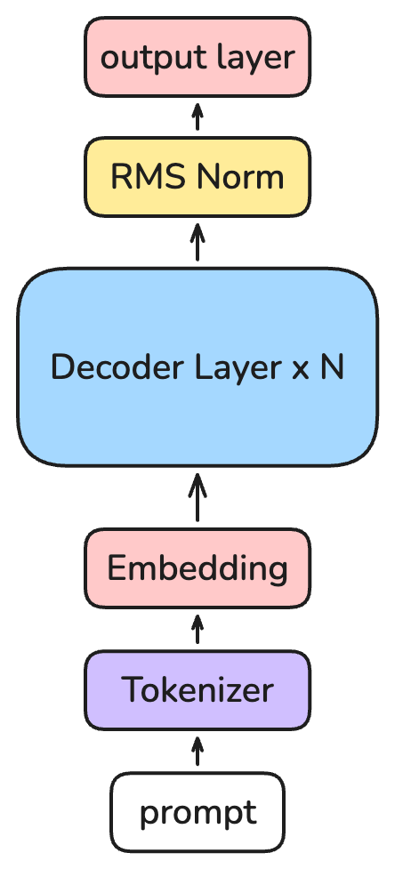
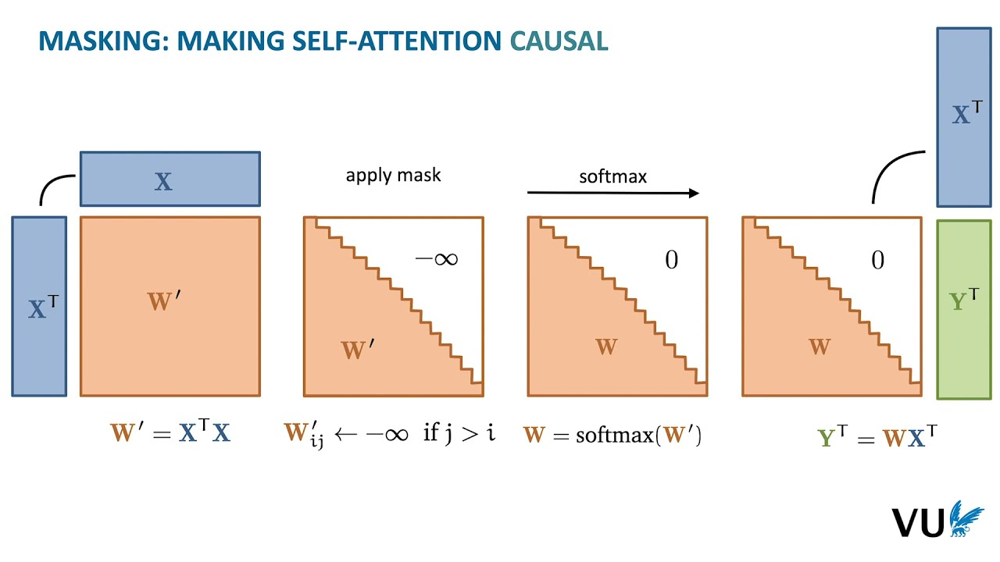
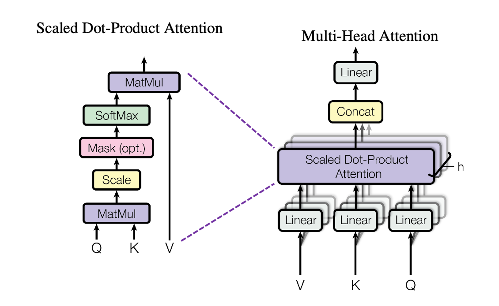
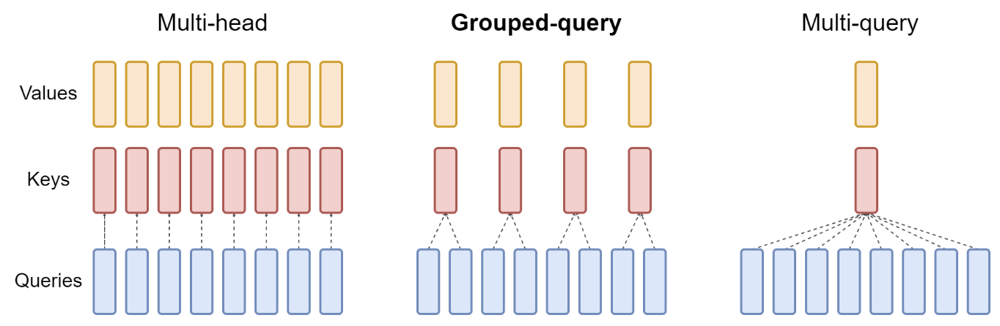
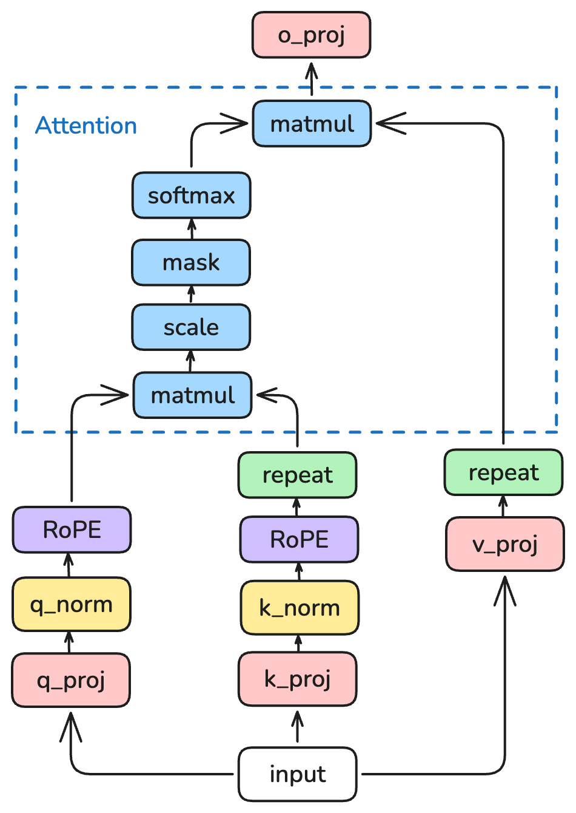
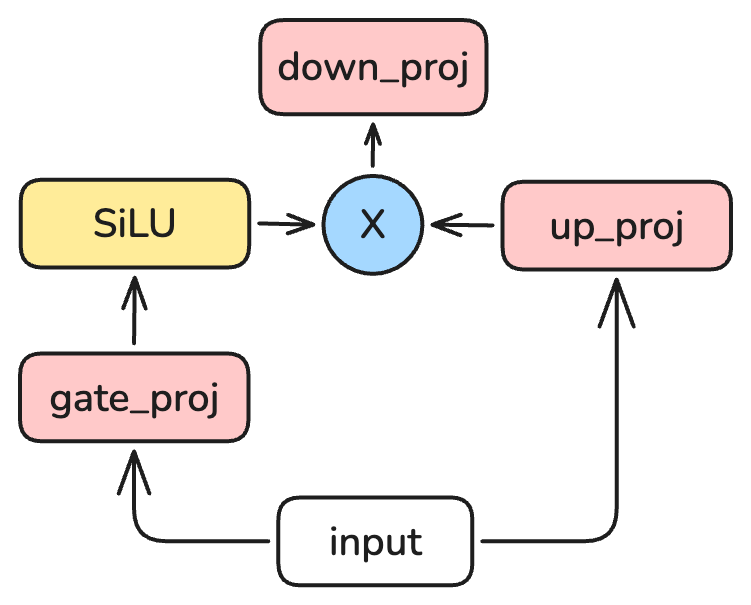

# 实验五: TinyLLM

!!! info "实验信息"

    负责助教：林熙 ([@Erix025](https://github.com/Erix025)), 茅晋源, 尤傲([@You-Ao](https://github.com/You-Ao))

## 实验简介

本实验通过从零实现 Qwen3-8B 模型中的关键组件来掌握深度学习的核心概念。你将亲手实现 Self Attention 和 Feed Forward Network (FFN)，最终构建一个完整的语言模型，并在此基础上进行文本生成。

在本实验中，你将学习并实践以下内容：

- 深入理解 Transformer 架构中的 Self Attention
- 掌握前馈神经网络 (FFN) 和 SwiGLU 激活函数的实现
- 了解分组查询注意力 (Grouped Query Attention, GQA) 优化方法
- 在实践中理解 LLM 的推理过程

## 知识讲解：Qwen3 Model Architecture

### Qwen3 模型架构概述

[Qwen3](https://qwenlm.github.io/blog/qwen3/) 采用标准的 Transformer Decoder 架构，其推理过程如下：

1. Tokenization：将输入文本转换为 token 序列，每一个 token 对应一个整数 ID。这一部分由 Tokenizer 完成。
2. Embedding：将 token ID 转换为高维向量表示。这一部分由 Embedding 层完成。
3. Decoder Layers: 将输入向量依次通过多个解码器层，每层包含以下组件：
   - Multi-Head Attention (MHA)：计算输入 token 之间的注意力分数。
   - Feed Forward Network (FFN)：对每个 token 的表示进行非线性变换。
   - Layer Normalization：对每层的输出进行归一化处理。
4. Output Layer：将最后一层的输出通过线性变换和 softmax 层转换为 token ID 的概率分布。
5. Text Generation：根据概率分布生成下一个 token，并将 token 放入 token 序列中。重复步骤 2-4 直到生成结束标志。

{ width="200" style="display:block; margin:auto;"}

Qwen 3 在标准 Decoder-Only 架构的基础上，采用了以下优化：

- **分组查询注意力 (Grouped Query Attention, GQA)**：通过共享 Key/Value 头来减少计算量。
- **RoPE (Rotary Position Embedding)**：使用旋转位置编码来增强模型对序列位置的感知。
- **Q/K Normalization**：在计算注意力分数之前，对 Query 和 Key 进行归一化处理。
- **RMSNorm**：使用 RMSNorm 替代 LayerNorm 进行归一化处理。
- **SwiGLU 激活函数**：使用 SwiGLU 作为前馈网络的激活函数，增强模型的表达能力。

在本次实验中我们使用的是 Qwen3-8B 模型，其关键参数如下：

| 参数 | 值 | 参数含义 |
|------|----|----------|
| `num_hidden_layers` | 36 | Decoder Layer 数量 |
| `hidden_size` | 4096 | 每层的隐藏层维度 |
| `num_attention_heads` | 32 | 注意力头数量 |
| `num_key_value_heads` | 8 | Key/Value 头数量 (用于 GQA) |
| `intermediate_size` | 12288 | 前馈网络中间层维度 |
| `vocab_size` | 151936 | 词汇表大小 |

其他更详细的参数可以参考权重目录下的 `config.json` 文件。

为了更好地理解 Qwen3 模型的核心组件，我们将重点讲解 Multi-Head Attention 和 Feed Forward Network 的实现细节。

### Self Attention Layer 详解

#### 注意力机制原理

注意力机制的核心思想是让模型在处理每个位置的token时，能够关注到序列中的所有相关位置。数学公式如下：

$$
\text{Attention}(Q, K, V) = \text{softmax}\left(\frac{QK^T + \text{mask}}{\sqrt{d_k}}\right)V
$$

其中：

- Q (Query)：查询矩阵，形状为 [batch_size, seq_len, d_model]
- K (Key)：键矩阵，形状为 [batch_size, seq_len, d_model]  
- V (Value)：值矩阵，形状为 [batch_size, seq_len, d_model]
- mask：掩码矩阵，形状为 [batch_size, seq_len, seq_len]
- $d_k$：Key的维度，用于缩放
- batch_size：一个 batch 的大小
- seq_len：序列长度
- d_model：模型的隐藏层维度

在我们的实验中，由于 LLM 是依赖前面的 token 来预测下一个 token 的过程，因此我们需要使用 Causal Mask（因果掩码）来确保模型只能看到当前 token 之前的 token。Causal Mask 的常见实现方式是将上三角部分设置为负无穷大，这样在 softmax 计算时，这些位置的注意力分数会被归一化为 0。



#### 多头注意力 (Multi-Head Attention)



多头注意力是在标准注意力机制的基础上，将注意力分成多个头来并行计算，以捕捉不同的表示子空间。其计算公式为：

$$
\text{MultiHead}(Q, K, V) = \text{Concat}(\text{head}_1, \ldots, \text{head}_h)W^O
$$

其中每个头的计算为：

$$
\text{head}_i = \text{Attention}(QW_i^Q, KW_i^K, VW_i^V)
$$

#### 自注意力层 (Self-Attention Layer)

在自注意力层中，Query、Key和Value都是来自同一输入序列。其实现步骤如下：

1. **QKV投影**：将输入 `hidden_states` 通过三个线性层 `q_proj`, `k_proj`, `v_proj` 投影为 `Q`, `K`, `V` 三个矩阵。
2. **形状变换**：将 Q, K, V 张量重塑为多头格式 `[batch, num_heads, seq_len, head_dim]`。其中 `head_dim * num_heads = d_model`。
3. **进行注意力计算**：计算注意力分数，并应用 mask 和 softmax 函数。
4. **输出投影**：将注意力输出重塑为 `[batch, seq_len, d_model]`，并通过输出投影层 `o_proj`。

#### 分组查询注意力 (Grouped Query Attention, GQA)

[GQA](https://arxiv.org/abs/2305.13245) 是一种用于减少 Key Value 数量和 Attention 计算量的优化方法。在 MHA 中，一个 Query Head 对应一个 Key/Value Head，但在 GQA 中，多个 Query Heads 可以共享同一个 Key/Value Head，这样可以显著减少 KV 的数量。



在 Qwen3-8B 中，`num_heads=32`，`num_key_value_heads=8`，因此每 4 个 Query Heads 共享 1 个 Key/Value Head。在实际实现中，Key/Value 投影时会将输入维度从 `d_model` 降低到 `num_key_value_heads * head_dim` (而不是 `num_heads * head_dim`)。

在进行注意力计算时，Query Heads 的数量仍然是 `num_heads`，而 Key/Value Heads 的数量是 `num_key_value_heads`。因此我们需要通过重复 Key/Value Heads 来匹配 Query Heads 的数量。

#### RoPE位置编码

RoPE（Rotary Position Embedding）是一种位置编码方法，通过将位置编码与 Query 和 Key 的向量相乘来增强模型对序列位置的感知。其核心思想是将位置编码嵌入到注意力计算中，而不是简单地添加到输入向量中。

RoPE 的计算公式为：

$$
\text{RoPE}(x, pos) = x \cdot \cos(pos) + \text{rot}(x) \cdot \sin(pos)
$$

其中 `rot(x)` 是对 `x` 进行旋转操作，`pos` 是位置编码。

在 Qwen3 中，在进行注意力计算之前，我们会对 Query 和 Key 应用 RoPE 位置编码。具体实现中，使用 `apply_rotary_pos_emb` 函数来将位置编码应用到 Query 和 Key 上。

#### RMSNorm

Qwen 3 使用 RMSNorm（Root Mean Square Normalization）来替代传统的 LayerNorm。RMSNorm 的计算公式为：

$$
\text{RMSNorm}(x) = \frac{x}{\sqrt{\text{mean}(x^2) + \epsilon}} \cdot \gamma
$$

其中 $\epsilon$ 是一个小常数，用于防止除零错误，$\gamma$ 是可学习的缩放参数。

#### Q/K Normalization

Qwen 3 引入了 Q/K Normalization，即在计算注意力分数之前，对 Query 和 Key 进行归一化处理。这有助于提高模型的稳定性和收敛速度。

在具体实现中，我们使用 RMSNorm 进行归一化处理。

#### Qwen 3 Self Attention Layer

在加入了上述优化后，Qwen 3 的 Self Attention Layer 结构如下：

{ width="400" style="display:block; margin:auto;" }

1. 首先输入 `hidden_states` 分别通过 `q_proj`, `k_proj`, `v_proj` 进行线性投影，得到 Q, K, V。
2. 对 Q 和 K 应用 RMSNorm 进行归一化处理。
3. 对 Q, K, V 进行形状变换，重塑为多头格式。
4. 对 Q 和 K 应用 RoPE 位置编码。
5. 根据 GQA 机制对 K 和 V 进行复制，以匹配 Q 的头数。
6. 进行注意力计算：

    - 计算注意力分数 ($QK^T$)、应用 scale ($\frac{1}{\sqrt{d_k}}$)，mask 和 softmax。
    - 计算注意力输出 (softmax结果乘以 V)。

7. 将注意力输出通过输出投影层 `o_proj`，得到最终的输出。

### Feed Forward Network (FFN)详解

#### SwiGLU激活函数

在理论课上我们介绍过 Sigmoid, Tanh 和 ReLU 等常见激活函数。而在 Qwen 3 使用了 SwiGLU 激活函数，它结合了 SiLU 和 GLU 的优点，能够更好地捕捉非线性关系。

**SiLU (Sigmoid Linear Unit)** 是 Sigmoid 和 ReLU 的改进版，其公式为：

$$\text{SiLU}(x) = x \cdot \text{Sigmoid}(x)$$

{ width="500" style="display:block; margin:auto;" }

**GLU (Gated Linear Unit)** 是一个门控机制，他的核心思想是通过一个范围在 [0, 1] 的门控函数来控制信息的流动。GLU 的公式为：

$$\text{GLU}(x) = \sigma(W_g x) \odot (W_x x)$$

其中 $\sigma$ 是范围为 [0,1] 的激活函数，$W_g$ 和 $W_x$ 是可学习的权重矩阵，$\odot$ 表示逐元素乘法。

**SwiGLU** 是 $\sigma = \text{SiLU}$ 的 GLU 变体，其公式为：

$$\text{SwiGLU}(x) = \text{SiLU}(W_g x) \odot (W_x x)$$

#### FFN 结构

标准的前馈神经网络 (FFN) 由两个线性层和一个激活函数组成，可以表示为：

$$
\text{FFN}(x) = W_2 \cdot \sigma(W_1 \cdot x + b_1) + b_2
$$

其中 $W_1$ 和 $W_2$ 是可学习的权重矩阵，$b_1$ 和 $b_2$ 是偏置项，$\sigma$ 是激活函数。

#### Qwen 3 FFN 结构

在 Qwen 3 中，FFN 采用 SwiGLU 作为激活函数，并使用 `intermediate_size` 作为中间层的维度。

包含三个线性层：

1. **门控投影 (Gate Projection)**：计算门控值，形状为 `[batch, seq_len, intermediate_size]`。
2. **上投影 (Up Projection)**：计算上投影值，形状为 `[batch, seq_len, intermediate_size]`。
3. **下投影 (Down Projection)**：将结果投影回原维度，形状为 `[batch, seq_len, hidden_size]`。

{ width="300" style="display:block; margin:auto;" }

### Decoder Layer 概览

Qwen 3 的 Decoder Layer 主要有 Self Attention Layer 和 Feed Forward Network 两个核心组件构成，同时还包括使用 RMSNorm 进行归一化处理，并在每个组件之后进行残差链接。

这一部分的具体实现已在实验框架中给出，此处省略架构详解。请同学们参考 `modules/layer.py` 中的实现结合理解，并完成思考题。

## 思考题

1. **请阅读并理解实验框架代码，描述 Qwen3 Decoder Layer 的结构和前向过程，并画图说明。**

    画图时请标注或用文字另外说明各个组件的输入输出形状。注意表明 Residual Connection 和 Normalization 的位置。

2. **请尝试计算 Qwen3 模型的参数量和理论显存占用，并查看实际运行时的显存占用情况。他们是否一致？若不一致请进行分析。**

    ??? note "如何计算参数量和显存占用？"

        参数量，即 model 的总参数数量。在 Transformer 模型中，参数量通常来自于以下几个部分：

        - Embedding 层的参数量：`vocab_size * hidden_size`
        - 每个 Decoder Layer 的参数量：包括 Self Attention 和 FFN 的参数量
        - 最终输出层的参数量：`hidden_size * vocab_size`

        在每个 Decoder Layer 中，所有的 Linear 层和 RMSNorm 层都会对最终的参数量有所贡献。

        你可以利用 PyTorch 的 `model.parameters()` 方法来得到模型的所有参数，由此来验证你的计算。

        而模型参数的显存占用则是由参数量和数据类型决定的。在本实验中使用的数据类型是 `bfloat16`，每个参数占用 2 字节，由此可以计算出模型的总显存占用。

        模型的实际显存占用可能与你计算的理论值有所不同，请你自行查找原因并在实验报告中进行分析。

## 实验指导和提示

### 实验框架介绍

实验框架的目录结构如下：

```text
.
├── main.py             # 简单推理脚本
├── modules
│   ├── attention.py    # TODO: 完成 Qwen3Attention 的实现
│   ├── config.py       # Qwen3 模型配置类
│   ├── __init__.py
│   ├── layer.py        # Qwen3 Decoder Layer 的实现
│   ├── mlp.py          # TODO: 完成 Qwen3FFN 的实现
│   ├── model.py        # Qwen3 模型的实现
│   └── rope.py         # RoPE 位置编码的实现
├── README.md
├── simple_test.py      # 单元测试脚本
└── utils
```

你需要完成 `modules/attention.py` 中的 `Qwen3Attention` 类和 `modules/mlp.py` 中的 `Qwen3FFN` 类的实现。

我们提供了一个简单的推理脚本 `main.py`，你可以通过运行该脚本来测试你的模型是否能够输出正常的人类可读文本。你也可以通过修改 `main.py` 中的生成配置来探索不同的生成效果（如调整不同的参数、使用 `<think>` 标签强制模型思考等），欢迎同学们将自己的尝试和结果分享在实验报告中。

我们也提供了测试用例，你需要确保你的实现能够通过测试。你可以使用以下命令来运行测试：

```bash
python simple_test.py
```

### 开发环境设置

本次实验使用 [UV](https://docs.astral.sh/uv/) 进行环境管理。UV 是一个现代化的 Python 环境管理工具，支持多种 Python 版本和依赖包管理。

首先，你需要安装 UV。参考 UV 文档中的 [安装手册](https://docs.astral.sh/uv/getting-started/installation/) 使用以下命令来安装 UV：

```bash
curl -LsSf https://astral.sh/uv/install.sh | sh
```

本次实验提供了一个预配置的 UV 环境，你可以通过以下命令来加载环境:

```bash
source /river/hpc101/2025/lab5/env/bin/activate
```

加载后直接使用 `python main.py` 命令即可运行实验代码。

### 提交作业

本实验需要在 GPU 平台上运行，你可以参考 [提交作业 - 提交 GPU 任务](https://hpc101.zjusct.io/guide/job/#%E6%8F%90%E4%BA%A4gpu%E4%BB%BB%E5%8A%A1) 来申请 GPU 资源并提交你的任务。

需要注意的是，你需要确保在运行前加载 UV 环境。你可以在 SBATCH 提交脚本中执行加载环境的命令，或者在使用 `srun` 命令前确保已经加载了 UV 环境。

## 实验任务和要求

### 实验任务

1. 根据 [知识讲解](#知识讲解qwen3-model-architecture) 中的内容，完成 `modules/attention.py` 中的 Qwen3Attention 类的实现和 `modules/mlp.py` 中的 Qwen3FFN 类的实现。
2. 完成 [思考题](#思考题) （在实验报告中体现）
3. 完成实验报告，内容包括：
    - 你的实现思路和对这两个模块前向过程的理解
    - 单元测试通过的截图和模型生成效果的截图
    - 思考题的答案和分析
    - （可选）实验感想和改进建议
4. 在学在浙大中提交你的实验报告和两个模块的代码实现。

### 实验要求

1. 实现的模型能够正常进行前向推理，并生成正常的文本。
2. 不得直接调用 Pytorch 中现成的 Attention、FFN、Transformer 等模块，只可使用实验框架中的模块和函数以及 Pytorch 的基础 Tensor 操作。
3. 不得直接调用 torch.nn.functional 中的现成注意力函数。

## 参考资料与阅读材料

### 参考文献

- Qwen 3 官方博客: [Qwen3: Think Deeper, Act Faster](https://qwenlm.github.io/blog/qwen3/)
- Attention is All You Need: [Vaswani et al., 2017](https://arxiv.org/abs/1706.03762)
- GQA: Training Generalized Multi-Query Transformer Models from Multi-Head Checkpoints: [Ainslie et al., 2023](http://arxiv.org/abs/2305.13245)
- RoFormer: Enhanced Transformer with Rotary Position Embedding [Su et al., 2021](https://arxiv.org/abs/2104.09864)
- LLaMA: Open and Efficient Foundation Language Models [Touvron et al., 2023](https://arxiv.org/abs/2302.13971)

### 推荐阅读材料

- [UV 文档](https://docs.astral.sh/uv/): 本实验只使用 UV 进行环境管理，并没有完全发挥 UV 在项目管理上的强大功能，感兴趣的同学可以在后续的学习中深入了解 UV 的更多功能。
- PyTorch 文档: [Getting Started with PyTorch](https://docs.pytorch.org/tutorials/beginner/basics/intro.html) 这一篇文档可以帮你回顾我们在理论课上学过的 PyTorch 构建模型流程。而 [torch.Tensor API](https://docs.pytorch.org/docs/2.6/tensors.html) 则是 PyTorch 的核心 API 文档，包含了所有 Tensor 操作的详细说明，可以帮助你理解如何使用 Tensor 计算来完成本实验。
- [:simple-youtube: How DeepSeek Rewrote the Transformer](https://www.youtube.com/watch?v=0VLAoVGf_74): 感兴趣的同学可以观看这个视频来理解 MHA, MQA, GQA 以及 DeepSeek 提出的 MLA（Multi-Layer Attention）等注意力机制的区别。
